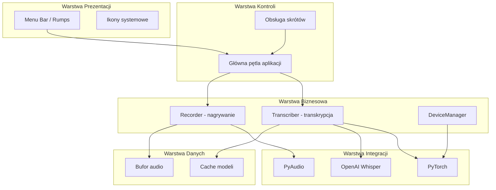

# Zadanie: Wygeneruj docs/ARCHITECTURE.md

## Data utworzenia
2025-10-10 14:20

## Priorytet
**HIGH** - Faza 2 z planu dokumentacji

## Kontekst
Projekt: whisper-dictation - aplikacja do wielojęzycznego dyktowania oparta na OpenAI Whisper.

Przeczytaj następujące pliki przed rozpoczęciem:
- `/Users/mprzybyszewski/dev/ai-projects/whisper-dictation/docs/DOCUMENTATION_PLAN.md` - plan docelowej dokumentacji
- `/Users/mprzybyszewski/dev/ai-projects/whisper-dictation/docs/PROJECT_OVERVIEW.md` - przegląd projektu
- `/Users/mprzybyszewski/dev/ai-projects/whisper-dictation/README.md` - główna dokumentacja
- `/Users/mprzybyszewski/dev/ai-projects/whisper-dictation/whisper-dictation.py` - główny plik aplikacji
- `/Users/mprzybyszewski/dev/ai-projects/whisper-dictation/recorder.py` - moduł nagrywania
- `/Users/mprzybyszewski/dev/ai-projects/whisper-dictation/transcriber.py` - moduł transkrypcji
- `/Users/mprzybyszewski/dev/ai-projects/whisper-dictation/device_manager.py` - zarządzanie urządzeniami

## Cel
Utworzyć plik `/Users/mprzybyszewski/dev/ai-projects/whisper-dictation/docs/ARCHITECTURE.md` opisujący architekturę systemu zgodnie z planem w DOCUMENTATION_PLAN.md.

## Wymagane sekcje w ARCHITECTURE.md

### 1. Wprowadzenie
Krótki opis architektury aplikacji (2-3 akapity).

### 2. Warstwy systemu
Opisz główne warstwy (layery):
- **Warstwa prezentacji** - menu bar, ikona systemowa (rumps)
- **Warstwa kontroli** - główna pętla aplikacji, obsługa skrótów klawiszowych
- **Warstwa biznesowa** - nagrywanie (recorder), transkrypcja (transcriber)
- **Warstwa danych** - bufor audio, cache modeli Whisper
- **Warstwa integracji** - PyAudio, PyTorch, Whisper API

Dla każdej warstwy:
- Odpowiedzialność
- Główne komponenty
- Zależności

### 3. Komponenty główne
Opisz kluczowe komponenty:
- **WhisperDictation** (main app)
- **Recorder** (audio recording)
- **Transcriber** (Whisper integration)
- **DeviceManager** (M1/M2 optimization)
- **MPSOptimizer** (GPU acceleration)

### 4. Diagram: Warstwy architektury
Wygeneruj plik Mermaid: `docs/diagrams/architecture-layers.mmd`

Przykładowa struktura:

### 5. Wzorce projektowe
Wymień i opisz użyte wzorce:
- Singleton (jeśli używane)
- Observer (obsługa zdarzeń audio)
- Strategy (wybór modelu Whisper)
- Facade (uproszczenie interfejsu Whisper)

### 6. Kluczowe decyzje architektoniczne (ADR-lite)

Format dla każdej decyzji:
**Decyzja**: [Nazwa]
- **Kontekst**: Dlaczego była potrzebna
- **Decyzja**: Co zdecydowano
- **Konsekwencje**: Plusy i minusy
- **Status**: Aktywna/Przestarzała

Przykłady decyzji do udokumentowania:
- Dwie implementacje (Python vs C++)
- Offline processing
- Wybór PyAudio
- Device management dla M1/M2

### 7. Obszary ryzyka
Zidentyfikuj ryzyka architektoniczne:
- Performance bottlenecks
- Memory usage
- Model loading time
- Thread safety

### 8. Powiązane dokumenty
Sekcja z linkami:
- [README](./README.md)
- [Przegląd projektu](./PROJECT_OVERVIEW.md)
- [Przepływy danych](./DATA_FLOW.md) *(zostanie dodane)*
- [Diagram warstw](./diagrams/architecture-layers.mmd)
- [Diagram systemowy](./diagrams/system-overview.mmd)

## Wymagania techniczne
- Język: **Polski**
- Format: Markdown
- Długość: 800-1500 linii (szczegółowy dokument)
- Styl: Techniczny, precyzyjny
- Kod: Używaj bloków kodu dla przykładów
- Diagramy: Referencje do plików .mmd w docs/diagrams/

## Walidacja
Po utworzeniu dokumentu:
1. Sprawdź czy wszystkie sekcje są wypełnione
2. Upewnij się że diagram architecture-layers.mmd został utworzony
3. Zweryfikuj linki (ścieżki względne)
4. Sprawdź czy document ma sekcję "Powiązane dokumenty"

## Dodatkowe uwagi
- Bazuj na RZECZYWISTYM kodzie - nie wymyślaj
- Jeśli coś jest niejasne, oznacz jako `[TO INVESTIGATE]`
- Używaj przykładów z kodu projektu
- Zachowaj spójność z PROJECT_OVERVIEW.md
