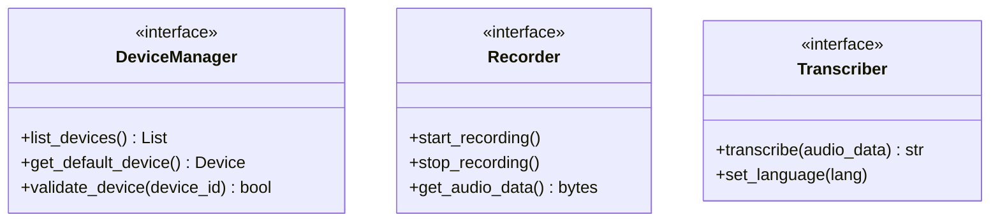
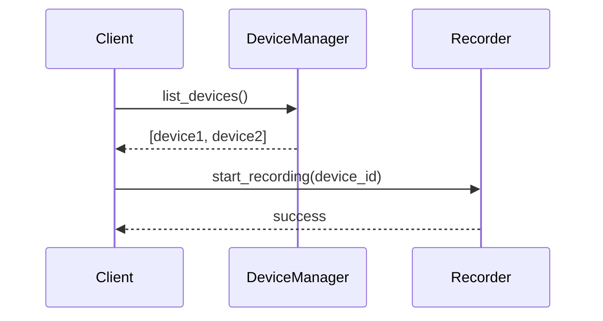
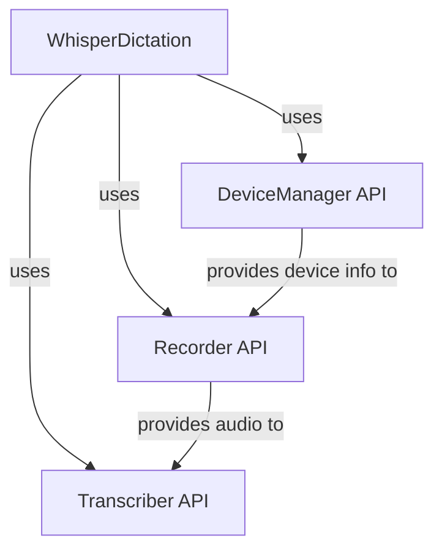
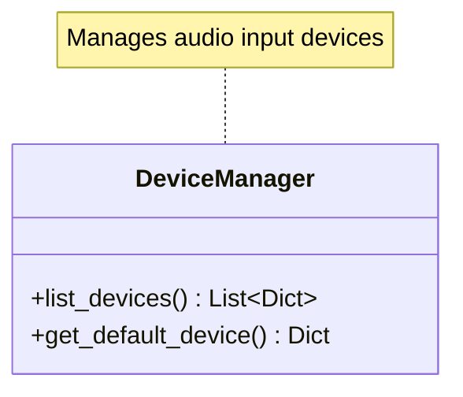

# Task: Convert API_INTERFACES.md Code to Diagrams

## Principle: "Image Over Code"
Replace source code blocks with visual diagrams showing API relationships, interfaces, and interactions.

## File to Modify
**EXACT PATH**: `/Users/mprzybyszewski/dev/ai-projects/whisper-dictation/docs/API_INTERFACES.md`

## Objectives

### 1. Identify Code Blocks
Read API_INTERFACES.md and identify code showing:
- Class definitions
- Method signatures
- API interactions
- Interface contracts

### 2. Replace with Interface Diagrams

#### Class Interfaces
Use **Class Diagrams**:


#### API Interactions
Use **Sequence Diagrams**:


#### Component Communication
Use **Component Diagrams**:


### 3. Document API Contracts
For each interface, show:
- **Purpose**: What the interface does
- **Methods**: As diagram nodes, not code
- **Parameters**: Shown as labeled arrows
- **Return types**: Shown as return arrows

### 4. Keep Minimal Code
Only keep:
- Critical type definitions (1-2 lines)
- Example usage (max 3 lines)
- Complex data structures that can't be visualized

### 5. Add API Documentation
For each API section, include:
- Interface diagram
- Brief description of purpose
- Usage flow diagram
- Important notes/constraints

## Guidelines

### DO:
- ✅ Show all public interfaces
- ✅ Use class diagrams for structure
- ✅ Use sequence diagrams for interactions
- ✅ Label method parameters clearly
- ✅ Show relationships between interfaces

### DON'T:
- ❌ Show implementation code
- ❌ Include private methods
- ❌ Show internal data structures
- ❌ Make diagrams cluttered with details

## Examples

### Before (Code):
```python
class DeviceManager:
    def list_devices(self) -> List[Dict]:
        """List available audio devices."""
        pass
```

### After (Diagram):


## Verification
After editing:
1. Check code blocks: `grep -n '```python' /Users/mprzybyszewski/dev/ai-projects/whisper-dictation/docs/API_INTERFACES.md`
2. Count diagrams: `grep -c '```mermaid' /Users/mprzybyszewski/dev/ai-projects/whisper-dictation/docs/API_INTERFACES.md`
3. Verify changes: `git -C /Users/mprzybyszewski/dev/ai-projects/whisper-dictation diff docs/API_INTERFACES.md`

## Success Criteria
- [ ] All class definitions replaced with class diagrams
- [ ] At least 3-4 Mermaid diagrams added
- [ ] API contracts are clear from diagrams
- [ ] Interactions shown with sequence diagrams
- [ ] Minimal to no code blocks remain
