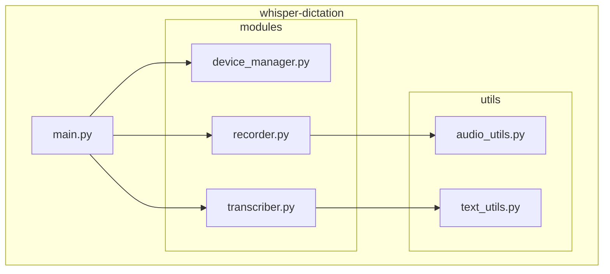
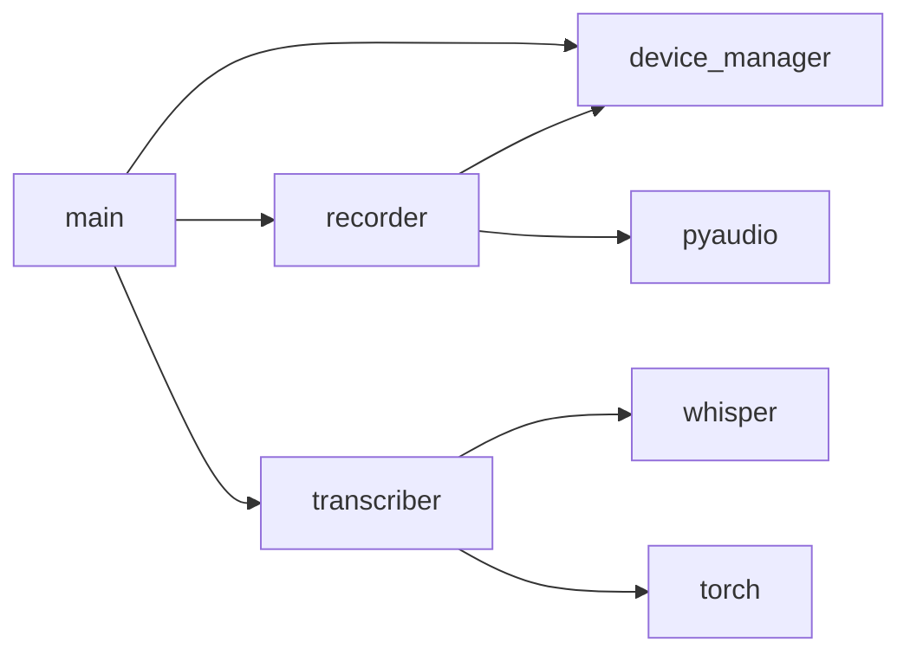
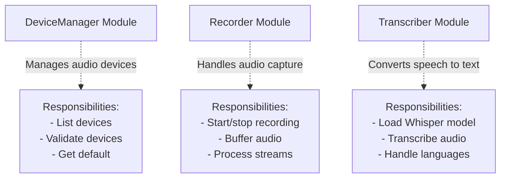
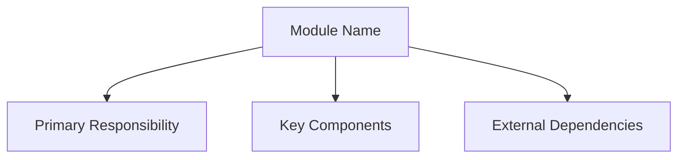

# Task: Convert MODULES.md Code to Diagrams

## Principle: "Image Over Code"
Replace source code blocks with visual diagrams showing module structure, relationships, and responsibilities.

## File to Modify
**EXACT PATH**: `/Users/mprzybyszewski/dev/ai-projects/whisper-dictation/docs/MODULES.md`

## Objectives

### 1. Identify Code Blocks
Read MODULES.md and identify code showing:
- Module structure
- Module relationships
- Component organization
- Import dependencies

### 2. Replace with Module Diagrams

#### Module Organization
Use **Package Diagrams**:


#### Module Dependencies
Use **Dependency Diagrams**:


#### Module Responsibilities
Use **Component Diagrams** with notes:


### 3. Module Overview Structure
For each module section, include:
1. **Purpose diagram** - What the module does
2. **Structure diagram** - Internal organization
3. **Interface diagram** - Public API (minimal)
4. **Dependencies diagram** - What it depends on

### 4. Keep Minimal Code
Only keep:
- Module import examples (1-2 lines)
- Critical configuration constants

### 5. Cross-Reference
Link to detailed module docs:
```markdown
See [device_manager.md](modules/device_manager.md) for detailed documentation.
```

## Guidelines

### DO:
- ✅ Show module hierarchy clearly
- ✅ Use subgraphs for organization
- ✅ Show dependencies between modules
- ✅ Indicate module responsibilities
- ✅ Keep high-level overview

### DON'T:
- ❌ Show implementation details
- ❌ Include class code
- ❌ Show all functions/methods
- ❌ Duplicate detailed docs

## Example Structure

### Module Overview


### Module Position in System


## Verification
After editing:
1. Check code blocks: `grep -n '```python' /Users/mprzybyszewski/dev/ai-projects/whisper-dictation/docs/MODULES.md`
2. Count diagrams: `grep -c '```mermaid' /Users/mprzybyszewski/dev/ai-projects/whisper-dictation/docs/MODULES.md`
3. Verify changes: `git -C /Users/mprzybyszewski/dev/ai-projects/whisper-dictation diff docs/MODULES.md`

## Success Criteria
- [ ] All code blocks replaced with diagrams
- [ ] At least 3-4 module diagrams added
- [ ] Module relationships are clear
- [ ] Dependencies are visualized
- [ ] Document provides clear overview
