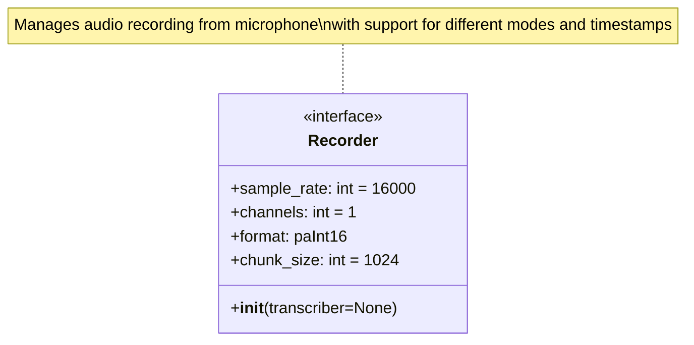
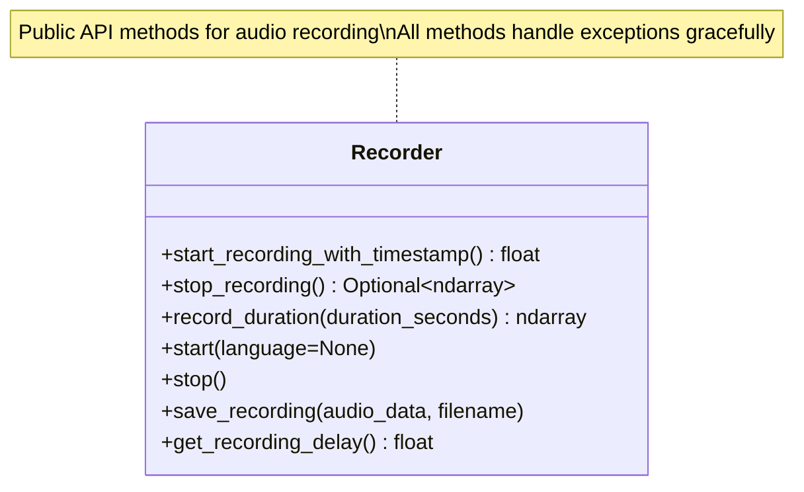
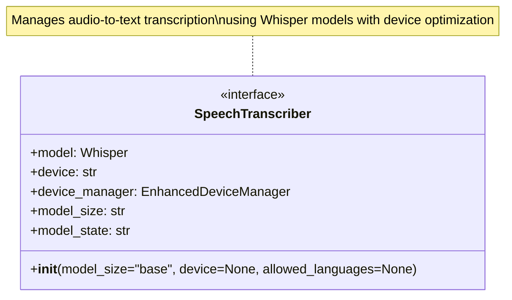
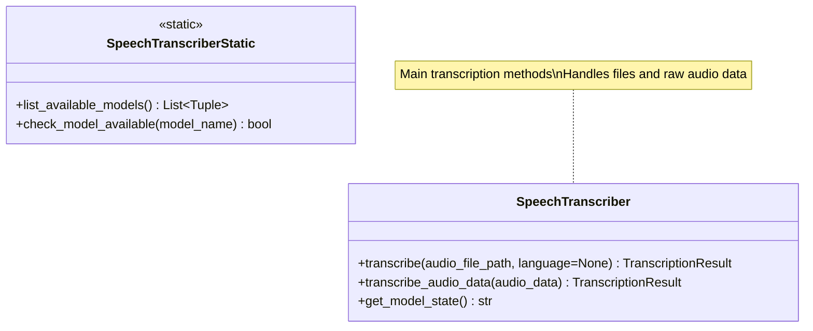

# API Interfaces - Whisper Dictation

## Spis treści

1. [Wprowadzenie](#wprowadzenie)
2. [Recorder API](#recorder-api)
3. [SpeechTranscriber API](#speechtranscriber-api)
4. [DeviceManager API](#devicemanager-api)
5. [Typy danych i klasy pomocnicze](#typy-danych-i-klasy-pomocnicze)
6. [Kontrakty między komponentami](#kontrakty-między-komponentami)
7. [Obsługa błędów](#obsługa-błędów)
8. [Przykłady użycia](#przykłady-użycia)
9. [Powiązane dokumenty](#powiązane-dokumenty)

---

## Wprowadzenie

Ten dokument opisuje publiczne interfejsy API głównych modułów aplikacji Whisper Dictation. Zawiera szczegółowe sygnatury metod, parametry, typy zwracane oraz wzorce obsługi błędów.

### Cel dokumentu

- Dostarczenie kompletnej referencji API dla wszystkich modułów
- Zdefiniowanie kontraktów między komponentami
- Dokumentacja wzorców obsługi błędów
- Przykłady integracji modułów

### Konwencje

- Wszystkie ścieżki plików są bezwzględne lub względne do katalogu głównego projektu
- Typy danych zgodne z Python 3.x i NumPy/PyTorch
- Błędy są zgłaszane jako wyjątki z opisowymi komunikatami

---

## Recorder API

### Klasa: `Recorder`

**Lokalizacja**: `recorder.py`

**Opis**: Zarządza nagrywaniem audio z mikrofonu z obsługą różnych trybów pracy i timestampów.

### Konstruktor



**Parametry inicjalizacji**:
- `transcriber` (SpeechTranscriber, opcjonalny): Instancja transkrybera do automatycznej transkrypcji

### Metody publiczne



#### start_recording_with_timestamp()

**Opis**: Rozpoczyna nagrywanie i zwraca precyzyjny timestamp początku. Przydatne do synchronizacji z innymi zdarzeniami.

**Zwraca**: Unix timestamp (float) reprezentujący moment rozpoczęcia nagrywania

**Wyjątki**:
- `RuntimeError`: Gdy wystąpił błąd podczas otwierania strumienia audio

**Przykład**:
```python
recorder = Recorder()
start_time = recorder.start_recording_with_timestamp()
print(f"Nagrywanie rozpoczęte o: {start_time}")
```

#### stop_recording()

```python
def stop_recording(self) -> Optional[np.ndarray]:
    """
    Zatrzymuje nagrywanie i zwraca dane audio.
    
    Returns:
        numpy.ndarray: Tablica float32 z normalizowanymi danymi audio (zakres -1.0 do 1.0)
        None: Jeśli nagrywanie nie było aktywne lub brak danych
    """
```

**Opis**: Zatrzymuje aktywne nagrywanie i konwertuje nagrane dane do formatu numpy array.

**Zwraca**: 
- `numpy.ndarray` (dtype=float32): Znormalizowane dane audio w zakresie [-1.0, 1.0]
- `None`: Gdy nagrywanie nie było aktywne

**Format zwracanych danych**:
- Typ: `numpy.ndarray`
- dtype: `float32`
- Shape: `(n_samples,)` - jednowymiarowa tablica
- Zakres wartości: [-1.0, 1.0]
- Częstotliwość: 16000 Hz

**Przykład**:
```python
audio_data = recorder.stop_recording()
if audio_data is not None:
    print(f"Nagrano {len(audio_data)} próbek ({len(audio_data)/16000:.2f}s)")
```

#### record_duration()

```python
def record_duration(self, duration_seconds: float) -> np.ndarray:
    """
    Nagrywa przez określony czas.
    
    Args:
        duration_seconds (float): Czas nagrywania w sekundach
        
    Returns:
        numpy.ndarray: Nagrane dane audio jako float32 array
        
    Raises:
        RuntimeError: Gdy wystąpił błąd podczas nagrywania
    """
```

**Opis**: Automatycznie nagrywa przez określony czas i zwraca dane.

**Parametry**:
- `duration_seconds` (float): Czas trwania nagrania w sekundach

**Zwraca**: 
- `numpy.ndarray` (dtype=float32): Nagrane dane audio

**Przykład**:
```python
# Nagraj 5 sekund
audio = recorder.record_duration(5.0)
print(f"Nagrano {len(audio)/16000:.2f} sekund audio")
```

#### start()

```python
def start(self, language: Optional[str] = None):
    """
    Rozpoczyna nagrywanie w tle (wątek).
    
    Args:
        language (str, opcjonalny): Kod języka dla transkrypcji (np. 'en', 'pl')
    """
```

**Opis**: Rozpoczyna nagrywanie w osobnym wątku, umożliwiając asynchroniczne nagrywanie.

**Parametry**:
- `language` (str, opcjonalny): Kod języka ISO 639-1 dla późniejszej transkrypcji

**Uwagi**:
- Nagrywanie działa w tle
- Wymaga wywołania `stop()` do zakończenia
- Jeśli ustawiono transcriber, automatycznie transkrybuje po zatrzymaniu

**Przykład**:
```python
recorder.start(language='pl')
time.sleep(5)  # Nagrywa przez 5 sekund
recorder.stop()
```

#### stop()

```python
def stop():
    """
    Zatrzymuje nagrywanie w tle.
    """
```

**Opis**: Zatrzymuje nagrywanie uruchomione przez `start()`.

#### save_recording()

```python
def save_recording(self, audio_data: np.ndarray, filename: str):
    """
    Zapisuje dane audio do pliku WAV.
    
    Args:
        audio_data (numpy.ndarray): Dane audio do zapisania
        filename (str): Nazwa pliku wyjściowego (z rozszerzeniem .wav)
    """
```

**Opis**: Eksportuje nagrane audio do pliku WAV.

**Parametry**:
- `audio_data` (np.ndarray): Dane audio (float32 lub int16)
- `filename` (str): Ścieżka do pliku wyjściowego

**Format pliku**:
- Format: WAV
- Kodowanie: PCM 16-bit
- Kanały: 1 (mono)
- Częstotliwość: 16000 Hz

**Przykład**:
```python
audio = recorder.record_duration(3.0)
recorder.save_recording(audio, "recording.wav")
```

#### get_recording_delay()

```python
def get_recording_delay(self) -> float:
    """
    Mierzy opóźnienie między wywołaniem start a faktycznym rozpoczęciem.
    
    Returns:
        float: Średnie opóźnienie w sekundach (z 3 prób)
    """
```

**Opis**: Narzędzie diagnostyczne do pomiaru latencji inicjalizacji nagrywania.

**Zwraca**: Średnie opóźnienie w sekundach

**Przykład**:
```python
delay = recorder.get_recording_delay()
print(f"Średnie opóźnienie startu: {delay*1000:.2f}ms")
```

### Właściwości klasy Recorder

- `recording` (bool): Flaga statusu nagrywania
- `audio_data` (list): Bufor z fragmentami audio
- `start_timestamp` (float): Timestamp rozpoczęcia nagrywania
- `sample_rate` (int): Częstotliwość próbkowania (16000 Hz)
- `channels` (int): Liczba kanałów (1 - mono)
- `format` (int): Format audio (paInt16)
- `chunk_size` (int): Rozmiar bufora (1024 próbek)

### Typy wyjątków

- `RuntimeError`: Błędy związane z uruchomieniem/zatrzymaniem nagrywania
- `Exception`: Ogólne błędy przechwytywane w metodach

---

## SpeechTranscriber API

### Klasa: `SpeechTranscriber`

**Lokalizacja**: `transcriber.py`

**Opis**: Zarządza transkrypcją audio na tekst używając modeli Whisper z optymalizacją urządzeń.

### Konstruktor



**Parametry**:
- `model_size` (str): 
  - `'tiny'` - 75MB, najszybszy, najmniej dokładny
  - `'base'` - 145MB, dobry balans (domyślny)
  - `'small'` - 483MB, lepsza dokładność
  - `'medium'` - 1.5GB, bardzo dobra dokładność
  - `'large'` - 3GB, najlepsza dokładność

- `device` (str, opcjonalny): Docelowe urządzenie obliczeniowe
  - `'cpu'` - CPU (zawsze dostępne)
  - `'mps'` - Apple Silicon GPU
  - `'cuda'` - NVIDIA GPU
  - `None` - automatyczna detekcja (zalecane)

- `allowed_languages` (list, opcjonalny): Ograniczenie wykrywanych języków

**Właściwości**:
- `model` (whisper.model.Whisper): Załadowany model Whisper
- `device` (str): Aktualnie używane urządzenie
- `device_manager` (EnhancedDeviceManager): Menedżer optymalizacji urządzeń
- `model_size` (str): Rozmiar załadowanego modelu
- `model_state` (str): Identyfikator stanu modelu dla testowania

**Przykład**:
```python
# Podstawowa inicjalizacja
transcriber = SpeechTranscriber()

# Z określonym modelem i ograniczeniem języków
transcriber = SpeechTranscriber(
    model_size='small',
    allowed_languages=['en', 'pl']
)
```

### Metody publiczne



#### transcribe()

**Opis**: Główna metoda transkrypcji z pliku audio.

**Parametry**:
- `audio_file_path` (str): Ścieżka do pliku audio (obsługiwane formaty: WAV, MP3, M4A, itd.)
- `language` (str, opcjonalny): Kod języka ISO 639-1

**Zwraca**: `TranscriptionResult` z polami:
- `text` (str): Transkrybowany tekst
- `language` (str): Wykryty/użyty język
- `detection_time` (float): Czas detekcji języka (sekundy)
- `transcription_time` (float): Czas transkrypcji (sekundy)

**Przykład**:
```python
result = transcriber.transcribe("recording.wav", language="pl")
print(f"Tekst: {result.text}")
print(f"Język: {result.language}")
print(f"Czas: {result.transcription_time:.2f}s")
```

#### transcribe_audio_data()

```python
def transcribe_audio_data(self, audio_data: np.ndarray) -> TranscriptionResult:
    """
    Transkrybuje surowe dane audio.
    
    Args:
        audio_data (numpy.ndarray): Dane audio jako numpy array (float32)
        
    Returns:
        TranscriptionResult: Obiekt z tekstem, językiem i czasem transkrypcji
        
    Raises:
        Exception: Gdy transkrypcja nie powiodła się
    """
```

**Opis**: Transkrybuje dane audio bezpośrednio z pamięci (np. z Recordera).

**Parametry**:
- `audio_data` (np.ndarray): 
  - dtype: `float32` (preferowany) lub będzie skonwertowany
  - Zakres: [-1.0, 1.0] (znormalizowany)
  - Shape: `(n_samples,)`

**Zwraca**: `TranscriptionResult` z:
- `text` (str): Transkrybowany tekst
- `language` (str): Wykryty język
- `transcription_time` (float): Czas operacji

**Przykład**:
```python
# Integracja z Recorder
recorder = Recorder()
audio = recorder.record_duration(5.0)
result = transcriber.transcribe_audio_data(audio)
print(result.text)
```

#### get_model_state()

```python
def get_model_state(self) -> str:
    """
    Zwraca identyfikator stanu modelu.
    
    Returns:
        str: Unikalny identyfikator stanu modelu (dla testowania)
    """
```

**Opis**: Metoda pomocnicza do testowania zmiany stanu modelu.

**Zwraca**: String w formacie: `"{model_size}_{device}_{language}_{timestamp}"`

### Metody statyczne

#### list_available_models()

```python
@staticmethod
def list_available_models() -> List[Tuple[str, str]]:
    """
    Listuje modele dostępne lokalnie.
    
    Returns:
        List[Tuple[str, str]]: Lista krotek (nazwa_modelu, rozmiar_pliku)
    """
```

**Opis**: Skanuje lokalny cache w poszukiwaniu pobranych modeli Whisper.

**Zwraca**: Lista krotek z nazwą modelu i rozmiarem, np. `[('base', '145MB'), ('small', '483MB')]`

**Przykład**:
```python
models = SpeechTranscriber.list_available_models()
for name, size in models:
    print(f"Model: {name} ({size})")
```

#### check_model_available()

```python
@staticmethod
def check_model_available(model_name: str) -> bool:
    """
    Sprawdza czy określony model jest dostępny lokalnie.
    
    Args:
        model_name (str): Nazwa modelu do sprawdzenia
        
    Returns:
        bool: True jeśli model jest dostępny lokalnie
    """
```

**Opis**: Sprawdza dostępność modelu bez jego ładowania.

**Parametry**:
- `model_name` (str): Nazwa modelu ('tiny', 'base', 'small', 'medium', 'large')

**Zwraca**: `True` jeśli model jest w lokalnym cache

**Przykład**:
```python
if SpeechTranscriber.check_model_available('base'):
    print("Model 'base' jest dostępny")
else:
    print("Model 'base' wymaga pobrania")
```

### Właściwości klasy SpeechTranscriber

- `model` (whisper.model.Whisper): Instancja modelu Whisper
- `model_size` (str): Rozmiar modelu ('tiny', 'base', etc.)
- `device` (str): Aktualnie używane urządzenie
- `device_manager` (EnhancedDeviceManager): Menedżer urządzeń
- `allowed_languages` (list): Lista dozwolonych języków
- `model_state` (str): Identyfikator stanu modelu

### Obsługiwane formaty audio

- WAV (wszystkie warianty PCM)
- MP3
- M4A
- FLAC
- OGG
- Inne formaty obsługiwane przez FFmpeg

### Obsługiwane języki

Model Whisper obsługuje 99 języków. Najczęściej używane:

- `en` - Angielski
- `pl` - Polski
- `es` - Hiszpański
- `fr` - Francuski
- `de` - Niemiecki
- `it` - Włoski
- `ja` - Japoński
- `zh` - Chiński
- Pełna lista: https://github.com/openai/whisper

---

## DeviceManager API

### Klasa: `DeviceManager`

**Lokalizacja**: `device_manager.py`

**Opis**: Centralne zarządzanie urządzeniami obliczeniowymi z inteligentnym fallbackiem dla optymalizacji M1/M2.

### Konstruktor

```python
def __init__(self, enable_logging: bool = True):
    """
    Inicjalizuje menedżera urządzeń.
    
    Args:
        enable_logging (bool): Czy włączyć logowanie (domyślnie True)
    """
```

**Parametry**:
- `enable_logging` (bool): Kontrola szczegółowości logów

**Inicjalizacja**:
- Automatyczna detekcja dostępnych urządzeń
- Testowanie podstawowych możliwości każdego urządzenia
- Budowanie hierarchii preferencji urządzeń
- Inicjalizacja historii operacji

**Przykład**:
```python
device_manager = DeviceManager(enable_logging=True)
```

### Metody publiczne

#### get_device_for_operation()

```python
def get_device_for_operation(self, operation: OperationType, 
                            model_size: Optional[str] = None) -> str:
    """
    Zwraca optymalne urządzenie dla typu operacji.
    
    Args:
        operation (OperationType): Typ operacji (MODEL_LOADING, TRANSCRIPTION, BASIC_TENSOR)
        model_size (str, opcjonalny): Rozmiar modelu dla optymalizacji pamięci
        
    Returns:
        str: Nazwa urządzenia ('cpu', 'mps', 'cuda')
    """
```

**Opis**: Inteligentny wybór urządzenia bazujący na historii sukcessów i możliwościach.

**Parametry**:
- `operation` (OperationType): 
  - `OperationType.MODEL_LOADING` - Ładowanie modelu
  - `OperationType.TRANSCRIPTION` - Transkrypcja
  - `OperationType.BASIC_TENSOR` - Podstawowe operacje tensorowe
- `model_size` (str, opcjonalny): Rozmiar modelu dla decyzji o pamięci

**Zwraca**: String z nazwą urządzenia

**Logika wyboru**:
1. Sprawdza możliwości urządzenia dla danej operacji
2. Analizuje historię ostatnich 5 prób (współczynnik sukcesu > 80%)
3. Wybiera pierwsze urządzenie spełniające kryteria
4. Fallback do CPU jeśli żadne nie spełnia

**Przykład**:
```python
device = device_manager.get_device_for_operation(
    OperationType.MODEL_LOADING, 
    model_size='base'
)
print(f"Ładowanie modelu na: {device}")
```

#### handle_device_error()

```python
def handle_device_error(self, error: Exception, 
                       operation: OperationType,
                       current_device: str) -> str:
    """
    Obsługuje błąd urządzenia i zwraca fallback.
    
    Args:
        error (Exception): Wyjątek który wystąpił
        operation (OperationType): Typ operacji która zawiodła
        current_device (str): Urządzenie na którym wystąpił błąd
        
    Returns:
        str: Urządzenie fallback do użycia
    """
```

**Opis**: Inteligentna obsługa błędów z automatycznym fallbackiem.

**Parametry**:
- `error` (Exception): Przechwycony wyjątek
- `operation` (OperationType): Kontekst operacji
- `current_device` (str): Urządzenie które zawiodło

**Zwraca**: Nazwa urządzenia fallback

**Funkcjonalność**:
- Rejestruje błąd w historii
- Wykrywa znane problemy MPS (SparseMPS, aten::empty.memory_format)
- Dezaktywuje problematyczne urządzenie dla danej operacji
- Wybiera następne najlepsze urządzenie
- Zapewnia ultimate fallback do CPU

**Przykład**:
```python
try:
    result = model.transcribe(audio, device=device)
except Exception as e:
    fallback = device_manager.handle_device_error(
        e, 
        OperationType.TRANSCRIPTION, 
        device
    )
    print(f"Przełączam na: {fallback}")
    result = model.transcribe(audio, device=fallback)
```

#### register_operation_success()

```python
def register_operation_success(self, device: str, operation: OperationType):
    """
    Rejestruje sukces operacji dla przyszłych decyzji.
    
    Args:
        device (str): Urządzenie na którym operacja powiodła się
        operation (OperationType): Typ operacji
    """
```

**Opis**: Buduje historię sukcessów dla inteligentnego wyboru urządzeń.

**Parametry**:
- `device` (str): Nazwa urządzenia
- `operation` (OperationType): Typ operacji

**Uwagi**:
- Przechowuje ostatnie 10 wyników
- Używane do kalkulacji współczynnika sukcesu
- Wpływa na przyszłe wybory urządzeń

**Przykład**:
```python
device = device_manager.get_device_for_operation(OperationType.TRANSCRIPTION)
try:
    result = model.transcribe(audio, device=device)
    device_manager.register_operation_success(device, OperationType.TRANSCRIPTION)
except Exception as e:
    fallback = device_manager.handle_device_error(e, OperationType.TRANSCRIPTION, device)
```

#### should_retry_with_fallback()

```python
def should_retry_with_fallback(self, error: Exception) -> bool:
    """
    Określa czy błąd wymaga automatycznego fallbacku.
    
    Args:
        error (Exception): Wyjątek do analizy
        
    Returns:
        bool: True jeśli należy automatycznie przełączyć urządzenie
    """
```

**Opis**: Wykrywa znane problemy wymagające fallbacku.

**Parametry**:
- `error` (Exception): Wyjątek do sprawdzenia

**Zwraca**: `True` jeśli wykryto znany problem MPS

**Wykrywane wzorce**:
- `"sparsemps"` - Problemy ze sparse operations na MPS
- `"aten::empty.memory_format"` - Problemy z alokacją pamięci MPS
- `"mps backend"` - Ogólne błędy backendu MPS
- `"metal performance shaders"` - Błędy Metal

**Przykład**:
```python
try:
    result = operation_on_mps()
except Exception as e:
    if device_manager.should_retry_with_fallback(e):
        print("Wykryto problem z MPS, przełączam na CPU")
        result = operation_on_cpu()
    else:
        raise  # Nieznany błąd, propaguj dalej
```

#### get_device_status_report()

```python
def get_device_status_report(self) -> Dict:
    """
    Zwraca raport statusu wszystkich urządzeń.
    
    Returns:
        Dict: Słownik z informacjami o urządzeniach, możliwościach i historii
    """
```

**Opis**: Narzędzie diagnostyczne do debugowania problemów z urządzeniami.

**Zwraca**: Słownik z:
- `preferred_devices` (list): Hierarchia preferencji urządzeń
- `fallback_device` (str): Urządzenie fallback (zwykle 'cpu')
- `capabilities` (dict): Możliwości każdego urządzenia dla różnych operacji
- `operation_history` (dict): Historia sukcessów/porażek operacji

**Struktura capabilities**:
```python
{
    "device_name_operation": {
        "device": "mps",
        "available": True,
        "tested": True,
        "error": None,
        "performance_score": 1.0
    }
}
```

**Przykład**:
```python
report = device_manager.get_device_status_report()
print("Urządzenia preferencyjne:", report['preferred_devices'])
print("Możliwości MPS:", report['capabilities'].get('mps_model'))
```

### Metody prywatne (dla zaawansowanych)

#### _test_basic_operations()

```python
def _test_basic_operations(self, device: str) -> DeviceCapability:
    """
    Testuje podstawowe operacje tensorowe.
    
    Args:
        device (str): Urządzenie do przetestowania
        
    Returns:
        DeviceCapability: Wynik testu możliwości
    """
```

**Opis**: Wykonuje proste operacje tensorowe do weryfikacji działania urządzenia.

#### _test_model_loading_capability()

```python
def _test_model_loading_capability(self, device: str) -> DeviceCapability:
    """
    Testuje możliwość ładowania modelu bez pobierania Whisper.
    
    Args:
        device (str): Urządzenie do przetestowania
        
    Returns:
        DeviceCapability: Wynik testu
    """
```

**Opis**: Lekki test operacji podobnych do Whisper (konwolucje, linear layers).

### Właściwości klasy DeviceManager

- `logger` (logging.Logger): Logger dla komunikatów
- `capabilities` (Dict[str, DeviceCapability]): Cache możliwości urządzeń
- `operation_history` (Dict): Historia sukcessów/porażek operacji
- `preferred_devices` (List[str]): Hierarchia preferencji urządzeń
- `fallback_device` (str): Urządzenie fallback (domyślnie 'cpu')

---

## Typy danych i klasy pomocnicze

### TranscriptionResult

**Lokalizacja**: `transcriber.py`

```python
class TranscriptionResult:
    """Obiekt wyniku transkrypcji z detekcją języka."""
    
    def __init__(self, text: str, language: str, 
                 detection_time: float = 0, 
                 transcription_time: float = 0):
        self.text = text
        self.language = language
        self.detection_time = detection_time
        self.transcription_time = transcription_time
```

**Pola**:
- `text` (str): Transkrybowany tekst
- `language` (str): Wykryty/użyty język (kod ISO 639-1)
- `detection_time` (float): Czas detekcji języka w sekundach
- `transcription_time` (float): Czas transkrypcji w sekundach

**Przykład użycia**:
```python
result = transcriber.transcribe("audio.wav")
print(f"Tekst: {result.text}")
print(f"Język: {result.language}")
print(f"Czas całkowity: {result.transcription_time:.2f}s")
```

### DeviceCapability

**Lokalizacja**: `device_manager.py`

```python
class DeviceCapability:
    """Wynik oceny możliwości urządzenia."""
    
    def __init__(self, device: str, available: bool, 
                 tested: bool = False,
                 error: Optional[str] = None, 
                 performance_score: float = 0.0):
        self.device = device
        self.available = available
        self.tested = tested
        self.error = error
        self.performance_score = performance_score
        self.last_test_time = time.time()
```

**Pola**:
- `device` (str): Nazwa urządzenia
- `available` (bool): Czy urządzenie jest dostępne dla operacji
- `tested` (bool): Czy urządzenie zostało przetestowane
- `error` (Optional[str]): Komunikat błędu jeśli test nie powiódł się
- `performance_score` (float): Ocena wydajności (0.0 - 1.0)
- `last_test_time` (float): Timestamp ostatniego testu

### OperationType (Enum)

**Lokalizacja**: `device_manager.py`

```python
class OperationType(Enum):
    """Typy operacji wymagających różnych urządzeń."""
    MODEL_LOADING = "model_loading"
    TRANSCRIPTION = "transcription"
    BASIC_TENSOR = "basic_tensor"
```

**Wartości**:
- `MODEL_LOADING`: Ładowanie modelu do pamięci
- `TRANSCRIPTION`: Wykonywanie transkrypcji audio
- `BASIC_TENSOR`: Podstawowe operacje tensorowe

### DeviceType (Enum)

**Lokalizacja**: `device_manager.py`

```python
class DeviceType(Enum):
    """Obsługiwane typy urządzeń."""
    CPU = "cpu"
    MPS = "mps"
    CUDA = "cuda"
```

**Wartości**:
- `CPU`: Procesor (zawsze dostępny)
- `MPS`: Apple Silicon GPU (Metal Performance Shaders)
- `CUDA`: NVIDIA GPU

---

## Kontrakty między komponentami

### Recorder → Transcriber

**Format danych**: `numpy.ndarray`

**Specyfikacja**:
- dtype: `float32`
- Shape: `(n_samples,)`
- Zakres wartości: [-1.0, 1.0] (znormalizowane)
- Częstotliwość: 16000 Hz
- Kanały: 1 (mono)

**Przykład przepływu**:
```python
# Recorder tworzy dane
recorder = Recorder()
audio_data = recorder.record_duration(5.0)
# dtype: float32, shape: (80000,), range: [-1.0, 1.0]

# Transcriber przetwarza dane
transcriber = SpeechTranscriber()
result = transcriber.transcribe_audio_data(audio_data)
# result.text: str
```

### Transcriber → Clipboard/Output

**Format danych**: `str` (UTF-8)

**Specyfikacja**:
- Kodowanie: UTF-8
- Znaki końca linii: Usunięte (`.strip()`)
- Format: Czysty tekst bez formatowania

**Przykład**:
```python
result = transcriber.transcribe("audio.wav")
text = result.text  # UTF-8 string, stripped
# Gotowe do wklejenia do schowka lub dalszego przetwarzania
```

### DeviceManager → Transcriber

**Format danych**: `torch.device` lub `str`

**Specyfikacja**:
- Typ: String ('cpu', 'mps', 'cuda')
- Używany przez PyTorch/Whisper do alokacji tensora

**Przykład przepływu**:
```python
# DeviceManager wybiera optymalne urządzenie
device_manager = DeviceManager()
device = device_manager.get_device_for_operation(
    OperationType.MODEL_LOADING, 
    model_size='base'
)
# device: 'mps'

# Transcriber używa wybranego urządzenia
transcriber = SpeechTranscriber(model_size='base', device=device)
# Model załadowany na 'mps'
```

### Pełny przepływ integracji

```python
# 1. Inicjalizacja komponentów
device_manager = DeviceManager()
device = device_manager.get_device_for_operation(OperationType.MODEL_LOADING)
transcriber = SpeechTranscriber(model_size='base', device=device)
recorder = Recorder(transcriber=transcriber)

# 2. Nagrywanie
audio_data = recorder.record_duration(5.0)
# audio_data: numpy.ndarray, float32, (80000,), [-1.0, 1.0]

# 3. Transkrypcja
transcription_device = device_manager.get_device_for_operation(
    OperationType.TRANSCRIPTION
)
result = transcriber.transcribe_audio_data(audio_data)
# result.text: str (UTF-8)

# 4. Rejestracja sukcesu
device_manager.register_operation_success(
    transcription_device, 
    OperationType.TRANSCRIPTION
)

# 5. Output
print(f"Transkrypcja: {result.text}")
# Gotowe do użycia
```

---

## Obsługa błędów

### Hierarchia wyjątków

```
Exception
├── RuntimeError (Recorder)
│   └── "Failed to start recording: {details}"
├── FileNotFoundError (Transcriber)
│   ├── "Audio file not found: {path}"
│   └── "Model {size} not available locally and download refused"
└── Exception (ogólne)
    ├── Problemy z urządzeniami (MPS, CUDA)
    └── Błędy transkrypcji
```

### Wzorce obsługi błędów

#### Recorder - Start recording

```python
try:
    start_time = recorder.start_recording_with_timestamp()
except RuntimeError as e:
    print(f"Nie udało się rozpocząć nagrywania: {e}")
    # Fallback: sprawdź mikrofon, uprawnienia
```

#### Transcriber - Model loading

```python
try:
    transcriber = SpeechTranscriber(model_size='base')
except FileNotFoundError as e:
    print(f"Model niedostępny: {e}")
    # Fallback: pobierz model lub użyj mniejszego
```

#### Transcriber - Transcription with device fallback

```python
device = device_manager.get_device_for_operation(OperationType.TRANSCRIPTION)

try:
    result = transcriber.transcribe(audio_file, language='pl')
    device_manager.register_operation_success(device, OperationType.TRANSCRIPTION)
    
except Exception as e:
    if device_manager.should_retry_with_fallback(e):
        # Automatyczny fallback
        fallback = device_manager.handle_device_error(
            e, OperationType.TRANSCRIPTION, device
        )
        print(f"🔄 Przełączam z {device} na {fallback}")
        
        # Retry na nowym urządzeniu
        result = transcriber.transcribe(audio_file, language='pl')
        device_manager.register_operation_success(
            fallback, OperationType.TRANSCRIPTION
        )
    else:
        # Nieznany błąd, propaguj
        raise
```

### Znane problemy i rozwiązania

#### Problem: MPS SparseMPS error

**Objaw**:
```
RuntimeError: SparseMPS not supported for operation
```

**Rozwiązanie**:
```python
# DeviceManager automatycznie wykrywa i przełącza na CPU
if device_manager.should_retry_with_fallback(error):
    fallback = device_manager.handle_device_error(
        error, OperationType.TRANSCRIPTION, 'mps'
    )
    # fallback == 'cpu'
```

#### Problem: Insufficient memory for large model

**Objaw**:
```
RuntimeError: MPS backend out of memory
```

**Rozwiązanie**:
```python
try:
    transcriber = SpeechTranscriber(model_size='large', device='mps')
except RuntimeError as e:
    # Użyj mniejszego modelu lub CPU
    transcriber = SpeechTranscriber(model_size='medium', device='cpu')
```

#### Problem: Microphone not accessible

**Objaw**:
```
RuntimeError: Failed to start recording: [Errno -9999] Unanticipated host error
```

**Rozwiązanie**:
```python
try:
    recorder.start_recording_with_timestamp()
except RuntimeError:
    print("Sprawdź:")
    print("1. Uprawnienia do mikrofonu w System Preferences")
    print("2. Czy mikrofon jest podłączony")
    print("3. Czy inny program nie używa mikrofonu")
```

---

## Przykłady użycia

### Przykład 1: Proste nagrywanie i transkrypcja

```python
from recorder import Recorder
from transcriber import SpeechTranscriber

# Setup
transcriber = SpeechTranscriber(model_size='base')
recorder = Recorder()

# Nagraj 5 sekund
print("Nagrywanie...")
audio = recorder.record_duration(5.0)
print(f"Nagrano {len(audio)/16000:.1f}s")

# Transkrybuj
print("Transkrypcja...")
result = transcriber.transcribe_audio_data(audio)
print(f"Tekst: {result.text}")
print(f"Język: {result.language}")
```

### Przykład 2: Nagrywanie w tle z automatyczną transkrypcją

```python
from recorder import Recorder
from transcriber import SpeechTranscriber
import time

# Setup z automatyczną transkrypcją
transcriber = SpeechTranscriber(model_size='base')
recorder = Recorder(transcriber=transcriber)

# Nagraj w tle
print("Rozpoczynam nagrywanie w tle...")
recorder.start(language='pl')

# Kontynuuj inne operacje
time.sleep(5.0)

# Zatrzymaj (transkrypcja automatyczna)
print("Zatrzymuję...")
recorder.stop()
# Tekst wyświetli się automatycznie
```

### Przykład 3: Optymalizacja urządzeń

```python
from device_manager import DeviceManager, OperationType
from transcriber import SpeechTranscriber
from recorder import Recorder

# Inicjalizacja z optymalizacją
device_manager = DeviceManager()

# Wybierz optymalne urządzenie
device = device_manager.get_device_for_operation(
    OperationType.MODEL_LOADING,
    model_size='base'
)
print(f"Ładowanie modelu na: {device}")

# Załaduj z wybranym urządzeniem
transcriber = SpeechTranscriber(model_size='base', device=device)

# Nagraj
recorder = Recorder()
audio = recorder.record_duration(5.0)

# Transkrybuj z obsługą błędów
transcription_device = device_manager.get_device_for_operation(
    OperationType.TRANSCRIPTION
)

try:
    result = transcriber.transcribe_audio_data(audio)
    device_manager.register_operation_success(
        transcription_device,
        OperationType.TRANSCRIPTION
    )
    print(f"Sukces na {transcription_device}: {result.text}")
    
except Exception as e:
    if device_manager.should_retry_with_fallback(e):
        fallback = device_manager.handle_device_error(
            e, OperationType.TRANSCRIPTION, transcription_device
        )
        print(f"Retry na {fallback}")
        result = transcriber.transcribe_audio_data(audio)
        print(f"Sukces: {result.text}")
    else:
        raise
```

### Przykład 4: Zapisywanie i ładowanie nagrań

```python
from recorder import Recorder
from transcriber import SpeechTranscriber

# Setup
recorder = Recorder()
transcriber = SpeechTranscriber()

# Nagraj i zapisz
print("Nagrywanie...")
audio = recorder.record_duration(5.0)
recorder.save_recording(audio, "recording.wav")
print("Zapisano do recording.wav")

# Później: załaduj i transkrybuj
print("Transkrypcja z pliku...")
result = transcriber.transcribe("recording.wav", language="pl")
print(f"Tekst: {result.text}")
print(f"Język: {result.language}")
print(f"Czas: {result.transcription_time:.2f}s")
```

### Przykład 5: Diagnostyka urządzeń

```python
from device_manager import DeviceManager

# Inicjalizacja
device_manager = DeviceManager()

# Raport statusu
report = device_manager.get_device_status_report()

print("=== Raport urządzeń ===")
print(f"Preferencje: {report['preferred_devices']}")
print(f"Fallback: {report['fallback_device']}")

print("\n=== Możliwości ===")
for key, cap in report['capabilities'].items():
    status = "✅" if cap['available'] else "❌"
    print(f"{status} {key}: {cap.get('error', 'OK')}")

print("\n=== Historia operacji ===")
for (device, op), history in report['operation_history'].items():
    successes = sum(history)
    total = len(history)
    rate = (successes / total * 100) if total > 0 else 0
    print(f"{device}/{op}: {successes}/{total} ({rate:.0f}% sukces)")
```

### Przykład 6: Sprawdzanie dostępnych modeli

```python
from transcriber import SpeechTranscriber

# Lista lokalnych modeli
print("=== Dostępne modele ===")
models = SpeechTranscriber.list_available_models()

if models:
    for name, size in models:
        print(f"✅ {name}: {size}")
else:
    print("Brak lokalnych modeli")

# Sprawdź konkretny model
model_name = 'base'
if SpeechTranscriber.check_model_available(model_name):
    print(f"\n✅ Model '{model_name}' jest dostępny lokalnie")
    transcriber = SpeechTranscriber(model_size=model_name)
else:
    print(f"\n⚠️  Model '{model_name}' wymaga pobrania")
    # Zostaniesz zapytany o zgodę przy inicjalizacji
```

### Przykład 7: Pomiar opóźnienia nagrywania

```python
from recorder import Recorder

recorder = Recorder()

# Zmierz opóźnienie startu
delay = recorder.get_recording_delay()
print(f"Średnie opóźnienie startu nagrywania: {delay*1000:.2f}ms")

# Uwzględnij w synchronizacji
call_time = time.time()
actual_start = recorder.start_recording_with_timestamp()
print(f"Wywołanie: {call_time}")
print(f"Start: {actual_start}")
print(f"Opóźnienie: {(actual_start - call_time)*1000:.2f}ms")
```

---

## Powiązane dokumenty

- [Architektura](./ARCHITECTURE.md) - Ogólna architektura systemu
- [Przepływy danych](./DATA_FLOW.md) - Szczegółowe diagramy przepływu danych
- [Moduły](./MODULES.md) - Przegląd wszystkich modułów aplikacji
- [Optymalizacja M1/M2](./M1_OPTIMIZATION.md) - Optymalizacje dla Apple Silicon
- [Testy](./TESTING.md) - Strategia testowania i TDD

---

## Wersjonowanie API

### Obecna wersja: 1.0

**Data**: 2025-10-10

**Status**: Stabilne

### Historia zmian

#### v1.0 (2025-10-10)
- Pierwsza stabilna wersja API
- Implementacja DeviceManager z inteligentnym fallbackiem
- TranscriptionResult z metrykami czasowymi
- Pełna integracja Recorder ↔ Transcriber ↔ DeviceManager

### Kompatybilność

- Python: 3.8+
- NumPy: 1.20+
- PyTorch: 2.0+
- Whisper: 1.0+
- PyAudio: 0.2.11+

---

## Najlepsze praktyki

### Inicjalizacja komponentów

```python
# ✅ Dobre - wykorzystanie DeviceManager
device_manager = DeviceManager()
device = device_manager.get_device_for_operation(OperationType.MODEL_LOADING)
transcriber = SpeechTranscriber(model_size='base', device=device)

# ❌ Złe - ręczne ustawianie bez fallbacku
transcriber = SpeechTranscriber(model_size='base', device='mps')
# Może zawieść bez obsługi błędów
```

### Obsługa błędów

```python
# ✅ Dobre - pełna obsługa z fallbackiem
try:
    result = transcriber.transcribe(audio)
    device_manager.register_operation_success(device, operation)
except Exception as e:
    if device_manager.should_retry_with_fallback(e):
        fallback = device_manager.handle_device_error(e, operation, device)
        result = retry_on_fallback(fallback)
    else:
        handle_unknown_error(e)

# ❌ Złe - ignorowanie błędów
try:
    result = transcriber.transcribe(audio)
except:
    pass  # Cicha porażka
```

### Zarządzanie zasobami

```python
# ✅ Dobre - cleanup zasobów
recorder = Recorder()
try:
    audio = recorder.record_duration(5.0)
finally:
    del recorder  # Wywołuje __del__ i czyści PyAudio

# ✅ Dobre - context manager (jeśli dostępny)
with Recorder() as recorder:
    audio = recorder.record_duration(5.0)
```

### Wydajność

```python
# ✅ Dobre - reużycie instancji
transcriber = SpeechTranscriber(model_size='base')
for audio_file in audio_files:
    result = transcriber.transcribe(audio_file)
    process(result)

# ❌ Złe - wielokrotne ładowanie modelu
for audio_file in audio_files:
    transcriber = SpeechTranscriber(model_size='base')  # Kosztowne!
    result = transcriber.transcribe(audio_file)
```

---

*Dokument wygenerowany: 2025-10-10*
*Wersja API: 1.0*
*Projekt: Whisper Dictation*
