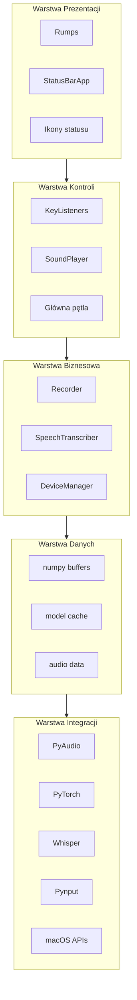
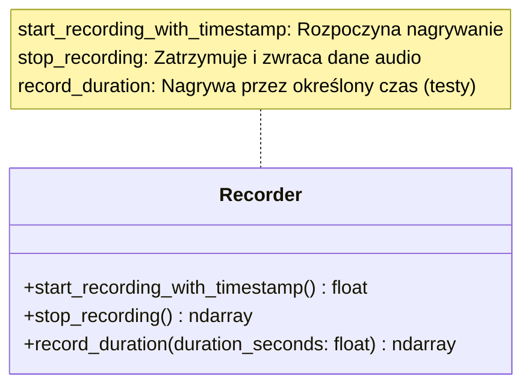
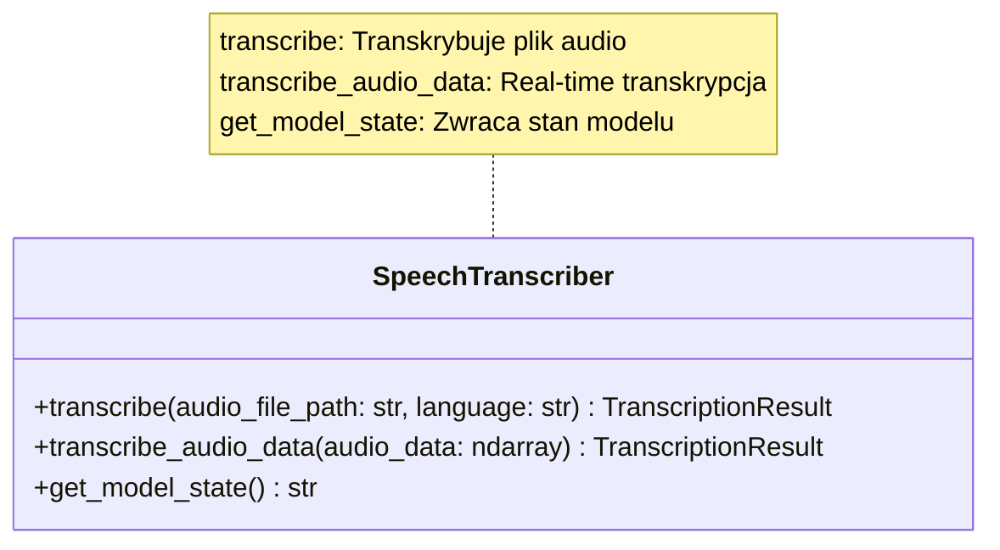
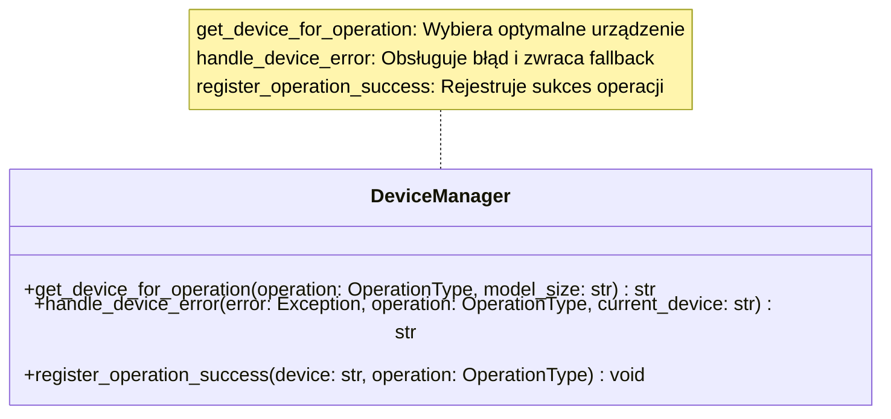

# Architektura aplikacji Whisper Dictation

## 1. Wprowadzenie

Whisper Dictation to wielojęzyczna aplikacja dyktowania oparta na modelu OpenAI Whisper ASR, zaprojektowana specjalnie dla platformy macOS z optymalizacją pod procesory Apple Silicon (M1/M2). Aplikacja działa jako demon systemowy uruchamiany za pomocą skrótów klawiszowych, zapewniając całkowicie offline konwersję mowy na tekst bez udostępniania danych użytkownika.

Architektura systemu została zaprojektowana z naciskiem na:
- **Modularność** - wyraźne rozdzielenie odpowiedzialności między komponenty
- **Wydajność** - inteligentne zarządzanie urządzeniami (CPU/GPU) dla optymalnej wydajności
- **Niezawodność** - mechanizmy fallback i obsługa błędów specyficznych dla Apple Silicon
- **Prywatność** - całkowicie offline przetwarzanie bez wysyłania danych

System wykorzystuje warstwową architekturę, gdzie każda warstwa ma jasno określone zadania i zależności, co umożliwia łatwe testowanie, rozwój i utrzymanie kodu.

## 2. Warstwy systemu

Aplikacja została zorganizowana w pięć głównych warstw, z wyraźnym rozdzieleniem odpowiedzialności:

**Diagram warstw systemu:**



### 2.1. Warstwa Prezentacji

**Odpowiedzialność**: Interfejs użytkownika, wizualna reprezentacja stanu aplikacji

**Komponenty**:
- `StatusBarApp` (rumps.App) - ikona w menu bar z opcjami
- Ikony statusu - reprezentacja wizualna stanu (⏯, 🔴, timer)
- Menu kontekstowe - opcje startu/stopu, wybór języka

**Zależności**: 
- macOS Menu Bar API (przez rumps)
- System dźwięków macOS

**Charakterystyka**:
- Minimalistyczny interfejs nie przeszkadzający w pracy
- Dynamiczna aktualizacja tytułu z timerem nagrywania
- Ikony zmieniające się w zależności od stanu (idle → recording → transcribing)

### 2.2. Warstwa Kontroli

**Odpowiedzialność**: Zarządzanie cyklem życia aplikacji, obsługa zdarzeń użytkownika

**Komponenty**:
- `GlobalKeyListener` - obsługa kombinacji klawiszy (cmd+alt)
- `DoubleCommandKeyListener` - specjalny tryb dla podwójnego cmd
- `SoundPlayer` - feedback dźwiękowy (rozpoczęcie/zakończenie nagrywania)
- Główna pętla aplikacji w `whisper-dictation.py`

**Zależności**: 
- `pynput` - globalne przechwytywanie skrótów klawiszowych
- `afplay` - odtwarzacz dźwięków systemowych macOS
- `threading` - asynchroniczna obsługa zdarzeń

**Charakterystyka**:
- Nie blokujący model obsługi zdarzeń
- Separacja logiki nagrywania od interfejsu użytkownika
- Feedback audio wzorowany na systemowym rozpoznawaniu mowy macOS

### 2.3. Warstwa Biznesowa

**Odpowiedzialność**: Kluczowa logika aplikacji - nagrywanie i transkrypcja

**Komponenty**:

#### Recorder
- Zarządzanie strumieniem audio przez PyAudio
- Buforowanie danych audio w czasie rzeczywistym
- Konwersja formatów audio (int16 → float32)
- Wsparcie dla testów TDD (timestamp, duration)

**Kluczowe metody:**



#### SpeechTranscriber
- Zarządzanie modelami Whisper (tiny, base, small, medium, large)
- Wykrywanie języka z ograniczeniami (allowed_languages)
- Optymalizacja ustawień transkrypcji dla różnych urządzeń
- Automatyczna konwersja transkrypcji na wpisywany tekst

**Kluczowe metody:**



#### DeviceManager
- Centralne zarządzanie urządzeniami (CPU, MPS, CUDA)
- Testowanie możliwości urządzeń przy inicjalizacji
- Historia operacji dla inteligentnego wyboru urządzenia
- Automatyczny fallback przy błędach

**Kluczowe metody:**



#### MPSOptimizer & EnhancedDeviceManager
- Specjalistyczna obsługa błędów MPS (Apple Silicon)
- Optymalizacja ustawień Whisper dla M1/M2
- Przyjazne użytkownikowi komunikaty błędów (po polsku)
- Monitorowanie zużycia pamięci

**Zależności**:
- PyAudio - nagrywanie audio
- PyTorch - framework ML
- Whisper - silnik ASR
- numpy - przetwarzanie danych audio

### 2.4. Warstwa Danych

**Odpowiedzialność**: Przechowywanie i zarządzanie danymi

**Komponenty**:
- **Bufory audio** - numpy arrays przechowujące próbki audio (float32)
- **Cache modeli** - `~/.cache/whisper/` przechowuje pobrane modele Whisper
- **Historia operacji** - tracking sukcesu/porażki operacji na urządzeniach
- **Capabilities cache** - informacje o możliwościach urządzeń

**Charakterystyka**:
- Brak persystencji danych audio (prywatność)
- Modele cachowane lokalnie po pierwszym pobraniu
- Dynamiczne zarządzanie pamięcią dla różnych rozmiarów modeli
- Historia operacji w pamięci (nie persystowana)

### 2.5. Warstwa Integracji

**Odpowiedzialność**: Integracja z zewnętrznymi bibliotekami i API systemowymi

**Komponenty**:
- **PyAudio/PortAudio** - interfejs do urządzeń audio
- **PyTorch** - framework ML z backendami (CPU, MPS, CUDA)
- **Whisper API** - silnik rozpoznawania mowy
- **Pynput** - przechwytywanie globalnych skrótów klawiszowych
- **macOS APIs** - menu bar, dźwięki systemowe, dostęp do mikrofonu

**Zależności systemowe**:
```bash
brew install portaudio llvm  # Wymagane biblioteki systemowe
```

**Uprawnienia systemowe**:
- Dostęp do mikrofonu (Privacy Settings)
- Accessibility permissions (globalne skróty klawiszowe)

## 3. Komponenty główne

### 3.1. WhisperDictation (Main App)

**Plik**: `whisper-dictation.py`

**Odpowiedzialność**: 
- Punkt wejścia aplikacji
- Inicjalizacja wszystkich komponentów
- Parsowanie argumentów wiersza poleceń
- Zarządzanie główną pętlą aplikacji

**Kluczowe metody**: Inicjalizacja `DeviceManager`, ładowanie modelu z fallbackiem, parsowanie argumentów CLI.

**Zależności**:
- `SpeechTranscriber` - silnik transkrypcji
- `Recorder` - moduł nagrywania
- `StatusBarApp` - interfejs użytkownika
- `EnhancedDeviceManager` - zarządzanie urządzeniami
- `GlobalKeyListener` / `DoubleCommandKeyListener` - obsługa skrótów

**Argumenty CLI**:
- `-m, --model_name` - rozmiar modelu (tiny/base/small/medium/large)
- `-k, --key_combination` - kombinacja klawiszy (np. cmd_l+alt)
- `--k_double_cmd` - tryb podwójnego Command (jak w systemowym dyktowaniu)
- `-l, --language` - wymuszone języki (np. "en,pl")
- `--allowed_languages` - ograniczenie detekcji języka
- `-t, --max_time` - maksymalny czas nagrywania (domyślnie 30s)

### 3.2. Recorder

**Plik**: `recorder.py`

**Odpowiedzialność**:
- Zarządzanie strumieniem audio z mikrofonu
- Buforowanie danych audio w czasie rzeczywistym
- Precyzyjne timestamping (dla testów wydajności)
- Zapis nagrań do plików WAV (dla testów)

**Kluczowe metody**: `start_recording_with_timestamp()`, `stop_recording()`, `record_duration()`.

**Parametry audio**: `sample_rate = 16000`, `channels = 1`, `format = pyaudio.paInt16`, `chunk_size = 1024`.

**Zależności**:
- `pyaudio` - interfejs do urządzeń audio
- `numpy` - przetwarzanie danych audio
- `wave` - zapis do plików WAV
- `SpeechTranscriber` - opcjonalny, do automatycznej transkrypcji

**Przepływ nagrywania**:
1. Inicjalizacja PyAudio interface
2. Otwarcie strumienia audio (16kHz, mono, int16)
3. Ciągłe czytanie chunks do bufora
4. Przy stop: zamknięcie strumienia
5. Konwersja int16 → float32 z normalizacją

### 3.3. SpeechTranscriber

**Plik**: `transcriber.py`

**Odpowiedzialność**:
- Zarządzanie modelami Whisper (ładowanie, cache, przełączanie)
- Transkrypcja audio z automatyczną detekcją języka
- Optymalizacja ustawień dla różnych urządzeń (CPU/MPS)
- Integracja z DeviceManager dla fallback

**Kluczowe metody**: `__init__()`, `transcribe()`, `transcribe_audio_data()`.

**Struktura wyniku**: `TranscriptionResult` (text: str, language: str, detection_time: float, transcription_time: float).

**Zależności**:
- `whisper` - silnik ASR OpenAI
- `torch` - PyTorch framework
- `EnhancedDeviceManager` - inteligentne zarządzanie urządzeniami
- `numpy` - przetwarzanie audio

**Optymalizacje urządzeń**:
- **MPS (M1/M2)**: fp16=True, beam_size=1, pojedynczy pass
- **CPU**: fp16=False, beam_size=5 (dla tiny/base), lepszy context
- **CUDA**: (jeśli dostępne) podobne do MPS

**Obsługa błędów**:
- Automatyczny fallback MPS → CPU przy błędach SparseMPS
- Przyjazne komunikaty błędów po polsku
- Rejestracja sukcesu/porażki dla przyszłych decyzji

### 3.4. DeviceManager

**Plik**: `device_manager.py`

**Odpowiedzialność**:
- Centralne zarządzanie urządzeniami obliczeniowymi
- Testowanie możliwości urządzeń przy starcie
- Śledzenie historii operacji (sukces/porażka)
- Inteligentny wybór urządzenia na podstawie historii

**Kluczowe metody**: `get_device_for_operation()`, `handle_device_error()`, `register_operation_success()`.

**Typy operacji** (enum): `MODEL_LOADING`, `TRANSCRIPTION`, `BASIC_TENSOR`.

**Capabilities testing**: Testowanie podstawowych operacji tensorowych i operacji podobnych do ładowania modelu.

**Historia operacji**: Słownik śledzący sukcesy/porażki operacji dla każdej kombinacji urządzenia i operacji.

### 3.5. MPSOptimizer & EnhancedDeviceManager

**Plik**: `mps_optimizer.py`

**Odpowiedzialność**:
- Specjalistyczna obsługa błędów MPS (Apple Silicon)
- Kategoryzacja błędów MPS (SparseMPS, memory format, OOM)
- Optymalizacja ustawień Whisper dla M1/M2
- Przyjazne użytkownikowi komunikaty (po polsku)

**Komponenty**: `MPSErrorHandler` (kategoryzacja błędów MPS), `MPSOptimizer` (optymalne ustawienia Whisper dla M1/M2), `EnhancedDeviceManager` (wrapper łączący `DeviceManager` + `MPSOptimizer` + `MPSErrorHandler`).

**Przykład użycia w kodzie**: Inicjalizacja `EnhancedDeviceManager`, wybór urządzenia, ładowanie i optymalizacja modelu, obsługa błędów z fallbackiem.

## 4. Diagram architektury

Szczegółowy diagram warstw systemu znajduje się w:

**[Diagram warstw architektury](./diagrams/architecture-layers.mmd)**

Diagram przedstawia:
- 5 głównych warstw systemu
- Przepływ danych między warstwami
- Kluczowe komponenty w każdej warstwie
- Zależności między komponentami
- Integracje z zewnętrznymi bibliotekami

Aby wyświetlić diagram, użyj narzędzi obsługujących Mermaid (np. GitHub, VS Code z rozszerzeniem Mermaid, IntelliJ).

## 5. Wzorce projektowe

Szczegółowy opis wzorców projektowych użytych w systemie, wraz z przykładami implementacji i uzasadnieniem, znajduje się w dedykowanym dokumencie:

- **[Szczegóły Implementacji Architektury - Wzorce Projektowe](./architecture/IMPLEMENTATION.md#implementacja-wzorców-projektowych)**

## 6. Kluczowe decyzje architektoniczne

Dokumentacja najważniejszych decyzji architektonicznych (Architecture Decision Records - ADR) znajduje się w dedykowanym katalogu:

- **[ADR-001: Dwie równoległe implementacje (Python vs C++)](./architecture/ADR/ADR-001-dual-implementations.md)**
- **[ADR-002: Całkowicie offline processing](./architecture/ADR/ADR-002-offline-processing.md)**
- **[ADR-003: Dedykowany DeviceManager dla M1/M2](./architecture/ADR/ADR-003-device-manager.md)**
- **[ADR-004: Rumps dla menu bar (zamiast native AppKit)](./architecture/ADR/ADR-004-rumps-for-menu-bar.md)**
- **[ADR-005: Threading model (Background recording + UI thread)](./architecture/ADR/ADR-005-threading-model.md)**

Pełny indeks ADR-ów znajduje się w **[docs/architecture/ADR/README.md](./architecture/ADR/README.md)**.

## 7. Obszary ryzyka

Szczegółowa analiza ryzyk architektonicznych, wraz z ich opisem, wagą i strategiami mitygacji, znajduje się w dedykowanym dokumencie:

- **[Analiza Ryzyk Architektury](./architecture/RISKS.md)**


## 8. Powiązane dokumenty

- **[README](../README.md)** - szczegółowa dokumentacja projektu, instalacja i użycie
- **[Przegląd projektu](./PROJECT_OVERVIEW.md)** - cel aplikacji, stos technologiczny, kluczowe funkcjonalności
- **[Diagram warstw architektury](./diagrams/architecture-layers.mmd)** - szczegółowy diagram 5 warstw systemu
- **[Diagram systemowy](./diagrams/system-overview.mmd)** - overview komponentów i przepływów
- **[Szczegóły Implementacji Architektury](./architecture/IMPLEMENTATION.md)** - szczegółowe przykłady wzorców projektowych i implementacji
- **[Analiza Ryzyk Architektury](./architecture/RISKS.md)** - szczegółowa analiza ryzyk i mitygacji
- **[Indeks ADR](./architecture/ADR/README.md)** - indeks wszystkich decyzji architektonicznych
- **[Dokumentacja Warstw Architektury](./architecture/layers/README.md)** - szczegółowa dokumentacja każdej warstwy

---

## Metadata

**Wersja dokumentu**: 1.1  
**Data utworzenia**: 2025-10-10  
**Ostatnia aktualizacja**: 2025-10-19  
**Autor**: AI Agent (based on codebase analysis and restructuring)  
**Status**: ✅ Ukończone i zrestrukturyzowane  

**Changelog**:
- 2025-10-19: Restrukturyzacja dokumentu, przeniesienie szczegółów do ADR, IMPLEMENTATION i RISKS.md, kondensacja treści.
- 2025-10-10: Initial version - comprehensive architecture documentation based on actual code analysis
