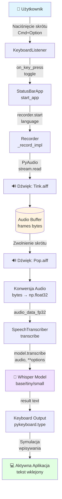

# DATA_FLOW.md - Przepływ Danych w Aplikacji Whisper Dictation

## 1. Wprowadzenie

Ten dokument opisuje szczegółowo przepływy danych w aplikacji Whisper Dictation - od momentu naciśnięcia skrótu klawiszowego przez użytkownika, aż do wklejenia transkrybowanego tekstu do aktywnej aplikacji.

### 1.1. Główne komponenty

- **GlobalKeyListener / DoubleCommandKeyListener** - nasłuchiwanie skrótów klawiszowych
- **StatusBarApp** - interfejs użytkownika w pasku menu macOS (rumps)
- **Recorder** - moduł nagrywania audio przez PyAudio
- **SpeechTranscriber** - moduł transkrypcji wykorzystujący OpenAI Whisper
- **DeviceManager / EnhancedDeviceManager** - zarządzanie urządzeniami (CPU/MPS/CUDA)
- **SoundPlayer** - odtwarzanie dźwięków systemowych (Tink.aiff, Pop.aiff)

### 1.2. Formaty danych w systemie

| Typ danych | Format | Opis |
|------------|--------|------|
| **Audio surowe** | `bytes` (paInt16) | Dane z mikrofonu, 16-bit PCM, mono, 16kHz |
| **Audio przetworzone** | `np.float32` | Znormalizowane: wartości w zakresie [-1.0, 1.0] |
| **Transkrypcja** | `str` (UTF-8) | Wynik z modelu Whisper |
| **Konfiguracja** | `dict` | Opcje transkrypcji (język, model, próg, FP16) |
| **Stan urządzenia** | `str` | "cpu", "mps", lub "cuda" |

---

## 2. Główny Przepływ - Happy Path

### 2.1. Przegląd kroku po kroku

1. **Inicjalizacja aplikacji**
   - Ładowanie modelu Whisper (tiny/base/small/medium/large)
   - Wybór optymalnego urządzenia (CPU/MPS/CUDA) przez DeviceManager
   - Optymalizacja modelu dla wybranego urządzenia
   - Rejestracja listenera klawiatury

2. **Użytkownik naciska skrót klawiszowy**
   - Domyślnie: `Cmd+Option` (macOS) lub `Ctrl+Alt` (inne)
   - Alternatywnie: podwójne naciśnięcie `Right Command` (--k_double_cmd)

3. **Rozpoczęcie nagrywania**
   - StatusBarApp wywołuje `recorder.start(language)`
   - Odtwarzanie dźwięku "Tink.aiff" (start recording)
   - Timer rozpoczyna odliczanie w ikonie paska menu (🔴)
   - Opcjonalny limit czasu (domyślnie 30s)

4. **Nagrywanie audio**
   - Otwiercie strumienia PyAudio:
     - Format: 16-bit PCM (paInt16)
     - Kanały: 1 (mono)
     - Częstotliwość: 16000 Hz
     - Bufor: 1024 próbki na ramkę
   - Ciągłe zapisywanie ramek audio do listy `frames[]`

5. **Użytkownik zatrzymuje nagrywanie**
   - Zwolnienie skrótu klawiszowego lub upływ max_time
   - StatusBarApp wywołuje `recorder.stop()`

6. **Przetwarzanie audio**
   - Zamknięcie strumienia PyAudio
   - Odtwarzanie dźwięku "Pop.aiff" (stop recording)
   - Konwersja: `bytes` → `np.int16` → `np.float32` (normalizacja przez 32768.0)

7. **Transkrypcja**
   - Wywołanie `transcriber.transcribe(audio_data, language)`
   - Detekcja języka (jeśli nie określono)
   - Walidacja języka względem `allowed_languages` (jeśli ustawione)
   - Model Whisper przetwarza audio z optymalizacjami:
     - FP16 na MPS/CUDA
     - Progi: `no_speech_threshold=0.6`, `logprob_threshold=-1.0`
     - Obsługa błędów z automatycznym fallback (MPS→CPU)

8. **Wklejanie tekstu**
   - Iteracja przez każdy znak w `result["text"]`
   - Pomijanie pierwszej spacji
   - Symulacja wpisywania przez `pykeyboard.type(element)`
   - Opóźnienie 2.5ms między znakami (`time.sleep(0.0025)`)

9. **Powrót do stanu gotowości**
   - Ikona w pasku menu wraca do "⏯"
   - Menu "Start Recording" aktywne ponownie

### 2.2. Schemat przepływu danych



**Kluczowe punkty przepływu:**
- **Capture**: Nagrywanie audio jako 16-bit PCM przy 16kHz
- **Transform**: Normalizacja do float32 w zakresie [-1.0, 1.0]
- **Process**: Model Whisper przetwarza audio z optymalizacjami (FP16 na MPS/CUDA)
- **Output**: Symulacja wpisywania z opóźnieniem 2.5ms między znakami

---

## 3. Diagram Sekwencji - Main Flow

**Plik**: [`docs/diagrams/sequence-main-flow.mmd`](./diagrams/sequence-main-flow.mmd)

Diagram przedstawia szczegółową sekwencję interakcji między komponentami podczas prawidłowego przepływu (happy path). Zawiera:

- Interakcję użytkownika z systemem
- Komunikację między komponentami
- Przepływ danych audio
- Proces transkrypcji
- Wklejanie tekstu

[Zobacz diagram →](./diagrams/sequence-main-flow.mmd)

---

## 4. Obsługa Błędów

### 4.1. Typy błędów

#### 4.1.1. Błędy inicjalizacji

| Błąd | Przyczyna | Obsługa |
|------|-----------|---------|
| **Model nie załadowany** | Brak pliku w cache, błąd pobierania | Komunikat + pytanie o pobranie |
| **Urządzenie niedostępne** | MPS/CUDA nie działa | Automatyczny fallback na CPU |
| **Brak pamięci** | Model za duży dla urządzenia | Fallback + komunikat |

**Kod obsługi** (whisper-dictation.py:337-353):
```python
try:
    model = load_model(model_name, device=device)
except Exception as e:
    if device_manager.base_manager.should_retry_with_fallback(e):
        fallback_device, user_message = device_manager.handle_device_error_enhanced(...)
        # Retry z fallback device
```

#### 4.1.2. Błędy nagrywania

| Błąd | Przyczyna | Obsługa |
|------|-----------|---------|
| **Brak mikrofonu** | Mikrofon odłączony/zajęty | PyAudio exception → komunikat |
| **Stream overflow** | Bufor przepełniony | `exception_on_overflow=False` |
| **Brak uprawnień** | System nie zezwala na dostęp | Komunikat systemowy macOS |

**Kod obsługi** (recorder.py:147-152):
```python
try:
    data = self.stream.read(self.chunk_size, exception_on_overflow=False)
except Exception as e:
    print(f"Recording error: {e}")
    break
```

#### 4.1.3. Błędy transkrypcji

| Błąd | Przyczyna | Obsługa |
|------|-----------|---------|
| **OOM (Out of Memory)** | Audio za długie dla urządzenia | Fallback CPU + retry |
| **Timeout** | Model zawiesił się | Timeout nie zaimplementowany (TODO) |
| **Invalid audio** | Pusta/nieprawidłowa próbka | Cichy błąd (brak wyjścia) |
| **Language mismatch** | Język poza `allowed_languages` | Wymuszenie pierwszego z allowed |

**Kod obsługi detekcji języka** (whisper-dictation.py:47-59):
```python
if self.allowed_languages and language is None:
    result = self.model.transcribe(audio_data, ...)
    detected_lang = result.get('language', 'en')
    
    if detected_lang not in self.allowed_languages:
        options["language"] = self.allowed_languages[0]  # Override
    
    result = self.model.transcribe(audio_data, **options)  # Re-transcribe
```

**Kod obsługi fallback** (transcriber.py:145-169):
```python
try:
    result = self.model.transcribe(audio_file, **options)
except Exception as e:
    if self.device_manager.base_manager.should_retry_with_fallback(e):
        fallback_device, user_message = device_manager.handle_device_error_enhanced(...)
        # Move model to fallback device
        self.model = self.model.to(fallback_device)
        # Retry with optimized settings for fallback
```

#### 4.1.4. Błędy wklejania tekstu

| Błąd | Przyczyna | Obsługa |
|------|-----------|---------|
| **Keyboard input blocked** | Brak uprawnień accessibility | `try-except pass` - cichy błąd |
| **Special characters** | Znaki niedostępne na klawiaturze | `try-except pass` |

**Kod obsługi** (whisper-dictation.py:69-73):
```python
try:
    self.pykeyboard.type(element)
    time.sleep(0.0025)
except:
    pass  # Cicho ignorujemy błędy wpisywania
```

### 4.2. Strategia odzyskiwania (Recovery Strategy)

#### Device Fallback Chain:
```
MPS (M1/M2 GPU) → CUDA (NVIDIA GPU) → CPU
```

**DeviceManager** śledzi:
- Historię błędów dla każdego urządzenia
- Licznik sukcesów dla operacji (MODEL_LOADING, TRANSCRIPTION)
- Automatyczny wybór urządzenia na podstawie kontekstu

#### Enhanced Error Messages:
DeviceManager dostarcza przyjazne komunikaty po polsku:
- "🔄 Wykryto problem z MPS. Przełączam na CPU dla stabilności."
- "✅ Model załadowany pomyślnie na urządzeniu: cpu"

---

## 5. Diagram Sekwencji - Error Handling

**Plik**: [`docs/diagrams/sequence-error-handling.mmd`](./diagrams/sequence-error-handling.mmd)

Diagram przedstawia różne scenariusze błędów i ich obsługę:

- Brak mikrofonu
- Model nie załadowany / OOM
- Błędy urządzenia (MPS/CUDA)
- Timeout transkrypcji
- Automatyczny fallback

[Zobacz diagram →](./diagrams/sequence-error-handling.mmd)

---

## 6. Formaty Danych - Szczegóły Techniczne

### 6.1. Audio Pipeline

```
Mikrofon
  ↓ PyAudio capture
bytes[] (paInt16, 16kHz, mono)
  ↓ np.frombuffer(dtype=np.int16)
np.ndarray[int16]
  ↓ .astype(np.float32) / 32768.0
np.ndarray[float32] ∈ [-1.0, 1.0]
  ↓ Whisper model
str (UTF-8)
```

### 6.2. Konfiguracja transkrypcji

```python
options = {
    "fp16": device == "mps",              # Half precision na GPU
    "language": "pl" | "en" | None,       # Język (auto-detect jeśli None)
    "task": "transcribe",                 # Zawsze "transcribe" (nie "translate")
    "no_speech_threshold": 0.6,           # Próg detekcji mowy (wyższy = szybszy)
    "logprob_threshold": -1.0,            # Próg prawdopodobieństwa logicznego
    "compression_ratio_threshold": 2.4    # Próg kompresji tekstu
}
```

**Optymalizacje dla M1/M2 (MPS)**:
- `fp16=True` - znacząco przyspiesza inferancję
- `torch.set_grad_enabled(False)` - wyłącza gradienty (inferancja only)

### 6.3. Timing Audio

| Parametr | Wartość | Obliczenie |
|----------|---------|------------|
| Sample Rate | 16000 Hz | Standardowa częstotliwość dla ASR |
| Chunk Size | 1024 próbki | ~64ms audio na chunk |
| Chunk Frequency | ~15.6 Hz | 16000 / 1024 |
| Inter-char Delay | 2.5ms | Opóźnienie między znakami przy wpisywaniu |
| Typical Recording | 5-10s | Użytkownik mówi przez 5-10 sekund |

**Przykład**: 5-sekundowe nagranie
- Ramki: `5s × 16000 Hz / 1024 = ~78 chunks`
- Rozmiar bufora: `78 × 1024 × 2 bytes = ~160 KB`
- Po konwersji float32: `~320 KB`

### 6.4. Model Size vs Performance

| Model | Rozmiar | RAM (CPU) | VRAM (MPS) | Prędkość (CPU) | Prędkość (MPS) |
|-------|---------|-----------|------------|----------------|----------------|
| tiny | 75 MB | ~400 MB | ~1 GB | ~0.5x realtime | ~3x realtime |
| base | 145 MB | ~500 MB | ~1.2 GB | ~0.3x realtime | ~2x realtime |
| small | 483 MB | ~1 GB | ~2 GB | ~0.15x realtime | ~1x realtime |
| medium | 1.5 GB | ~2.5 GB | ~4 GB | ~0.05x realtime | ~0.5x realtime |
| large | 3 GB | ~5 GB | ~8 GB | ~0.02x realtime | ~0.3x realtime |

**Uwaga**: Prędkości są przybliżone i zależą od:
- Długości audio
- Jakości nagrania
- Konkretnego sprzętu (M1 vs M2 Pro)
- Obecności innych procesów

---

## 7. Szczegółowe Przepływy Warunkowe

### 7.1. Decyzja o języku transkrypcji

```
┌─────────────────────────────┐
│ Rozpoczęcie transkrypcji    │
└──────────┬──────────────────┘
           │
           ▼
      ┌─────────┐
      │ language │ Jest ustawiony jawnie?
      │ != None? │
      └─┬────┬──┘
        │NO  │YES
        │    │
        │    └──────────────────┐
        │                       │
        ▼                       ▼
┌─────────────────────┐  ┌──────────────────┐
│ allowed_languages?  │  │ Użyj language    │
└─┬────────────┬──────┘  │ w options        │
  │YES         │NO       └──────────────────┘
  │            │
  │            └──────────────┐
  │                           │
  ▼                           ▼
┌─────────────────────┐  ┌──────────────────┐
│ Auto-detect język   │  │ Auto-detect      │
│ transcribe(no lang) │  │ (bez ograniczeń) │
└──────┬──────────────┘  └──────────────────┘
       │
       ▼
┌──────────────────────┐
│ detected_lang in     │
│ allowed_languages?   │
└─┬───────────────┬────┘
  │NO             │YES
  │               │
  │               └──────────────┐
  │                              │
  ▼                              ▼
┌─────────────────────┐  ┌──────────────────┐
│ Override z           │  │ Użyj detected    │
│ allowed_languages[0] │  │ language         │
└──────┬──────────────┘  └──────────────────┘
       │
       └──────────┬──────────────┘
                  │
                  ▼
        ┌──────────────────┐
        │ Re-transcribe z  │
        │ wybranym językiem│
        └──────────────────┘
```

### 7.2. Fallback urządzenia przy błędzie

```
┌─────────────────────┐
│ model.transcribe()  │
└──────┬──────────────┘
       │
       ▼
┌──────────────────────┐
│ Wystąpił Exception?  │
└─┬──────────────────┬─┘
  │NO                │YES
  │                  │
  │                  ▼
  │      ┌─────────────────────────────┐
  │      │ should_retry_with_fallback? │
  │      └─┬─────────────────────────┬─┘
  │        │YES                      │NO
  │        │                         │
  │        ▼                         ▼
  │  ┌──────────────────────┐  ┌─────────┐
  │  │ Pobierz fallback     │  │ Rzuć    │
  │  │ device (MPS→CPU)     │  │ błąd    │
  │  └──────┬───────────────┘  └─────────┘
  │         │
  │         ▼
  │  ┌──────────────────────┐
  │  │ Print user_message   │
  │  │ "🔄 Przełączam..."   │
  │  └──────┬───────────────┘
  │         │
  │         ▼
  │  ┌──────────────────────┐
  │  │ model.to(fallback)   │
  │  │ optimize_model()     │
  │  └──────┬───────────────┘
  │         │
  │         ▼
  │  ┌──────────────────────┐
  │  │ Retry transcribe     │
  │  │ z fallback options   │
  │  └──────┬───────────────┘
  │         │
  │         ▼
  │  ┌──────────────────────┐
  │  │ register_success()   │
  │  └──────────────────────┘
  │         │
  └─────────┴─────────────────►
           │
           ▼
    ┌──────────────┐
    │ Return result│
    └──────────────┘
```

---

## 8. Integracje Zewnętrzne

### 8.1. PyAudio ↔ System Audio

- **macOS**: CoreAudio backend
- **Uprawnienia**: "Mikrofon" w System Settings → Privacy & Security
- **Domyślne urządzenie**: Używa domyślnego mikrofonu z ustawień systemu

### 8.2. Whisper Model ↔ Cache

- **Lokalizacja cache**: `~/.cache/whisper/`
- **Pierwsze uruchomienie**: Model pobierany z Hugging Face
- **Kolejne uruchomienia**: Ładowanie z cache (szybsze)

### 8.3. Keyboard Output ↔ macOS Accessibility

- **pynput** wymaga uprawnień Accessibility
- **Prompt systemowy**: Pojawia się przy pierwszym uruchomieniu
- **Manualny sposób**: System Settings → Privacy & Security → Accessibility → dodaj Terminal/Warp

### 8.4. Dźwięki Systemowe

- **Odtwarzacz**: `afplay` (command-line audio player na macOS)
- **Dźwięki**:
  - Start: `/System/Library/Sounds/Tink.aiff`
  - Stop: `/System/Library/Sounds/Pop.aiff`
- **Non-blocking**: Odtwarzanie w osobnym wątku

---

## 9. Performance Monitoring

### 9.1. Kluczowe metryki

| Metryka | Cel | Typowa Wartość |
|---------|-----|----------------|
| Model load time | < 5s | 2-3s (base/MPS) |
| Audio capture latency | < 100ms | ~64ms (chunk size) |
| Transcription time (5s audio) | < 2s | 1-1.5s (base/MPS) |
| Character typing speed | ~400 chars/s | 2.5ms/char |

### 9.2. TranscriptionResult tracking

```python
class TranscriptionResult:
    text: str
    language: str
    detection_time: float      # Czas detekcji języka
    transcription_time: float  # Czas transkrypcji
```

Użycie (transcriber.py:191-195):
```python
return TranscriptionResult(
    text=text,
    language=detected_language,
    detection_time=detection_time,
    transcription_time=transcription_time
)
```

---

## 10. Stan Aplikacji

### 10.1. StatusBarApp States

```
┌───────────┐
│  Idle     │  Icon: "⏯"
│ (gotowość)│  Menu: "Start Recording" ✓
└─────┬─────┘        "Stop Recording" ✗
      │
      │ start_app()
      ▼
┌───────────┐
│Recording  │  Icon: "(MM:SS) 🔴"
│ (nagrywa) │  Menu: "Start Recording" ✗
└─────┬─────┘        "Stop Recording" ✓
      │          Timer: max_time countdown
      │
      │ stop_app()
      ▼
┌───────────┐
│Processing │  Icon: "⏯" (przejściowo)
│(transkryp)│  Print: "Transcribing..."
└─────┬─────┘
      │
      │ (async transcription)
      ▼
┌───────────┐
│  Idle     │  Icon: "⏯"
│ (gotowość)│  Print: "Done."
└───────────┘
```

### 10.2. Recorder States

```
recording = False  →  start()  →  recording = True
                                        ↓
                                  stream.read()
                                        ↓
                      stop()  ←  recording = True
                        ↓
               recording = False
```

---

## 11. Threading Model

### 11.1. Główne wątki

1. **Main Thread (rumps.App)**
   - Event loop aplikacji statusbar
   - Obsługa menu clicks
   - Aktualizacja ikony (timer)

2. **Keyboard Listener Thread**
   - `pynput.keyboard.Listener`
   - Nasłuchiwanie na skróty
   - Wywołanie `app.toggle()`

3. **Recording Thread**
   - `threading.Thread(target=_record_impl)`
   - Capture audio w pętli while
   - Automatyczne zakończenie przy `recording=False`

4. **Sound Player Threads**
   - `threading.Thread(target=_play_sound)`
   - Non-blocking odtwarzanie Tink/Pop
   - Krótkotrwałe, natychmiastowe zakończenie

5. **Timer Thread (Optional)**
   - `threading.Timer(max_time, callback)`
   - Auto-stop po max_time sekund
   - Cancellable przed upływem czasu

### 11.2. Thread Safety

- **Brak shared state**: Większość operacji jest niezależna
- **recording flag**: Proste boolean (atomic w CPython)
- **PyAudio stream**: Używany tylko w recording thread
- **Model Whisper**: Thread-safe (inferancja read-only)

---

## 12. Powiązane Dokumenty

- [**Architektura Systemu**](./ARCHITECTURE.md) - struktura komponentów, diagramy warstw
- [**Przegląd Projektu**](./PROJECT_OVERVIEW.md) - cel, funkcjonalności, wymagania
- [**Plan Dokumentacji**](./DOCUMENTATION_PLAN.md) - status dokumentacji
- [**API Interfaces**](./API_INTERFACES.md) *(planowane)* - interfejsy publiczne modułów
- [**Diagram głównego przepływu**](./diagrams/sequence-main-flow.mmd) - sekwencja happy path
- [**Diagram obsługi błędów**](./diagrams/sequence-error-handling.mmd) - scenariusze błędów
- [**Diagram architektury warstw**](./diagrams/architecture-layers.mmd) - warstwy systemu

---

## 13. Changelog

| Data | Wersja | Autor | Zmiany |
|------|--------|-------|--------|
| 2025-10-10 | 1.0 | Agent | Utworzenie dokumentu na podstawie kodu |

---

## 14. TODO / Przyszłe Usprawnienia

### 14.1. Timeout handling
- [ ] Implementacja timeout dla transkrypcji (obecnie brak)
- [ ] Graceful cancel długich transkrypcji

### 14.2. Error notifications
- [ ] macOS native notifications dla błędów krytycznych
- [ ] Logging errors do pliku (obecnie tylko print)

### 14.3. Audio quality
- [ ] Noise reduction pre-processing
- [ ] VAD (Voice Activity Detection) - auto-trim ciszy

### 14.4. Performance
- [ ] Batch processing dla długich nagrań
- [ ] Streaming transcription (Whisper streaming API)

### 14.5. UX
- [ ] Progress bar dla długich transkrypcji
- [ ] Visual feedback podczas detekcji języka
- [ ] Configurable keyboard shortcuts w UI

---

**Koniec dokumentu DATA_FLOW.md**
