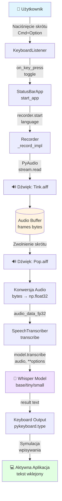
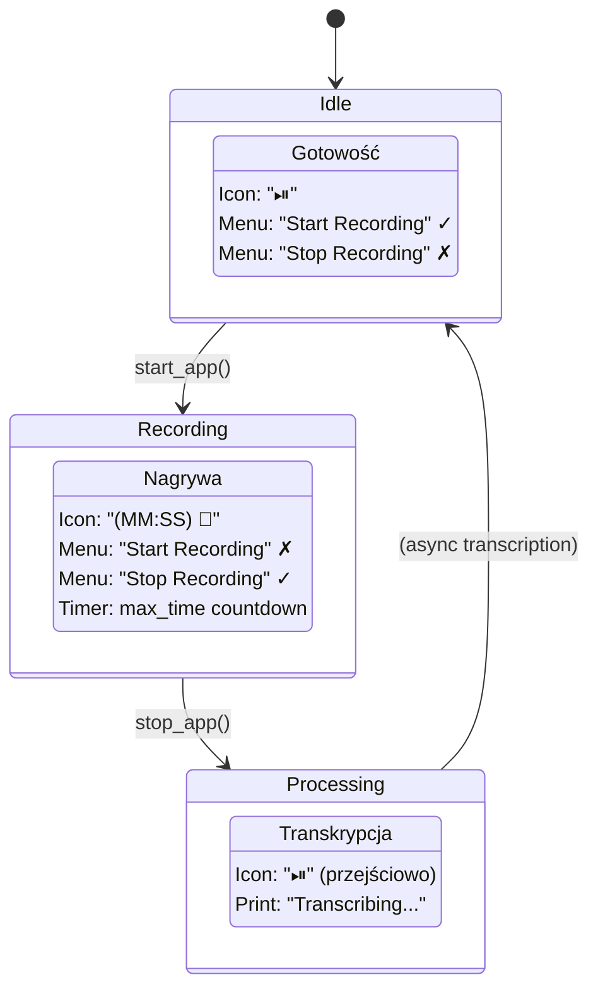

# DATA_FLOW.md - Przepływ Danych w Aplikacji Whisper Dictation

## 1. Wprowadzenie

Ten dokument opisuje szczegółowo przepływy danych w aplikacji Whisper Dictation - od momentu naciśnięcia skrótu klawiszowego przez użytkownika, aż do wklejenia transkrybowanego tekstu do aktywnej aplikacji.

### 1.1. Główne komponenty

- **GlobalKeyListener / DoubleCommandKeyListener** - nasłuchiwanie skrótów klawiszowych
- **StatusBarApp** - interfejs użytkownika w pasku menu macOS (rumps)
- **Recorder** - moduł nagrywania audio przez PyAudio
- **SpeechTranscriber** - moduł transkrypcji wykorzystujący OpenAI Whisper
- **DeviceManager / EnhancedDeviceManager** - zarządzanie urządzeniami (CPU/MPS/CUDA)
- **SoundPlayer** - odtwarzanie dźwięków systemowych (Tink.aiff, Pop.aiff)

### 1.2. Formaty danych w systemie

| Typ danych          | Format      | Opis                                      |
|---------------------|-------------|-------------------------------------------|
| **Audio surowe**    | `bytes`     | Dane z mikrofonu, 16-bit PCM, mono, 16kHz |
| **Audio przetworzone** | `np.float32` | Znormalizowane: wartości w zakresie [-1.0, 1.0] |
| **Transkrypcja**    | `str` (UTF-8) | Wynik z modelu Whisper                    |
| **Konfiguracja**    | `dict`      | Opcje transkrypcji (język, model, próg, FP16) |
| **Stan urządzenia** | `str`       | "cpu", "mps", lub "cuda"                |

---

## 2. Główny Przepływ - Happy Path

### 2.1. Przegląd kroku po kroku

Szczegółowy opis kroków realizacji głównego przepływu (Happy Path) znajduje się w dedykowanym dokumencie:

- **[Główny Przepływ - Kroki Realizacji](./processes/main_flow_steps.md)**

### 2.2. Schemat przepływu danych



**Kluczowe punkty przepływu:**
- **Capture**: Nagrywanie audio jako 16-bit PCM przy 16kHz
- **Transform**: Normalizacja do float32 w zakresie [-1.0, 1.0]
- **Process**: Model Whisper przetwarza audio z optymalizacjami (FP16 na MPS/CUDA)
- **Output**: Symulacja wpisywania z opóźnieniem 2.5ms między znakami

---

## 2.3. Diagram Sekwencji - Main Flow

**Plik**: [`docs/diagrams/sequence-main-flow.mmd`](./diagrams/sequence-main-flow.mmd)

Diagram przedstawia szczegółową sekwencję interakcji między komponentami podczas prawidłowego przepływu (happy path). Zawiera:

- Interakcję użytkownika z systemem
- Komunikację między komponentami
- Przepływ danych audio
- Proces transkrypcji
- Wklejanie tekstu

[Zobacz diagram →](./diagrams/sequence-main-flow.mmd)

---

## 3. Obsługa Błędów

Szczegółowy opis typów błędów, ich obsługi oraz strategii odzyskiwania znajduje się w dedykowanym dokumencie:

- **[Obsługa Błędów - Szczegóły](./processes/error_handling_details.md)**

---

## 4. Diagram Sekwencji - Error Handling

**Plik**: [`docs/diagrams/sequence-error-handling.mmd`](./diagrams/sequence-error-handling.mmd)

Diagram przedstawia różne scenariusze błędów i ich obsługę:

- Brak mikrofonu
- Model nie załadowany / OOM
- Błędy urządzenia (MPS/CUDA)
- Timeout transkrypcji
- Automatyczny fallback

[Zobacz diagram →](./diagrams/sequence-error-handling.mmd)

---

## 5. Formaty Danych - Szczegóły Techniczne

### 6.1. Audio Pipeline

```mermaid
flowchart TD
    A[Mikrofon] --> B{PyAudio capture}
    B --> C[bytes[] (paInt16, 16kHz, mono)]
    C --> D{np.frombuffer(dtype=np.int16)}
    D --> E[np.ndarray[int16]]
    E --> F{.astype(np.float32) / 32768.0}
    F --> G[np.ndarray[float32] ∈ [-1.0, 1.0]]
    G --> H{Whisper model}
    H --> I[str (UTF-8)]
```

### 6.2. Konfiguracja transkrypcji

**Konfiguracja transkrypcji**: Opcje transkrypcji obejmują `fp16` (half precision na GPU), `language` (język transkrypcji), `task` (zawsze "transcribe"), `no_speech_threshold`, `logprob_threshold` i `compression_ratio_threshold`.

**Optymalizacje dla M1/M2 (MPS)**:
- `fp16=True` - znacząco przyspiesza inferancję
- `torch.set_grad_enabled(False)` - wyłącza gradienty (inferancja only)

### 6.3. Timing Audio

| Parametr          | Wartość       | Obliczenie                               |
|-------------------|---------------|------------------------------------------|
| Sample Rate       | 16000 Hz      | Standardowa częstotliwość dla ASR        |
| Chunk Size        | 1024 próbki   | ~64ms audio na chunk                     |
| Chunk Frequency   | ~15.6 Hz      | 16000 / 1024                             |
| Inter-char Delay  | 2.5ms         | Opóźnienie między znakami przy wpisywaniu |
| Typical Recording | 5-10s         | Użytkownik mówi przez 5-10 sekund        |

**Przykład**: 5-sekundowe nagranie
- Ramki: `5s × 16000 Hz / 1024 = ~78 chunks`
- Rozmiar bufora: `78 × 1024 × 2 bytes = ~160 KB`
- Po konwersji float32: `~320 KB`

### 6.4. Model Size vs Performance

| Model  | Rozmiar | RAM (CPU) | VRAM (MPS) | Prędkość (CPU) | Prędkość (MPS) |
|--------|---------|-----------|------------|----------------|----------------|
| tiny   | 75 MB   | ~400 MB   | ~1 GB      | ~0.5x realtime | ~3x realtime   |
| base   | 145 MB  | ~500 MB   | ~1.2 GB    | ~0.3x realtime | ~2x realtime   |
| small  | 483 MB  | ~1 GB     | ~2 GB      | ~0.15x realtime | ~1x realtime   |
| medium | 1.5 GB  | ~2.5 GB   | ~4 GB      | ~0.05x realtime | ~0.5x realtime |
| large  | 3 GB    | ~5 GB     | ~8 GB      | ~0.02x realtime | ~0.3x realtime |

**Uwaga**: Prędkości są przybliżone i zależą od:
- Długości audio
- Jakości nagrania
- Konkretnego sprzętu (M1 vs M2 Pro)
- Obecności innych procesów

---

## 6. Szczegółowe Przepływy Warunkowe

### 7.1. Decyzja o języku transkrypcji

```mermaid
flowchart TD
    A[Rozpoczęcie transkrypcji] --> B{language jest ustawiony jawnie?}
    B -- No --> C{allowed_languages?}
    B -- Yes --> D[Użyj language w options]
    C -- Yes --> E[Auto-detect język]
    C -- No --> F[Auto-detect (bez ograniczeń)]
    E --> G{detected_lang in allowed_languages?}
    F --> G
    G -- No --> H[Override z allowed_languages[0]]
    G -- Yes --> I[Użyj detected language]
    H --> J[Re-transcribe z wybranym językiem]
    I --> J
    D --> J
```

### 7.2. Fallback urządzenia przy błędzie

```mermaid
flowchart TD
    A[model.transcribe()] --> B{Wystąpił Exception?}
    B -- No --> C[Return result]
    B -- Yes --> D{should_retry_with_fallback?}
    D -- No --> E[Rzuć błąd]
    D -- Yes --> F[Pobierz fallback device (MPS→CPU)]
    F --> G[Print user_message "🔄 Przełączam..."]
    G --> H[model.to(fallback) & optimize_model()]
    H --> I[Retry transcribe z fallback options]
    I --> J[register_success()]
    J --> C
```

---

## 7. Integracje Zewnętrzne

### 8.1. PyAudio ↔ System Audio

- **macOS**: CoreAudio backend
- **Uprawnienia**: "Mikrofon" w System Settings → Privacy & Security
- **Domyślne urządzenie**: Używa domyślnego mikrofonu z ustawień systemu

### 8.2. Whisper Model ↔ Cache

- **Lokalizacja cache**: `~/.cache/whisper/`
- **Pierwsze uruchomienie**: Model pobierany z Hugging Face
- **Kolejne uruchomienia**: Ładowanie z cache (szybsze)

### 8.3. Keyboard Output ↔ macOS Accessibility

- **pynput** wymaga uprawnień Accessibility
- **Prompt systemowy**: Pojawia się przy pierwszym uruchomieniu
- **Manualny sposób**: System Settings → Privacy & Security → Accessibility → dodaj Terminal/Warp

### 8.4. Dźwięki Systemowe

- **Odtwarzacz**: `afplay` (command-line audio player na macOS)
- **Dźwięki**:
  - Start: `/System/Library/Sounds/Tink.aiff`
  - Stop: `/System/Library/Sounds/Pop.aiff`
- **Non-blocking**: Odtwarzanie w osobnym wątku

---

## 8. Performance Monitoring

### 9.1. Kluczowe metryki

| Metryka                     | Cel     | Typowa Wartość |
|-----------------------------|---------|----------------|
| Model load time             | < 5s    | 2-3s (base/MPS) |
| Audio capture latency       | < 100ms | ~64ms (chunk size) |
| Transcription time (5s audio) | < 2s    | 1-1.5s (base/MPS) |
| Character typing speed      | ~400 chars/s | 2.5ms/char     |

### 9.2. TranscriptionResult tracking

**Użycie**: `TranscriptionResult` jest zwracany przez metody transkrypcji i zawiera `text`, `language`, `detection_time` i `transcription_time`.

---

## 9. Stan Aplikacji

### 10.1. StatusBarApp States



### 10.2. Recorder States

```mermaid
stateDiagram-v2
    [*] --> NotRecording
    NotRecording --> Recording: start()
    Recording --> NotRecording: stop()

    state NotRecording {
        NotRecording : recording = False
    }
    state Recording {
        Recording : recording = True
        Recording : stream.read() in progress
    }
```

---

## 10. Threading Model

### 11.1. Główne wątki

**Główne wątki**: Aplikacja wykorzystuje model wielowątkowy, gdzie główny wątek obsługuje UI (`rumps.App`), a osobne wątki są dedykowane dla `Keyboard Listener`, `Recording` i `Sound Player`. Opcjonalny wątek `Timer` jest używany do auto-stopu nagrywania.

### 11.2. Thread Safety

**Thread Safety**: Większość operacji jest niezależna. `recording flag` jest prostym booleanem. `PyAudio stream` jest używany tylko w wątku nagrywania. `Model Whisper` jest thread-safe (inferancja read-only).

---

## 11. Powiązane Dokumenty

- [**Architektura Systemu**](./ARCHITECTURE.md) - struktura komponentów, diagramy warstw
- [**Przegląd Projektu**](./PROJECT_OVERVIEW.md) - cel, funkcjonalności, wymagania
- [**Plan Dokumentacji**](./DOCUMENTATION_PLAN.md) - status dokumentacji
- [**API Interfaces**](./API_INTERFACES.md) *(planowane)* - interfejsy publiczne modułów
- [**Diagram głównego przepływu**](./diagrams/sequence-main-flow.mmd) - sekwencja happy path
- [**Diagram obsługi błędów**](./diagrams/sequence-error-handling.mmd) - scenariusze błędów
- [**Diagram architektury warstw**](./diagrams/architecture-layers.mmd) - warstwy systemu

---

## 12. Changelog

| Data       | Wersja | Autor | Zmiany                               |
|------------|--------|-------|--------------------------------------|
| 2025-10-10 | 1.0    | Agent | Utworzenie dokumentu na podstawie kodu |

---

## 13. TODO / Przyszłe Usprawnienia

### 14.1. Timeout handling
- [ ] Implementacja timeout dla transkrypcji (obecnie brak)
- [ ] Graceful cancel długich transkrypcji

### 14.2. Error notifications
- [ ] macOS native notifications dla błędów krytycznych
- [ ] Logging errors do pliku (obecnie tylko print)

### 14.3. Audio quality
- [ ] Noise reduction pre-processing
- [ ] VAD (Voice Activity Detection) - auto-trim ciszy

### 14.4. Performance
- [ ] Batch processing dla długich nagrań
- [ ] Streaming transcription (Whisper streaming API)

### 14.5. UX
- [ ] Progress bar dla długich transkrypcji
- [ ] Visual feedback podczas detekcji języka
- [ ] Configurable keyboard shortcuts w UI

---

## Metadata

**Wersja dokumentu**: 1.1  
**Data utworzenia**: 2025-10-10  
**Ostatnia aktualizacja**: 2025-10-19  
**Autor**: AI Agent  
**Status**: ✅ Ukończone  

**Changelog**:
- 2025-10-19: Zrestrukturyzowano sekcje, poprawiono numerację i formatowanie tabel, dodano diagramy Mermaid.
- 2025-10-10: Utworzenie dokumentu na podstawie kodu.

---

**Koniec dokumentu DATA_FLOW.md**
