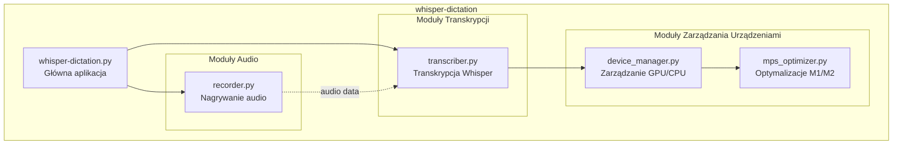
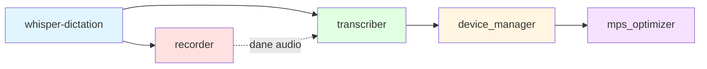
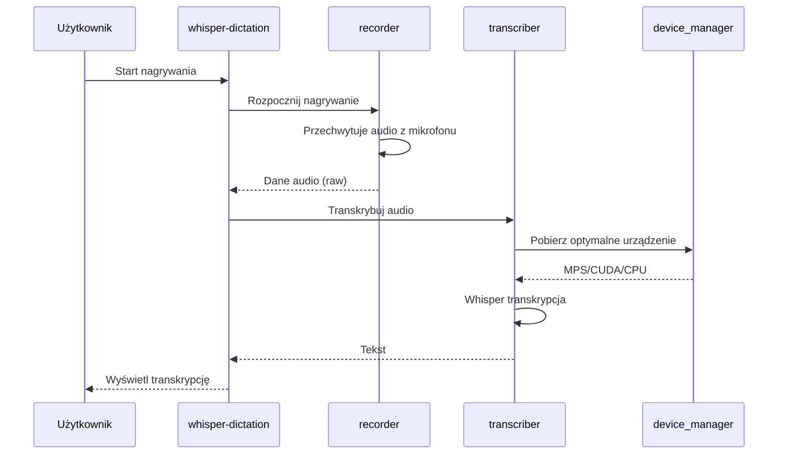
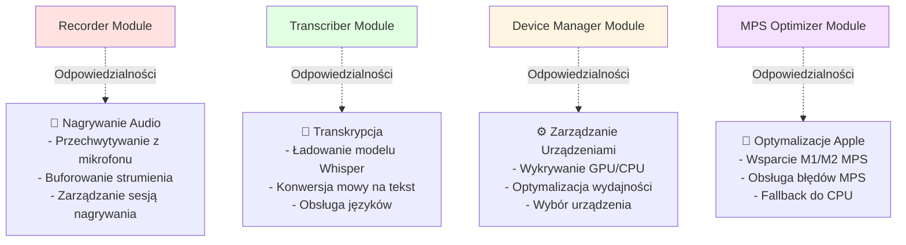
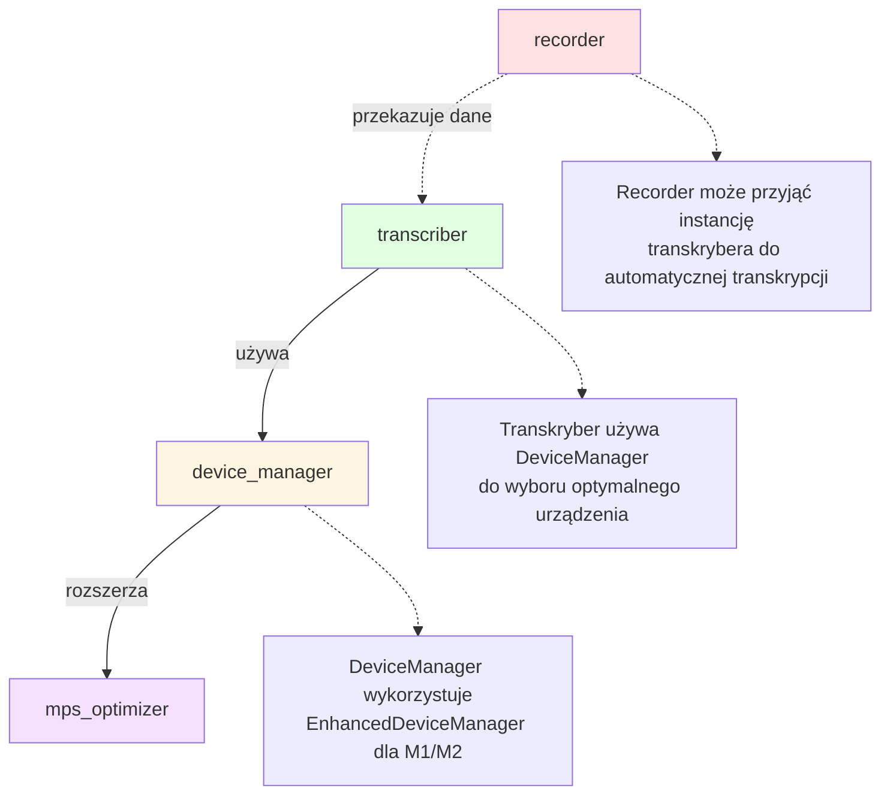

# Moduły Aplikacji whisper-dictation

## 1. Wprowadzenie

Ten dokument stanowi indeks głównych modułów aplikacji whisper-dictation. Każdy moduł ma jasno określoną odpowiedzialność i publiczne API, umożliwiając łatwą nawigację i zrozumienie architektury systemu.

Aplikacja whisper-dictation jest zbudowana modularnie, gdzie każdy komponent odpowiada za konkretny aspekt funkcjonalności: nagrywanie audio, transkrypcję mowy oraz zarządzanie urządzeniami przetwarzającymi (GPU/CPU).

## 2. Tabela Modułów

| Moduł | Odpowiedzialność | Dokumentacja |
|-------|------------------|--------------|
| whisper-dictation | Główna aplikacja - punkt wejścia, StatusBarApp, pętla zdarzeń | *W przygotowaniu* |
| recorder | Nagrywanie audio z mikrofonu | [recorder.md](./modules/recorder.md) |
| transcriber | Transkrypcja audio przy użyciu Whisper | [transcriber.md](./modules/transcriber.md) |
| device_manager | Zarządzanie GPU/CPU i optymalizacja dla M1/M2 | [device_manager.md](./modules/device_manager.md) |
| mps_optimizer | Optymalizacje M1/M2 GPU i obsługa błędów MPS | *Zintegrowane z device_manager.md* |

## 3. Graf Zależności

### Struktura Modułów

### Zależności Między Modułami

### Przepływ Danych

### Odpowiedzialności Modułów

### Kluczowe Zależności

## 4. Powiązane Dokumenty

- **[ARCHITECTURE.md](./ARCHITECTURE.md)** - Szczegółowy opis architektury systemu
- **[API_INTERFACES.md](./API_INTERFACES.md)** - Dokumentacja publicznych interfejsów API
- **[DATA_FLOW.md](./DATA_FLOW.md)** - Szczegółowy przepływ danych w systemie
- **[DOCUMENTATION_PLAN.md](./DOCUMENTATION_PLAN.md)** - Plan i status dokumentacji projektu

## 5. Wersjonowanie i Kompatybilność

Wszystkie moduły są zaprojektowane z myślą o TDD (Test-Driven Development) i posiadają:
- Jasne publiczne API
- Możliwość testowania jednostkowego
- Kompatybilność z różnymi urządzeniami (CPU, CUDA, MPS)

## 6. Rozpoczęcie Pracy

Aby rozpocząć pracę z modułami:

1. Sprawdź dokumentację konkretnego modułu w katalogu `docs/modules/`
2. Zobacz przykłady użycia w plikach testowych (`tests/`)
3. Przeczytaj ARCHITECTURE.md dla zrozumienia kontekstu systemowego

## 7. Rozwój i Rozszerzanie

Przy dodawaniu nowych modułów:
- Stwórz odpowiednią dokumentację w `docs/modules/`
- Zaktualizuj ten plik (MODULES.md) dodając wpis w tabeli
- Zaktualizuj graf zależności
- Dodaj testy jednostkowe dla nowego modułu

---

## Metadata

**Wersja dokumentu**: 1.1  
**Data utworzenia**: 2025-10-10  
**Ostatnia aktualizacja**: 2025-10-19  
**Autor**: AI Agent  
**Status**: ✅ Ukończone  

**Changelog**:
- 2025-10-19: Dodano diagramy Mermaid dla struktury, zależności i przepływu danych modułów.
- 2025-10-10: Utworzenie dokumentu na podstawie kodu.
