# Moduły Aplikacji whisper-dictation

## 1. Wprowadzenie

Ten dokument stanowi indeks głównych modułów aplikacji whisper-dictation. Każdy moduł ma jasno określoną odpowiedzialność i publiczne API, umożliwiając łatwą nawigację i zrozumienie architektury systemu.

Aplikacja whisper-dictation jest zbudowana modularnie, gdzie każdy komponent odpowiada za konkretny aspekt funkcjonalności: nagrywanie audio, transkrypcję mowy oraz zarządzanie urządzeniami przetwarzającymi (GPU/CPU).

## 2. Tabela Modułów

| Moduł | Odpowiedzialność | Dokumentacja |
|-------|------------------|--------------|
| whisper-dictation | Główna aplikacja - punkt wejścia, StatusBarApp, pętla zdarzeń | *W przygotowaniu* |
| recorder | Nagrywanie audio z mikrofonu | [recorder.md](./modules/recorder.md) |
| transcriber | Transkrypcja audio przy użyciu Whisper | [transcriber.md](./modules/transcriber.md) |
| device_manager | Zarządzanie GPU/CPU i optymalizacja dla M1/M2 | [device_manager.md](./modules/device_manager.md) |
| mps_optimizer | Optymalizacje M1/M2 GPU i obsługa błędów MPS | *Zintegrowane z device_manager.md* |

## 3. Graf Zależności

### Struktura Modułów

```mermaid
graph TD
    subgraph "whisper-dictation"
        A[whisper-dictation.py<br/>Główna aplikacja]
        
        subgraph "Moduły Audio"
            B[recorder.py<br/>Nagrywanie audio]
        end
        
        subgraph "Moduły Transkrypcji"
            C[transcriber.py<br/>Transkrypcja Whisper]
        end
        
        subgraph "Moduły Zarządzania Urządzeniami"
            D[device_manager.py<br/>Zarządzanie GPU/CPU]
            E[mps_optimizer.py<br/>Optymalizacje M1/M2]
        end
    end
    
    A --> B
    A --> C
    C --> D
    D --> E
    B -.->|audio data| C
```

### Zależności Między Modułami

### Przepływ Danych

```mermaid
sequenceDiagram
    participant U as Użytkownik
    participant A as whisper-dictation
    participant R as recorder
    participant T as transcriber
    participant D as device_manager
    
    U->>A: Start nagrywania
    A->>R: Rozpocznij nagrywanie
    R->>R: Przechwytuje audio z mikrofonu
    R-->>A: Dane audio (raw)
    A->>T: Transkrybuj audio
    T->>D: Pobierz optymalne urządzenie
    D-->>T: MPS/CUDA/CPU
    T->>T: Whisper transkrypcja
    T-->>A: Tekst
    A-->>U: Wyświetl transkrypcję
```

### Odpowiedzialności Modułów

```mermaid
graph TD
    A[Recorder Module]
    B[Transcriber Module]
    C[Device Manager Module]
    D[MPS Optimizer Module]
    
    A -.->|Odpowiedzialności| A1["📼 Nagrywanie Audio<br/>- Przechwytywanie z mikrofonu<br/>- Buforowanie strumienia<br/>- Zarządzanie sesją nagrywania"]
    
    B -.->|Odpowiedzialności| B1["🎯 Transkrypcja<br/>- Ładowanie modelu Whisper<br/>- Konwersja mowy na tekst<br/>- Obsługa języków"]
    
    C -.->|Odpowiedzialności| C1["⚙️ Zarządzanie Urządzeniami<br/>- Wykrywanie GPU/CPU<br/>- Optymalizacja wydajności<br/>- Wybór urządzenia"]
    
    D -.->|Odpowiedzialności| D1["🍎 Optymalizacje Apple<br/>- Wsparcie M1/M2 MPS<br/>- Obsługa błędów MPS<br/>- Fallback do CPU"]
    
    style A fill:#ffe1e1
    style B fill:#e1ffe1
    style C fill:#fff5e1
    style D fill:#f5e1ff
```

### Kluczowe Zależności

## 4. Powiązane Dokumenty

- **[ARCHITECTURE.md](./ARCHITECTURE.md)** - Szczegółowy opis architektury systemu
- **[API_INTERFACES.md](./API_INTERFACES.md)** - Dokumentacja publicznych interfejsów API
- **[DATA_FLOW.md](./DATA_FLOW.md)** - Szczegółowy przepływ danych w systemie
- **[DOCUMENTATION_PLAN.md](./DOCUMENTATION_PLAN.md)** - Plan i status dokumentacji projektu

## 5. Wersjonowanie i Kompatybilność

Wszystkie moduły są zaprojektowane z myślą o TDD (Test-Driven Development) i posiadają:
- Jasne publiczne API
- Możliwość testowania jednostkowego
- Kompatybilność z różnymi urządzeniami (CPU, CUDA, MPS)

## 6. Rozpoczęcie Pracy

Aby rozpocząć pracę z modułami:

1. Sprawdź dokumentację konkretnego modułu w katalogu `docs/modules/`
2. Zobacz przykłady użycia w plikach testowych (`tests/`)
3. Przeczytaj ARCHITECTURE.md dla zrozumienia kontekstu systemowego

## 7. Rozwój i Rozszerzanie

Przy dodawaniu nowych modułów:
- Stwórz odpowiednią dokumentację w `docs/modules/`
- Zaktualizuj ten plik (MODULES.md) dodając wpis w tabeli
- Zaktualizuj graf zależności
- Dodaj testy jednostkowe dla nowego modułu
