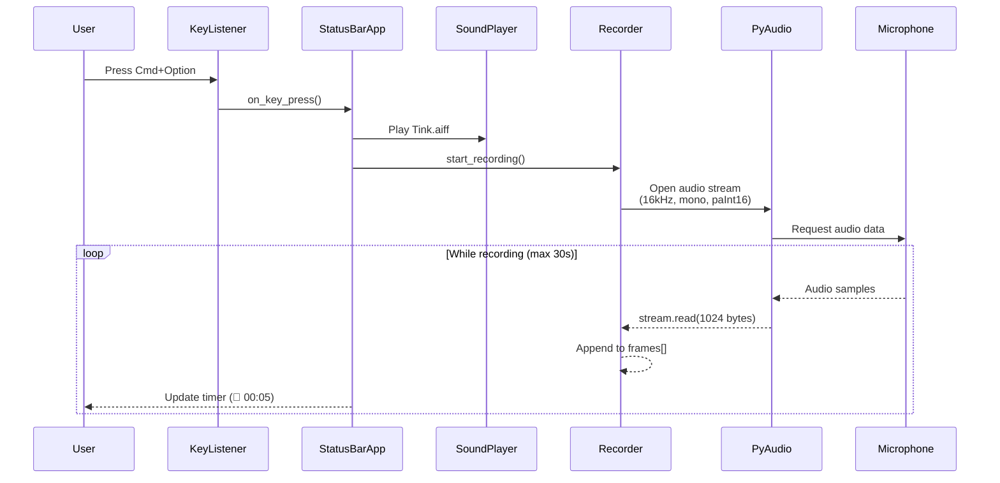
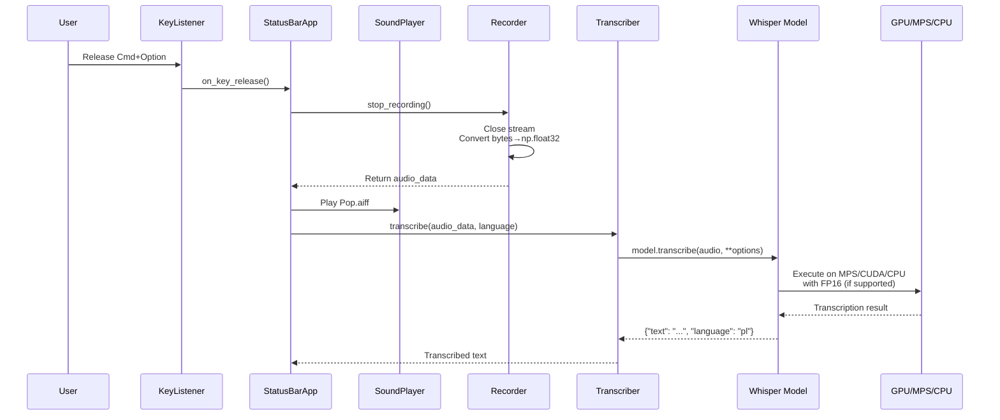
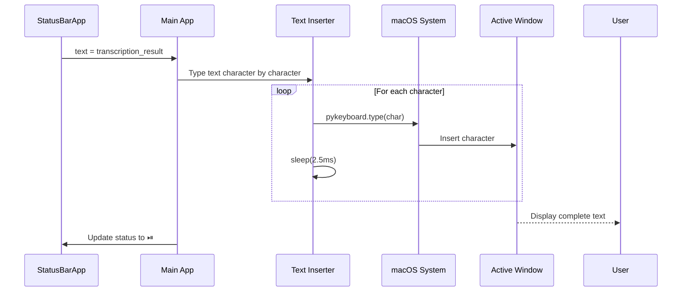
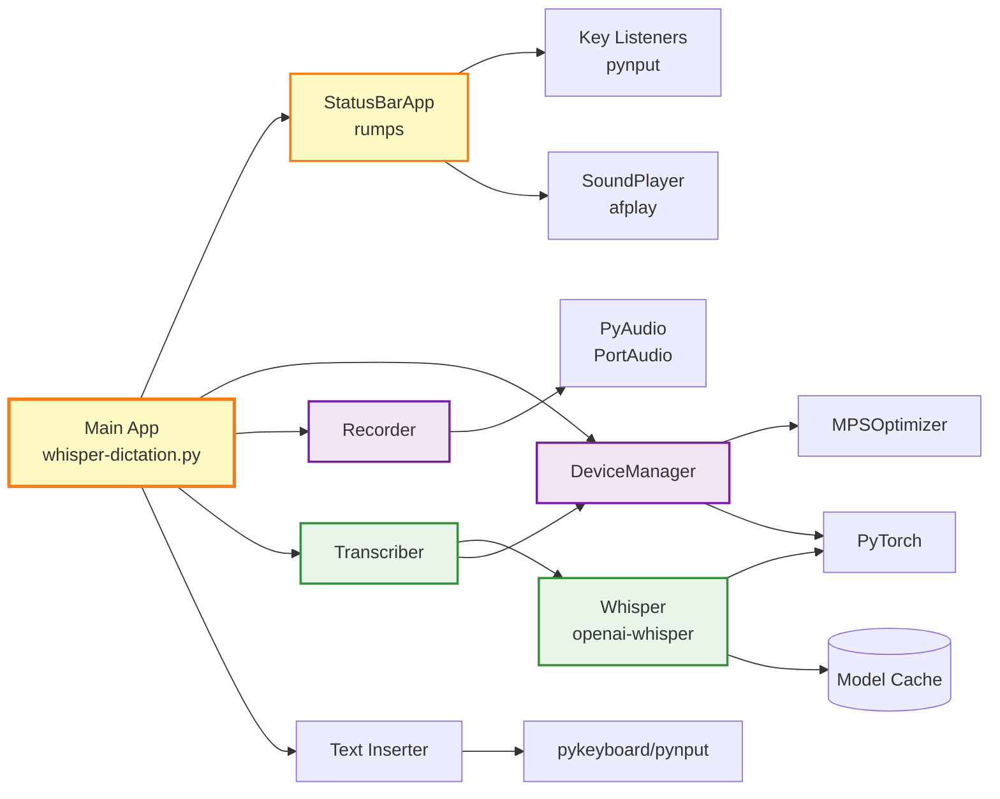
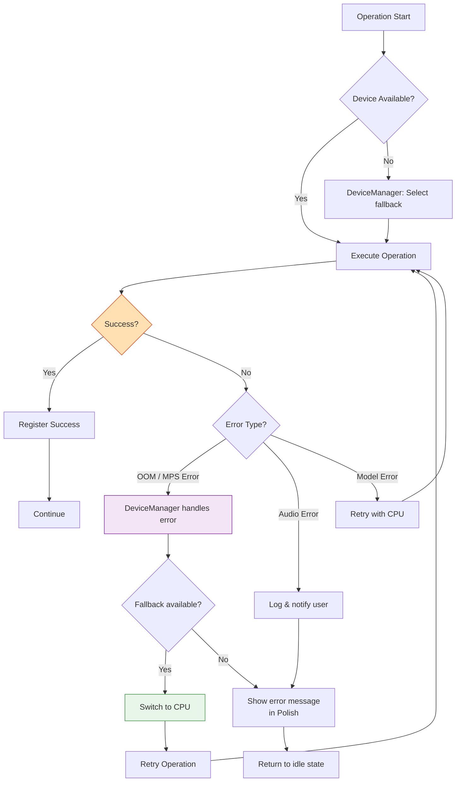
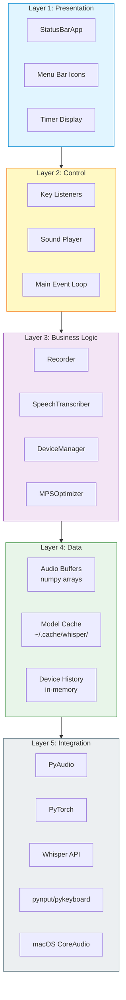

# System Integration Diagram

This diagram shows how all components of Whisper Dictation work together.

## Complete System Overview

```mermaid
graph TB
    subgraph "User Layer"
        U[👤 User]
        KB[⌨️ Keyboard - Hotkey<br/>Cmd+Option or Double-Cmd]
    end
    
    subgraph "Application Core"
        M[Main Application<br/>whisper-dictation.py]
        SBA[StatusBarApp<br/>rumps.App<br/>Menu Bar UI]
    end
    
    subgraph "Audio Layer"
        DM[DeviceManager<br/>device_manager.py<br/>CPU/MPS/CUDA selection]
        REC[Recorder<br/>recorder.py<br/>Audio capture & buffering]
        PA[PyAudio<br/>PortAudio wrapper<br/>16kHz 16-bit PCM]
    end
    
    subgraph "AI/ML Layer"
        TR[SpeechTranscriber<br/>transcriber.py<br/>Whisper orchestration]
        WM[Whisper Model<br/>openai-whisper<br/>tiny/base/small/medium/large]
        GPU[GPU/MPS/CPU<br/>PyTorch backend<br/>FP16 optimization]
        MPO[MPSOptimizer<br/>Apple Silicon<br/>error handling]
    end
    
    subgraph "Output Layer"
        TI[Text Inserter<br/>pykeyboard/pynput<br/>Keystroke simulation]
        AW[💻 Active Window<br/>Any macOS application]
    end
    
    subgraph "System Resources"
        MIC[🎤 Microphone Hardware<br/>macOS CoreAudio]
        SYS[🍎 macOS APIs<br/>Menu Bar, Permissions]
        CACHE[(~/.cache/whisper/<br/>Model Cache)]
        SND[🔊 Sound Player<br/>Tink.aiff / Pop.aiff]
    end
    
    %% User interactions
    U -->|Press/Release hotkey| KB
    KB -->|GlobalKeyListener<br/>DoubleCommandKeyListener| M
    
    %% Main app orchestration
    M -->|Initialize & control| SBA
    M -->|Initialize| DM
    M -->|Create & control| REC
    M -->|Create & control| TR
    M -->|Insert transcribed text| TI
    M -->|Play feedback sounds| SND
    
    %% Status Bar App
    SBA -->|Update UI status<br/>⏯ / 🔴 / Timer| U
    SBA -->|Control recording| REC
    
    %% Audio flow
    DM -->|Select optimal device| GPU
    DM -->|Device capabilities test| PA
    MIC -->|Audio stream| PA
    PA -->|16kHz 16-bit PCM<br/>mono, 1024 chunk| REC
    REC -->|numpy.float32 buffer<br/>normalized [-1.0, 1.0]| TR
    
    %% Transcription flow
    TR -->|Load model from cache| WM
    TR -->|Load model from cache| CACHE
    TR -->|Optimize for device| GPU
    TR -->|Apple Silicon handling| MPO
    WM -->|Use compute device| GPU
    WM -->|Transcribed text<br/>UTF-8 string| TR
    TR -->|Return result| M
    
    %% Output flow
    M -->|Text to insert| TI
    TI -->|Simulate typing<br/>2.5ms per char| SYS
    SYS -->|Insert text| AW
    AW -->|Display| U
    
    %% System permissions
    SYS -->|Microphone access| MIC
    SYS -->|Accessibility access| TI
    
    %% Styling
    classDef userClass fill:#e1f5ff,stroke:#0288d1,stroke-width:2px
    classDef coreClass fill:#fff9c4,stroke:#f57f17,stroke-width:3px
    classDef audioClass fill:#f3e5f5,stroke:#7b1fa2,stroke-width:2px
    classDef aiClass fill:#e8f5e9,stroke:#388e3c,stroke-width:2px
    classDef outputClass fill:#ffe0b2,stroke:#e64a19,stroke-width:2px
    classDef systemClass fill:#eceff1,stroke:#546e7a,stroke-width:2px
    
    class U,KB userClass
    class M,SBA coreClass
    class DM,REC,PA audioClass
    class TR,WM,GPU,MPO aiClass
    class TI,AW outputClass
    class MIC,SYS,CACHE,SND systemClass
```

## Data Flow Explanation

### 1. Initialization Phase
1. **Main app starts** (`whisper-dictation.py`)
2. **DeviceManager** queries available compute devices (CPU/MPS/CUDA)
3. **Recorder** and **SpeechTranscriber** are initialized
4. **Whisper model** is loaded from cache (`~/.cache/whisper/`) with optimal device (MPS/CUDA/CPU)
5. **StatusBarApp** creates menu bar icon (⏯)
6. **Global keyboard listener** registers hotkey handlers

### 2. Recording Phase (Hotkey Pressed)



**Key points:**
- User presses hotkey
- **SoundPlayer** provides audio feedback ("Tink.aiff")
- **StatusBarApp** updates icon to 🔴 with timer
- **Recorder** opens PyAudio stream: 16kHz, mono, 16-bit PCM
- Audio data flows: **Microphone → PyAudio → Recorder buffer**
- Maximum recording time: 30 seconds (configurable)

### 3. Processing Phase (Hotkey Released)



**Key points:**
- User releases hotkey
- **Recorder** stops and converts audio: `bytes → np.int16 → np.float32` (normalized by 32768.0)
- **SoundPlayer** provides feedback ("Pop.aiff")
- **StatusBarApp** updates icon to show processing
- **Transcriber** passes audio to Whisper model
- **Model** processes with device-specific optimizations:
  - FP16 on MPS/CUDA
  - Thresholds: `no_speech_threshold=0.6`, `logprob_threshold=-1.0`
- **DeviceManager** handles automatic fallback if errors occur (MPS→CPU)

### 4. Output Phase



**Key points:**
- **Main app** receives transcribed text
- **Text Inserter** simulates typing with 2.5ms delay between characters
- Text appears in **Active Window** (any macOS application)
- **StatusBarApp** returns to idle state (⏯)
- User sees final result

## Component Dependencies



## Error Handling Flow



**Error Handling Examples:**

### MPS (Apple Silicon) Errors
- **Problem**: Memory overflow, unsupported operation
- **Solution**: `MPSOptimizer` catches error → automatic fallback to CPU
- **User notification**: "⚠️ Wystąpił problem z GPU, przełączono na CPU" (Polish message)

### Audio Recording Errors
- **Problem**: Microphone disconnected, buffer overflow
- **Solution**: PyAudio exception caught → silent skip of frames (`exception_on_overflow=False`)
- **User notification**: Console log + continue recording

### Transcription Errors
- **Problem**: Model timeout, invalid audio, language mismatch
- **Solution**: Language validation, silent handling of empty audio
- **Fallback**: If language not in `allowed_languages`, force first allowed language

## Layer Architecture



## Key Technical Decisions

### Audio Processing
- **Sampling Rate**: 16kHz (optimal for speech recognition)
- **Format**: 16-bit PCM → float32 normalized [-1.0, 1.0]
- **Channels**: Mono (Whisper expects single channel)
- **Chunk Size**: 1024 samples for real-time buffering

### Device Selection Strategy
1. **Test devices at startup**: Check MPS/CUDA availability
2. **Select optimal device**: MPS (M1/M2) > CUDA > CPU
3. **Track operation history**: Remember successful device per operation type
4. **Automatic fallback**: On error, switch to next best device
5. **FP16 optimization**: Enable on MPS/CUDA, disable on CPU

### Model Loading
- **Cache location**: `~/.cache/whisper/`
- **Model sizes**: tiny, base (default), small, medium, large
- **First run**: Downloads model from OpenAI
- **Subsequent runs**: Loads from local cache (faster)

### Text Insertion
- **Method**: Keystroke simulation (not clipboard-based)
- **Delay**: 2.5ms between characters (prevents dropped chars)
- **Skip first space**: Improves formatting in most contexts

## See Also
- **[Architecture Details](ARCHITECTURE.md)** - In-depth component architecture
- **[Data Flow Documentation](DATA_FLOW.md)** - Detailed flow descriptions and code examples
- **[API Interfaces](API_INTERFACES.md)** - Public APIs and method signatures
- **[Module Documentation](modules/)** - Individual module deep-dives
  - [recorder.md](modules/recorder.md) - Audio recording module
  - [transcriber.md](modules/transcriber.md) - Whisper transcription module
  - [device_manager.md](modules/device_manager.md) - M1/M2 device management

## Legend

### Icon Meanings
- 👤 User
- ⌨️ Keyboard/Input
- 🎤 Microphone
- 🔊 Sound/Audio
- 💻 Application/Window
- 🍎 macOS System
- 🤖 AI/ML Model

### Color Coding
- **Blue**: User interaction layer
- **Yellow**: Application core
- **Purple**: Audio processing
- **Green**: AI/ML layer
- **Orange**: Output layer
- **Gray**: System resources

---

**Last updated**: 2025-10-10  
**System version**: Based on current codebase snapshot
