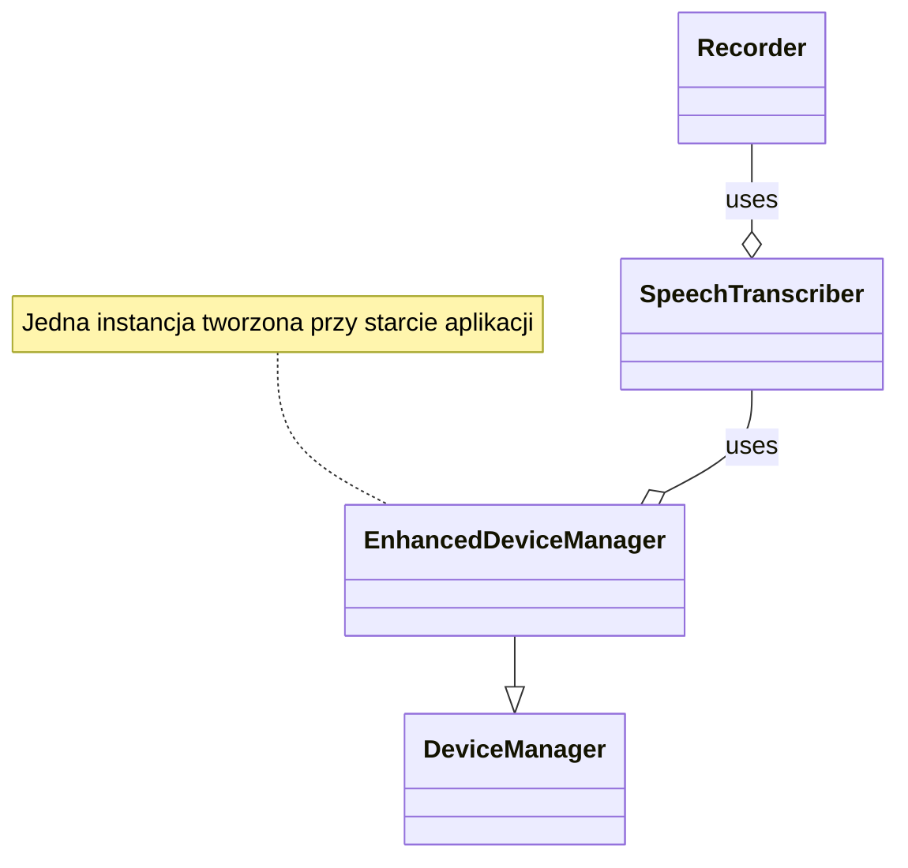
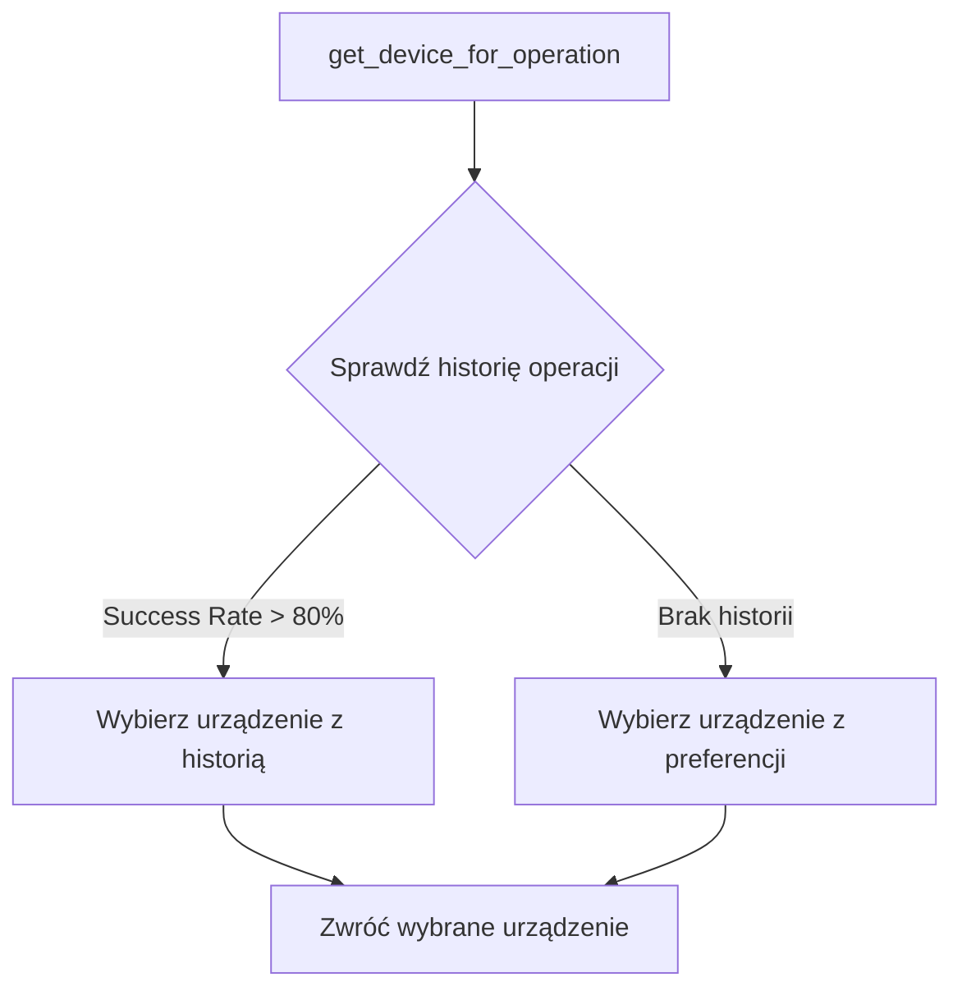
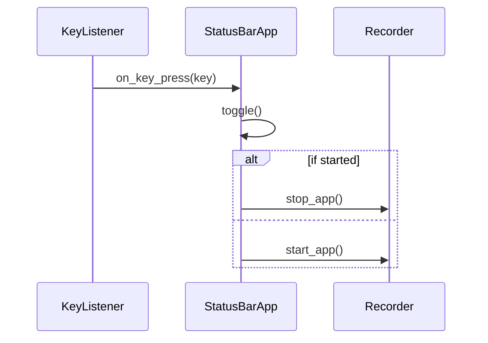
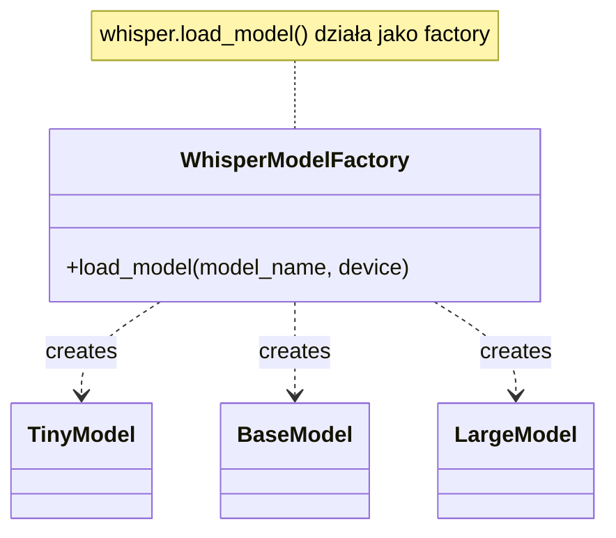
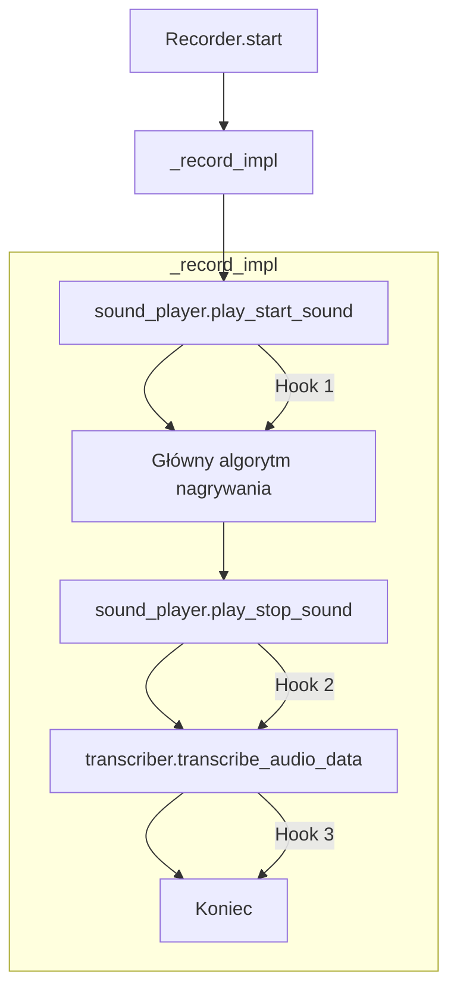
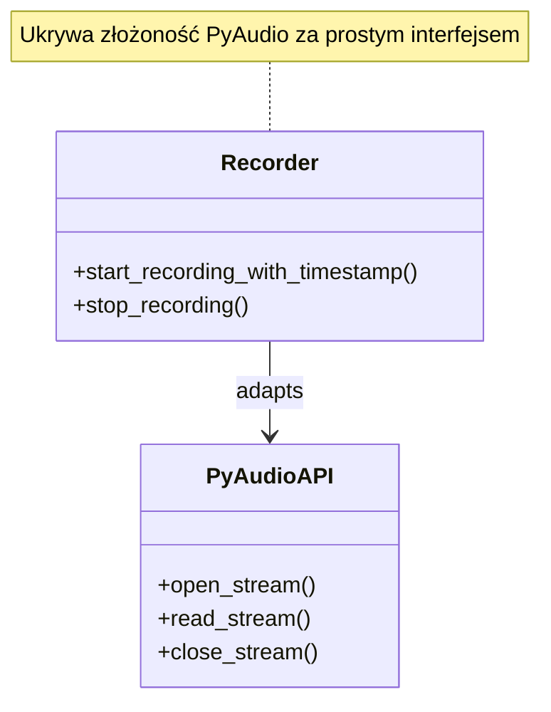

# Szczegóły Implementacji Architektury

Ten dokument zawiera szczegółowe informacje dotyczące implementacji kluczowych aspektów architektury aplikacji Whisper Dictation.

## Cel

Celem tego dokumentu jest uzupełnienie wysokopoziomowego opisu architektury o konkretne detale implementacyjne, przykłady kodu oraz techniczne wyjaśnienia, które zostały przeniesione z głównego dokumentu ARCHITECTURE.md w celu zachowania jego zwięzłości.

## Spis Treści

1.  [Implementacja Wzorców Projektowych](#implementacja-wzorców-projektowych)
2.  [Szczegóły Komponentów Głównych](#szczegóły-komponentów-głównych)
3.  [Optymalizacje Specyficzne dla Urządzeń](#optymalizacje-specyficzne-dla-urządzeń)
4.  [Obsługa Błędów i Fallback](#obsługa-błędów-i-fallback)
5.  [Przykłady Użycia i Konfiguracji](#przykłady-użycia-i-konfiguracji)

## Implementacja Wzorców Projektowych

### Singleton (Implicit)

**Gdzie**: `DeviceManager`, `EnhancedDeviceManager`

**Implementacja**: Choć nie klasyczny Singleton, te komponenty są tworzone raz przy starcie aplikacji i współdzielone przez wszystkie moduły.



**Uzasadnienie**: Centralizacja zarządzania urządzeniami i historii operacji wymaga pojedynczej instancji.

### Strategy

**Gdzie**: `DeviceManager.get_device_for_operation()`

**Implementacja**: Wybór strategii (CPU/MPS/CUDA) na podstawie typu operacji i historii:



**Uzasadnienie**: Różne operacje (ładowanie modelu vs transkrypcja) mogą preferować różne urządzenia.

### Observer (Event-based)

**Gdzie**: `KeyListener` → `StatusBarApp` → `Recorder`

**Implementacja**: Wzorzec obserwatora przez callbacks:



**Uzasadnienie**: Luźne powiązanie między warstwą kontroli a warstwą biznesową.

### Factory (Model Loading)

**Gdzie**: Ładowanie modeli Whisper

**Implementacja**: Factory pattern dla różnych rozmiarów modeli:



**Uzasadnienie**: Ukrycie złożoności tworzenia różnych wariantów modeli za prostym interfejsem.

### Template Method

**Gdzie**: `Recorder.start()` → `_record_impl()`

**Implementacja**: Szkielet algorytmu z customizowalnymi krokami:



**Uzasadnienie**: Stały przepływ nagrywania z możliwością customizacji (dźwięki, transkrypcja).

### Adapter

**Gdzie**: `recorder.py` jako adapter między PyAudio a resztą aplikacji

**Implementacja**: Opakowuje PyAudio API w prosty interfejs:



**Uzasadnienie**: Izoluje resztę kodu od szczegółów implementacji PyAudio.

### Chain of Responsibility

**Gdzie**: Device fallback chain w `DeviceManager`

**Implementacja**: Próba urządzeń w kolejności do pierwszego sukcesu:

```mermaid
flowchart TD
    A[handle_device_error] --> B{Current Device Failed?}
    B -->|Yes| C[Try Next Preferred Device]
    C --> D{Device Capable?}
    D -->|Yes| E[Return Device]
    D -->|No| C
    C --> F[Return Fallback Device (CPU)]
```

**Uzasadnienie**: Graceful degradation - jeśli MPS zawiedzie, próbuj CUDA, potem CPU.

## Powiązane Dokumenty

- [ARCHITECTURE.md](../ARCHITECTURE.md) - Główna dokumentacja architektury
- [MODULES.md](../../MODULES.md) - Indeks modułów
