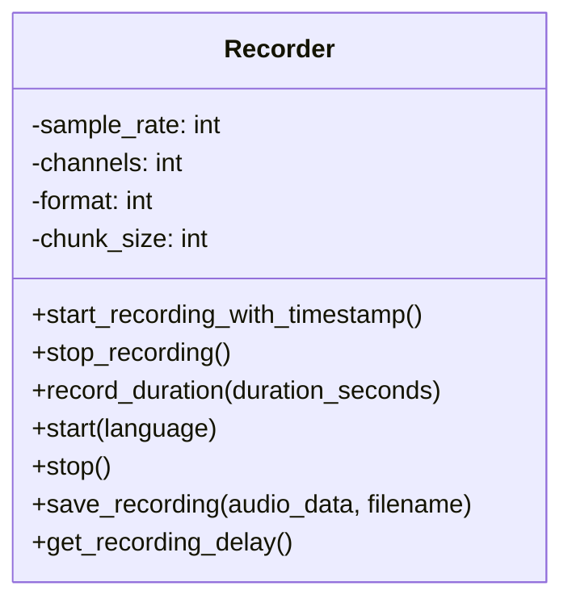
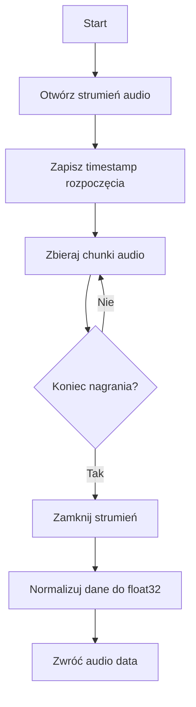
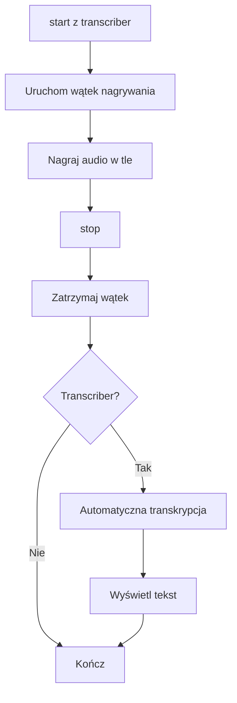
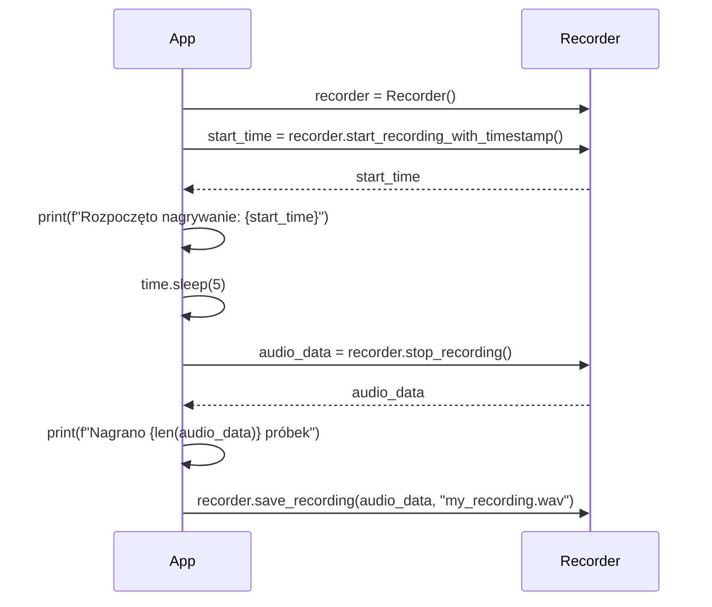
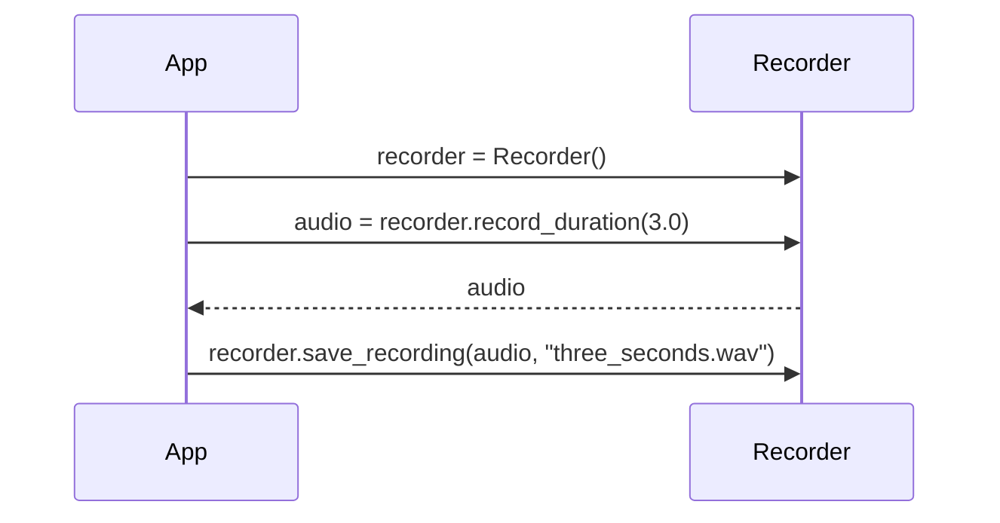
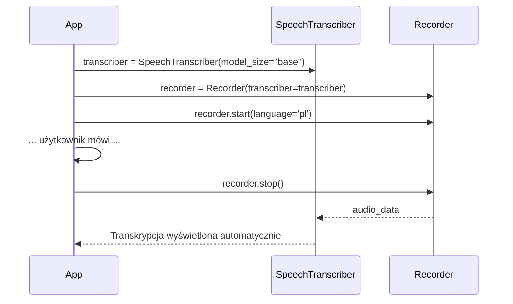
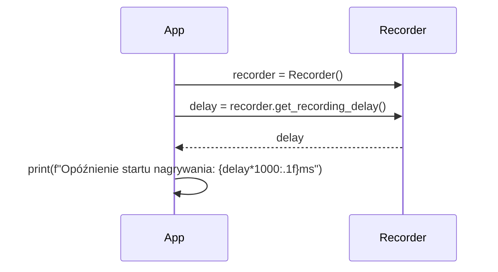

# Moduł: Recorder

## Odpowiedzialność

Moduł `recorder` odpowiada za nagrywanie audio z mikrofonu użytkownika. Zapewnia wrapper kompatybilny z TDD wokół funkcjonalności nagrywania, umożliwiając precyzyjne śledzenie czasu rozpoczęcia nagrywania oraz nagrywanie o określonym czasie trwania.

## Struktura Klasy



## Publiczne API

### Klasa: `Recorder`

Główna klasa odpowiedzialna za nagrywanie audio.

#### Konstruktor

```python
def __init__(self, transcriber=None)
```

**Parametry:**
- `transcriber` (SpeechTranscriber, opcjonalny): Opcjonalna instancja transkrybera do automatycznej transkrypcji nagranego audio

**Atrybuty:**
- `sample_rate` (int): Częstotliwość próbkowania (domyślnie 16000 Hz)
- `channels` (int): Liczba kanałów audio (domyślnie 1 - mono)
- `format` (int): Format audio (pyaudio.paInt16)
- `chunk_size` (int): Rozmiar chunka (domyślnie 1024)

#### Metody Publiczne

##### `start_recording_with_timestamp() -> float`

Rozpoczyna nagrywanie i zwraca rzeczywisty timestamp rozpoczęcia.

**Zwraca:**
- `float`: Timestamp (Unix time) momentu rzeczywistego rozpoczęcia nagrywania

**Rzuca:**
- `RuntimeError`: Gdy nie można rozpocząć nagrywania

**Przykład:**
```python
recorder = Recorder()
actual_start = recorder.start_recording_with_timestamp()
print(f"Nagrywanie rozpoczęte o: {actual_start}")
```

##### `stop_recording() -> Optional[np.ndarray]`

Zatrzymuje nagrywanie i zwraca nagrane dane audio.

**Zwraca:**
- `np.ndarray`: Nagrane audio jako tablica float32 znormalizowana do zakresu [-1.0, 1.0]
- `None`: Jeśli nie trwa nagrywanie

**Przykład:**
```python
audio_data = recorder.stop_recording()
if audio_data is not None:
    print(f"Nagrano {len(audio_data)} próbek")
```

##### `record_duration(duration_seconds: float) -> np.ndarray`

Nagrywa audio przez określony czas.

**Parametry:**
- `duration_seconds` (float): Czas trwania nagrania w sekundach

**Zwraca:**
- `np.ndarray`: Nagrane audio

**Przykład:**
```python
recorder = Recorder()
audio = recorder.record_duration(5.0)  # Nagraj 5 sekund
```

### Przepływ Nagrywania



##### `start(language=None)`

Rozpoczyna nagrywanie w tle (wątek).

**Parametry:**
- `language` (str, opcjonalny): Język dla transkrypcji

**Przykład:**
```python
recorder = Recorder(transcriber=my_transcriber)
recorder.start(language='pl')
# ... nagrywanie w tle ...
recorder.stop()
```

### Nagrywanie z Transkrypcją



##### `stop()`

Zatrzymuje nagrywanie w tle.

##### `save_recording(audio_data: np.ndarray, filename: str)`

Zapisuje nagrane audio do pliku WAV.

**Parametry:**
- `audio_data` (np.ndarray): Dane audio do zapisania
- `filename` (str): Nazwa pliku wyjściowego

**Przykład:**
```python
audio = recorder.record_duration(3.0)
recorder.save_recording(audio, "test_recording.wav")
```

##### `get_recording_delay() -> float`

Mierzy opóźnienie między wywołaniem start a rzeczywistym rozpoczęciem nagrywania.

**Zwraca:**
- `float`: Średnie opóźnienie w sekundach (na podstawie 3 testów)

**Przykład:**
```python
recorder = Recorder()
delay = recorder.get_recording_delay()
print(f"Średnie opóźnienie startu: {delay:.3f}s")
```

## Zależności

### Zależy od:
- `pyaudio`: Niskopoziomowe nagrywanie audio
- `numpy`: Przetwarzanie danych audio
- `wave`: Zapis plików WAV
- `threading`: Nagrywanie w tle
- `time`: Pomiary czasowe

### Używany przez:
- `whisper-dictation.py`: Główna aplikacja
- `tests/test_recording_quality.py`: Testy jakości nagrywania
- `_test_recording_advanced.py`: Zaawansowane testy nagrywania

## Przykład Użycia

### Podstawowe nagrywanie z timestampem



### Nagrywanie o określonym czasie trwania



### Nagrywanie z automatyczną transkrypcją



### Pomiar opóźnienia startu



## Szczegóły Implementacji

### Format Audio
- **Sample Rate**: 16000 Hz (optymalne dla Whisper)
- **Channels**: 1 (mono)
- **Format**: 16-bit PCM (pyaudio.paInt16)
- **Wewnętrzne przetwarzanie**: float32 znormalizowane do [-1.0, 1.0]

### Nagrywanie w Tle
Metoda `start()` uruchamia nagrywanie w osobnym wątku, co pozwala aplikacji kontynuować inne operacje. Audio jest automatycznie transkrybowane po zatrzymaniu, jeśli dostarczono instancję transkrybera.

### Precyzja Timestampów
Metoda `start_recording_with_timestamp()` zapewnia precyzyjne śledzenie momentu rozpoczęcia nagrywania, rejestrując timestamp bezpośrednio po otwarciu strumienia audio.

## TODO/FIXME

Brak znanych TODO/FIXME w kodzie modułu recorder.

## Znane Ograniczenia

1. **Overflow Handling**: Metoda `read()` używa `exception_on_overflow=False`, aby zapobiec błędom przy przeciążeniu bufora
2. **Single Recording**: Tylko jedno nagrywanie może być aktywne jednocześnie
3. **Device Selection**: Obecnie używa domyślnego urządzenia wejściowego systemu

## Powiązane Dokumenty

- [MODULES.md](../MODULES.md) - Przegląd wszystkich modułów
- [transcriber.md](./transcriber.md) - Moduł transkrypcji
- [ARCHITECTURE.md](../ARCHITECTURE.md) - Architektura systemu
- [API_INTERFACES.md](../API_INTERFACES.md) - Szczegóły API
