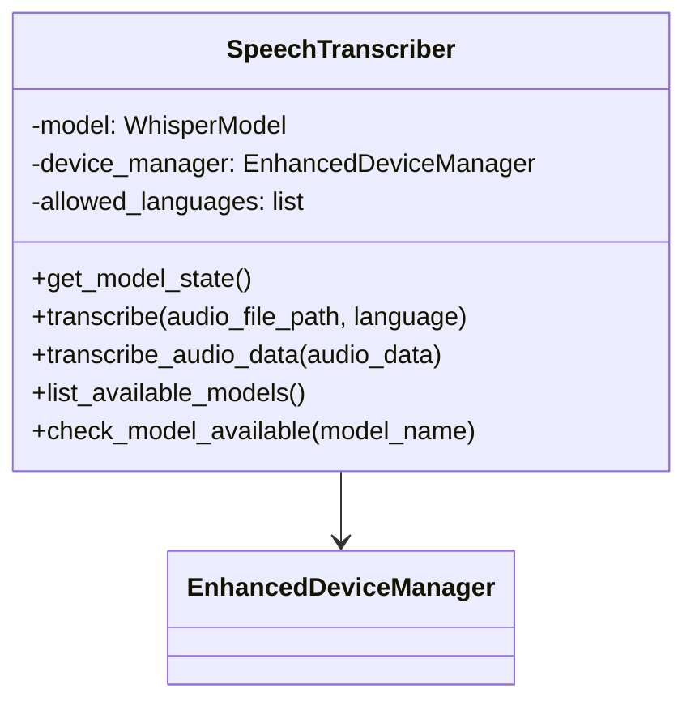
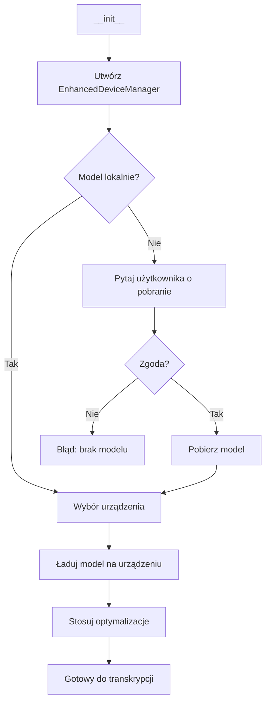
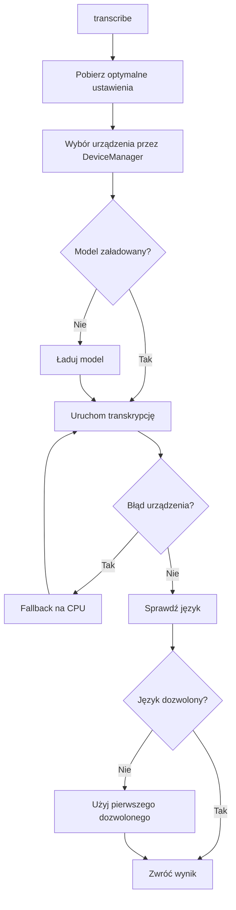
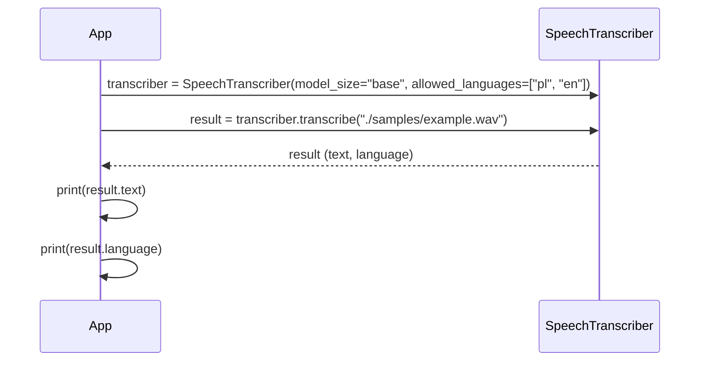
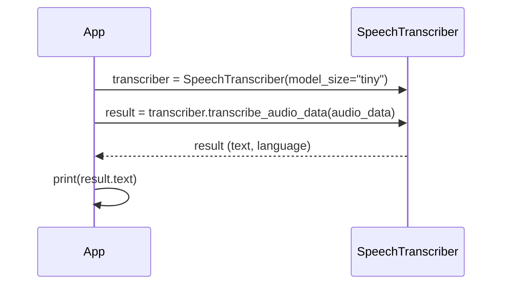

# Moduł: Transcriber

## Odpowiedzialność

Moduł `transcriber` (klasa `SpeechTranscriber`) odpowiada za transkrypcję mowy na tekst przy użyciu modeli Whisper. Zapewnia kompatybilność z TDD oraz obsługuje detekcję języka, wybór i optymalizację urządzenia (CPU/MPS/CUDA) oraz bezpieczne mechanizmy fallback w przypadku problemów z M1/M2.

## Struktura Klasy



## Publiczne API

### Klasa: `SpeechTranscriber`

#### Konstruktor

```python
def __init__(self, model_size="base", device=None, allowed_languages=None)
```

**Parametry:**
- `model_size` (str): Rozmiar modelu Whisper: `tiny`, `base`, `small`, `medium`, `large`
- `device` (str | None): Wymuszone urządzenie (`'cpu'`, `'cuda'`, `'mps'`); domyślnie wybierane automatycznie
- `allowed_languages` (list[str] | None): Lista dozwolonych języków (np. `['en', 'pl']`)

**Zachowanie:**
- Wykrywa dostępne urządzenia przez `EnhancedDeviceManager`
- Sprawdza lokalną dostępność modelu w `~/.cache/whisper/<model>.pt`
- W razie braku modelu prosi użytkownika o zgodę na pobranie
- Ładuje model na optymalnym urządzeniu i stosuje optymalizacje

### Inicjalizacja i Wybor Urządzenia



#### Metody

##### `get_model_state() -> str`
Zwraca identyfikator stanu modelu (pomocne w testach przełączeń urządzeń/języka).

##### `transcribe(audio_file_path: str, language: str | None = None) -> TranscriptionResult`
Transkrybuje plik audio.

- `audio_file_path`: Ścieżka do pliku audio
- `language`: Wymusza język transkrypcji (opcjonalnie)

Zachowanie:
- Przygotowuje ustawienia poprzez `EnhancedDeviceManager.get_optimized_settings`
- Uruchamia transkrypcję; w razie błędów MPS/CUDA stosuje inteligentny fallback i powtarza próbę
- Uwzględnia `allowed_languages` (jeśli wykryty język nie jest na liście, ustawia pierwszy dozwolony jako finalny)

Zwraca: `TranscriptionResult` z polami: `text`, `language`, `detection_time`, `transcription_time`.

### Przepływ Transkrypcji



##### `transcribe_audio_data(audio_data: np.ndarray) -> TranscriptionResult`
Transkrybuje surowe dane audio (np. z recordera w czasie rzeczywistym). Obsługuje normalizację i fallback na inne urządzenia.

##### `list_available_models() -> list[tuple[str, str]]` (staticmethod)
Zwraca listę lokalnie dostępnych modeli w `~/.cache/whisper` wraz z rozmiarami.

##### `check_model_available(model_name: str) -> bool` (staticmethod)
Sprawdza, czy konkretny model jest dostępny lokalnie.

## Zależności

### Zależy od:
- `whisper`: Modele ASR
- `torch`: Wykorzystanie urządzeń (CPU/MPS/CUDA)
- `numpy`: Przetwarzanie audio
- `device_manager.DeviceManager`, `mps_optimizer.EnhancedDeviceManager`: Zarządzanie urządzeniami i optymalizacje

### Używany przez:
- `whisper-dictation.py`: Główna aplikacja
- `debug_transcriptions.py`: Narzędzia debugujące
- Testy: `tests/test_language_detection.py`, `tests/test_performance.py`, `test_*`

## Przykład Użycia

### Transkrypcja pliku audio



### Transkrypcja danych audio z pamięci



## Detale i Optymalizacje

- Inteligentny wybór urządzenia na podstawie dostępności i historii sukcesów
- Specjalne ścieżki optymalizacji dla M1/M2 (MPS): half-precision, ograniczenie pamięci, itp.
- Automatyczny fallback w razie typowych błędów MPS (np. SparseMPS, memory_format)
- Możliwość wymuszenia języka w opcjach transkrypcji

## TODO/FIXME

- Rozważyć strategię: gdy wykryty język nie jest dozwolony, czy wykonywać ponowną transkrypcję z wymuszonym językiem, czy tylko nadpisywać metadane? Obecnie: nadpisanie.

## Powiązane Dokumenty

- [MODULES.md](../MODULES.md)
- [device_manager.md](./device_manager.md)
- [ARCHITECTURE.md](../ARCHITECTURE.md)
- [DATA_FLOW.md](../DATA_FLOW.md)
