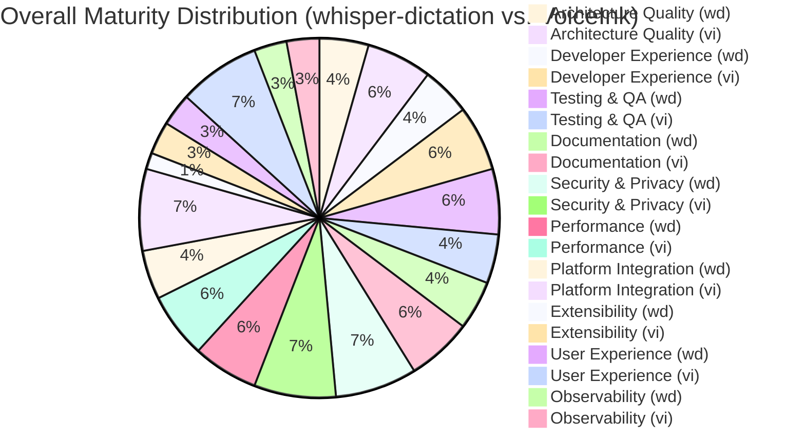

# Maturity Assessment

## Context for AI Agents
This document compares architectural maturity between VoiceInk (reference) and 
whisper-dictation (target for improvement). Scores indicate capability gaps 
and inform roadmap prioritization. Uses 1-5 scale where 1=Missing, 5=Exemplary.

## Executive Summary
This assessment highlights VoiceInk's superior user experience and deep platform integration, driven by its native macOS architecture. whisper-dictation, while strong in core transcription and privacy, lags in extensibility and overall UX due to its CLI-first, Python-based approach. Key areas for whisper-dictation improvement include formalizing a plugin architecture and enhancing developer experience.

## Feature Inventory

| Feature Domain | whisper-dictation | VoiceInk | Maturity Gap |
|---|---|---|---|
| **Audio Capture** | Basic microphone input via PyAudio. Supports device selection. | Native macOS audio capture. Likely more robust error handling and device management. | -1 |
| **Transcription Engine** | Dual implementation: OpenAI's Python lib (CPU) and whisper.cpp (GPU). Model selection available. | Primarily whisper.cpp for performance. Mentions "Parakeet" model. | 0 |
| **Post-Processing** | Not explicitly mentioned. Likely minimal. | "Smart Modes" and "Personal Dictionary" suggest significant post-processing capabilities. | -3 |
| **UI/UX Paradigm** | Minimalist status bar app (`rumps`). Interaction via keyboard shortcuts. | Full native macOS GUI with settings panels and visual feedback. | -3 |
| **Configuration** | Command-line arguments for model, language, and shortcuts. No persistent GUI for settings. | GUI-based settings. "Power Mode" allows for per-app/URL configurations. | -2 |
| **Extensibility** | No explicit plugin system. Extensibility requires direct code modification. | No explicit plugin system mentioned, but "Smart Modes" and "AI Assistant" suggest an extensible architecture. | -1 |
| **Platform Support** | Primarily macOS. Cross-platform in theory but with macOS-specific dependencies (`rumps`). | macOS 14.0+ only. | 0 |
| **Killer Features** | Dual Python/C++ backends. | "Power Mode" (per-app settings), "Context Aware" (screen reading), "Personal Dictionary", polished UI. | - |

## Comparative Matrix

| Dimension | whisper-dictation | VoiceInk | Gap | Priority |
|---|---|---|---|---|
| Architecture Quality | 3 - Functional | 4 - Solid | -1 | High |
| Developer Experience | 3 - Functional | 4 - Solid | -1 | Medium |
| Testing & Quality Assurance | 4 - Solid | 3 - Functional | +1 | Low |
| Documentation | 3 - Functional | 4 - Solid | -1 | Medium |
| Security & Privacy | 5 - Exemplary | 5 - Exemplary | 0 | Low |
| Performance | 4 - Solid | 4 - Solid | 0 | Low |
| Platform Integration | 3 - Functional | 5 - Exemplary | -2 | High |
| Extensibility | 1 - Missing | 2 - Limited | -1 | High |
| User Experience | 2 - Limited | 5 - Exemplary | -3 | High |
| Observability | 2 - Limited | 2 - Limited | 0 | Low |

**Justifications**:
- **Architecture Quality**:
    - **whisper-dictation (3)**: Clear component separation (recorder, transcriber), dual Python/C++ backends. Lacks formal plugin architecture for broader extensibility.
    - **VoiceInk (4)**: Follows native macOS patterns, robust internal architecture for complex features like "Power Mode." Uses `whisper.cpp` effectively.
- **Developer Experience**:
    - **whisper-dictation (3)**: Poetry for dependency management, `pytest` for testing, clear `README.md` for setup. Lacks deeper developer documentation or contribution guidelines.
    - **VoiceInk (4)**: `Makefile` for simplified builds, explicit `BUILDING.md` and `CONTRIBUTING.md`. Standard Xcode tooling support.
- **Testing & Quality Assurance**:
    - **whisper-dictation (4)**: Dedicated `tests/` directory, `pytest` config, coverage reporting, and implied CI via `.github/`. Strong focus on automated testing.
    - **VoiceInk (3)**: Standard Xcode testing (`VoiceInkTests`, `VoiceInkUITests`). Less explicit detail on CI/release process in provided context.
- **Documentation**:
    - **whisper-dictation (3)**: Comprehensive user-facing `README.md`. `docs/` exists but content unknown. AI agent-specific docs (`GEMINI.md`).
    - **VoiceInk (4)**: Good user `README.md`, clear `BUILDING.md` and `CONTRIBUTING.md` for developers.
- **Security & Privacy**:
    - **whisper-dictation (5)**: Explicitly "entirely offline, no data shared." Aligns with core mission.
    - **VoiceInk (5)**: Explicitly "100% offline processing ensures your data never leaves your device." Core design principle.
- **Performance**:
    - **whisper-dictation (4)**: Strong focus with C++ `whisper.cpp` backend for GPU acceleration on Apple Silicon. Performance test results provided.
    - **VoiceInk (4)**: Native app leveraging `whisper.cpp` for high performance. "Almost instantly" claim suggests strong performance focus.
- **Platform Integration**:
    - **whisper-dictation (3)**: Uses `rumps` for status bar, `pynput` for hotkeys, good for a Python app on macOS, but not as deep as native.
    - **VoiceInk (5)**: Native macOS app, deep integration with OS features (hotkeys, launch at login, media controls, selected text).
- **Extensibility**:
    - **whisper-dictation (1)**: No formal plugin system or explicit extension points. Requires direct code modification for new features.
    - **VoiceInk (2)**: No explicit public plugin system. Internal modularity for features like "Smart Modes" exists, but not exposed for external extension.
- **User Experience**:
    - **whisper-dictation (2)**: Minimalist CLI/status bar UI. Functional but lacks polish and advanced user-facing features.
    - **VoiceInk (5)**: Full native GUI, "joy to use" as a goal. Rich features like "Power Mode", "Context Aware", "Personal Dictionary", and "AI Assistant" provide a highly polished UX.
- **Observability**:
    - **whisper-dictation (2)**: `test_results.log` indicates some performance logging. No explicit comprehensive error reporting or metrics strategy.
    - **VoiceInk (2)**: No explicit mention of logging, error reporting, or metrics in the `README.md`. As an offline app, external metrics are limited.

## Maturity Visualization

## Standout Features in VoiceInk
*Behavioral descriptions without code specifics, to be detailed in Phase 3.*

- **Active Application Context**: Automatically adjusts settings based on the foreground application or even the specific URL in a browser.
- **Screen Content Awareness**: The transcription engine can consider on-screen text to improve accuracy for specific contexts (e.g., technical terms, names).
- **Custom Vocabulary**: Users can define custom words, phrases, and replacements to train the model on their specific vocabulary.
- **Polished Native UI**: A full graphical user interface for settings, feedback, and updates, providing a more user-friendly experience than a command-line tool.

## Quality Checklist
- [ ] Durability: No brittle references
- [ ] Diagram-first: Visual representations included
- [ ] Self-contained: Context for agents present
- [ ] Cross-linked: References to other analysis files
