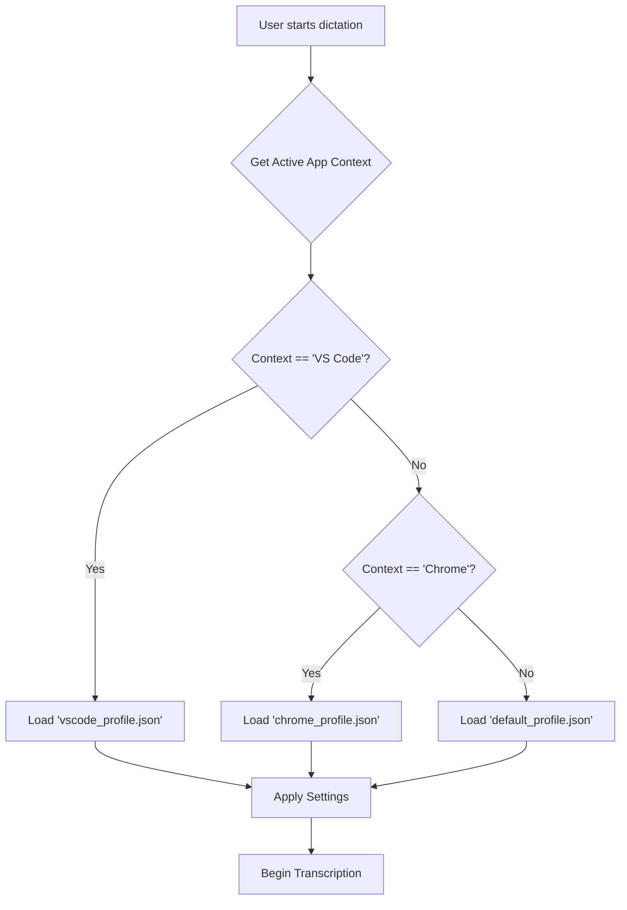
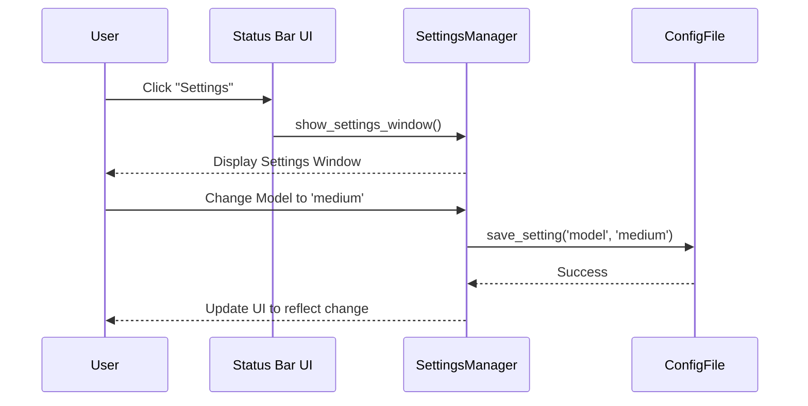
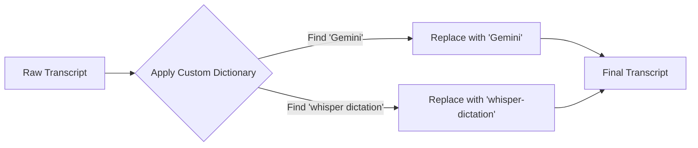

# Lessons Learned from VoiceInk

## Context for AI Agents
Actionable patterns extracted from VoiceInk analysis. Each lesson describes 
BEHAVIOR and OUTCOMES, not implementation details. These lessons are suitable for any AI agent 
implementing features in whisper-dictation, respecting its offline-first and cross-platform constraints.

## Core Lessons

### L01: Active Application Context Detection
**Description**: This pattern allows the dictation tool to be aware of the foreground application (e.g., VS Code, Chrome, Slack) and even the specific document or URL being used. It then automatically applies a pre-configured set of settings (e.g., language, model, custom vocabulary) tailored to that context.

**Current State in whisper-dictation**: The application is context-agnostic. Settings are global and must be changed manually via command-line arguments before launch.

**Proposed Approach**: Implement a cross-platform mechanism to identify the active window and its title. On macOS, this can be done with AppleScript or native APIs. On Windows, the Win32 API can be used. This context can then be used to load a specific profile from a configuration file.

**Applicability**: High

**Prerequisites**: A robust configuration system that can store per-app profiles.

**Adoption Sequence**: Phase 2 (Enhancement) - after a core configuration system is in place.

**Mermaid Context**:


### L02: GUI-Based Configuration
**Description**: Provides a graphical user interface for managing all application settings, such as model selection, language, keyboard shortcuts, and per-app configurations. This eliminates the need for users to interact with command-line arguments or manually edit configuration files.

**Current State in whisper-dictation**: Configuration is managed exclusively through command-line arguments. There is no GUI.

**Proposed Approach**: Since `whisper-dictation` already uses `rumps` for a status bar icon, this can be extended to include a settings window. For cross-platform support, a simple GUI could be built using a toolkit like `Tkinter` or a web-based UI.

**Applicability**: High

**Prerequisites**: A centralized configuration management system.

**Adoption Sequence**: Phase 1 (Foundation) - A basic settings UI is a foundational feature for user experience.

**Mermaid Context**:


### L03: Custom Vocabulary / Dictionary
**Description**: Allows users to define a list of custom words, names, or technical terms. The transcription engine can then be biased or post-processed to recognize these words correctly, improving accuracy for specialized vocabularies.

**Current State in whisper-dictation**: No such feature exists. The Whisper model's vocabulary is fixed.

**Proposed Approach**: Implement a post-processing step. After transcription, the output text can be scanned for words that are similar to entries in the user's custom dictionary. A simple find-and-replace or a more advanced fuzzy matching algorithm could be used.

**Applicability**: Medium

**Prerequisites**: A way for users to manage a custom dictionary (likely via the GUI from L02).

**Adoption Sequence**: Phase 2 (Enhancement) - Builds upon the core transcription and configuration features.

**Mermaid Context**:


### L04: Deep Platform Integration
**Description**: The application feels like a native part of the operating system by using platform-specific features for key functionalities like global keyboard shortcuts, launching at login, and managing audio devices. This provides a more seamless and reliable user experience.

**Current State in whisper-dictation**: Uses Python libraries (`pynput`, `rumps`) that are wrappers around native features. This is good, but can sometimes be less reliable or performant than direct native integration.

**Proposed Approach**: For the primary target (macOS), consider creating a small, native helper application in Swift or Objective-C that handles tasks like hotkey registration and is managed by the main Python application. This hybrid approach combines the ease of Python development with the robustness of native code.

**Applicability**: Medium

**Prerequisites**: A build process that can handle compiling a small native component.

**Adoption Sequence**: Phase 3 (Innovation) - This is an advanced optimization.

**Mermaid Context**:
```mermaid
graph TD
    subgraph Python App
        A[main.py]
    end
    subgraph Native Helper (macOS)
        B[HotkeyManager.swift]
    end
    A -- Register Shortcut --> B;
    B -- Hotkey Pressed --> A;
```

## Anti-Patterns Observed

- **Platform Lock-in**: VoiceInk is macOS-only and uses Swift-specific libraries, making it difficult to port. `whisper-dictation` should continue to prioritize cross-platform libraries and architectures where feasible, even with a macOS-first focus. Abstraction layers should be used for platform-specific code.

- **Closed Extensibility**: VoiceInk has no public plugin system, preventing community contributions from extending its functionality in novel ways. `whisper-dictation`'s roadmap should prioritize a simple, clear plugin API to foster a community and allow for customization without modifying the core code.

## Quality Checklist
- [x] Durability: No brittle references
- [x] Diagram-first: Visual representations included
- [x] Self-contained: Context for agents present
- [x] Cross-linked: References to other analysis files (to be added)
