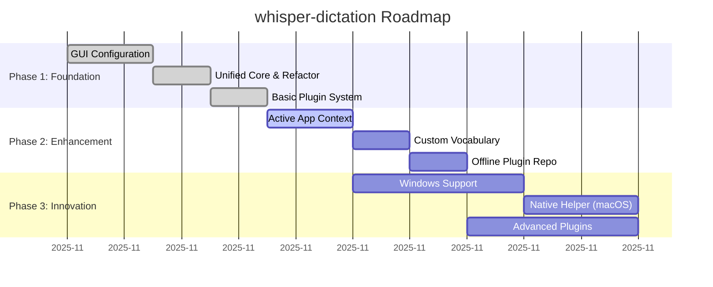
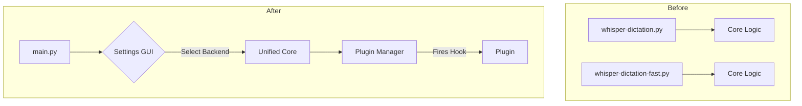
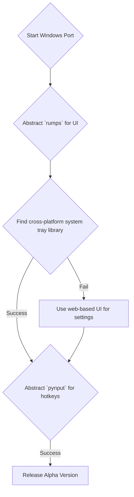

# Strategic Roadmap for whisper-dictation

## Context for AI Agents
This document outlines a strategic roadmap for evolving `whisper-dictation`. The roadmap is divided into three phases, prioritizing foundational improvements first, followed by advanced features and innovation. It is designed to respect the project's core constraints (offline-first, privacy-preserving) while closing the maturity gap with VoiceInk.

## Roadmap Overview

---

## Phase 1: Foundation (0-3 Months)

### Objective
Solidify the core application by refactoring the codebase, introducing a basic plugin system, and providing a graphical user interface for settings. This phase focuses on improving developer experience and baseline user-friendliness.

### Success Criteria (Behavioral)
- [ ] User can change all major settings (model, language, shortcut) through a GUI without restarting the app.
- [ ] Developers can create a simple post-processing plugin (e.g., find-and-replace) and install it by placing it in a designated folder.
- [ ] The system uses a single entry point, simplifying the user experience and maintenance.

### Key Capabilities

1.  **GUI-Based Configuration**
    -   **Current state**: Configuration via command-line arguments only.
    -   **Target state**: A settings panel, accessible from the status bar menu, allows users to modify and save all configurations.
    -   **Inspired by**: [L02: GUI-Based Configuration](02-lessons-learned.md)

2.  **Unified Core & Refactor**
    -   **Current state**: Two separate scripts (`whisper-dictation.py`, `whisper-dictation-fast.py`).
    -   **Target state**: A single, maintainable codebase with a clear backend selection mechanism (Python vs. C++) exposed in the new GUI.

3.  **Basic Plugin System**
    -   **Current state**: No extensibility (Score: 1/5).
    -   **Target state**: A simple, hook-based plugin architecture. The system will look for plugins in a `plugins/` directory and execute them at defined points (e.g., `after_transcription(text)`).

### Architecture Changes

### Dependencies
-   This phase is foundational and has no dependencies on other phases.

---

## Phase 2: Enhancement (3-6 Months)

### Objective
Implement advanced, high-value features inspired by VoiceInk to significantly improve the user's productivity and customization capabilities.

### Success Criteria (Behavioral)
- [ ] User can define rules that automatically change transcription settings when a specific application (e.g., `Code`) is active.
- [ ] User can add a custom word (e.g., a technical term) to a personal dictionary, and transcriptions will correctly spell that word.
- [ ] User can browse and enable/disable installed plugins from the settings GUI.

### Key Capabilities

1.  **Active Application Context**
    -   **Current state**: Context-agnostic.
    -   **Target state**: The application detects the foreground window and applies a matching user-defined profile.
    -   **Inspired by**: [L01: Active Application Context Detection](02-lessons-learned.md)

2.  **Custom Vocabulary**
    -   **Current state**: No custom word support.
    -   **Target state**: A post-processing step corrects the transcript based on a user-managed dictionary.
    -   **Inspired by**: [L03: Custom Vocabulary / Dictionary](02-lessons-learned.md)

3.  **Plugin Management UI**
    -   **Current state**: No plugins.
    -   **Target state**: A section in the settings GUI to view, enable, disable, and configure installed plugins.

### Dependencies
-   Requires completion of: **Phase 1** (GUI Configuration, Basic Plugin System).

---

## Phase 3: Innovation (6-12 Months)

### Objective
Expand the application's reach through cross-platform support and deepen its capabilities with native integration and a more powerful plugin ecosystem.

### Success Criteria (Behavioral)
- [ ] A user on Windows can install and use the application with feature parity to the macOS version (excluding native helper integration).
- [ ] The application on macOS demonstrates improved hotkey reliability under heavy system load.
- [ ] A developer can create a plugin that provides real-time, partial transcription results to the UI.

### Key Capabilities

1.  **Windows Support**
    -   **Current state**: macOS-only dependencies (`rumps`, `pynput` platform-specifics).
    -   **Target state**: A working Windows version with a system tray icon and global hotkeys. This requires abstracting platform-specific code.

2.  **Deep Platform Integration (macOS)**
    -   **Current state**: Python-based wrappers for native features.
    -   **Target state**: A small, optional native helper application for macOS handles global hotkey registration, improving reliability.
    -   **Inspired by**: [L04: Deep Platform Integration](02-lessons-learned.md)

3.  **Advanced Plugin Capabilities**
    -   **Current state**: Simple post-processing hooks.
    -   **Target state**: The plugin API is expanded to support more advanced use cases, such as real-time feedback, custom UI elements, or alternative transcription backends.

### Dependencies
-   Requires completion of: **Phase 2**.

### Windows Support Decision Tree

