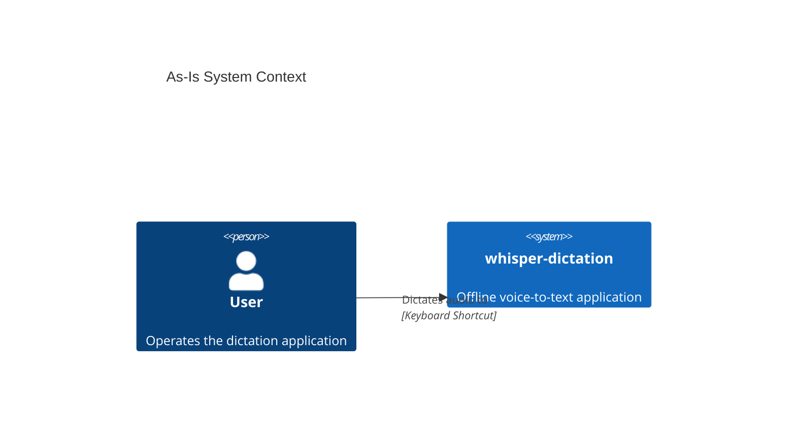
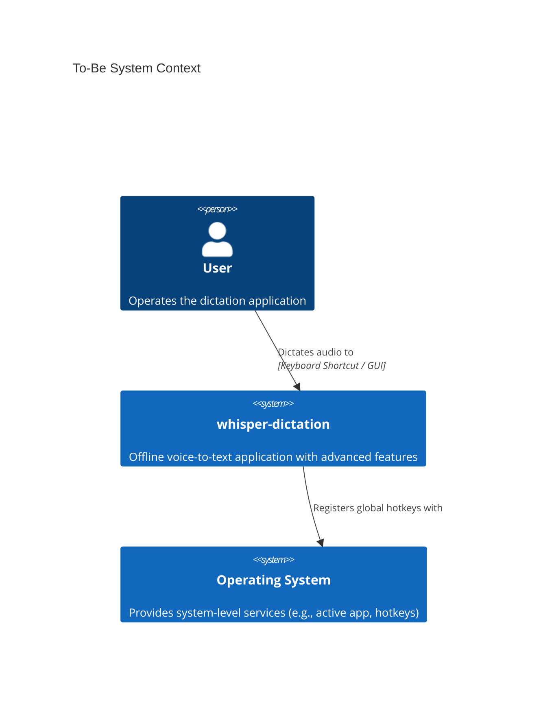
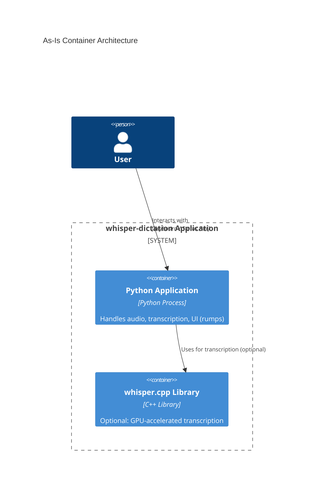
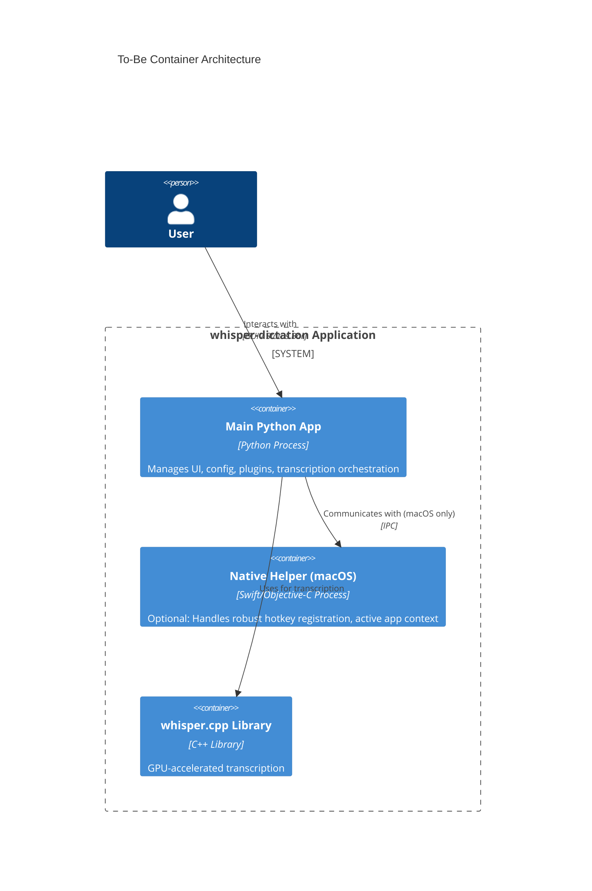
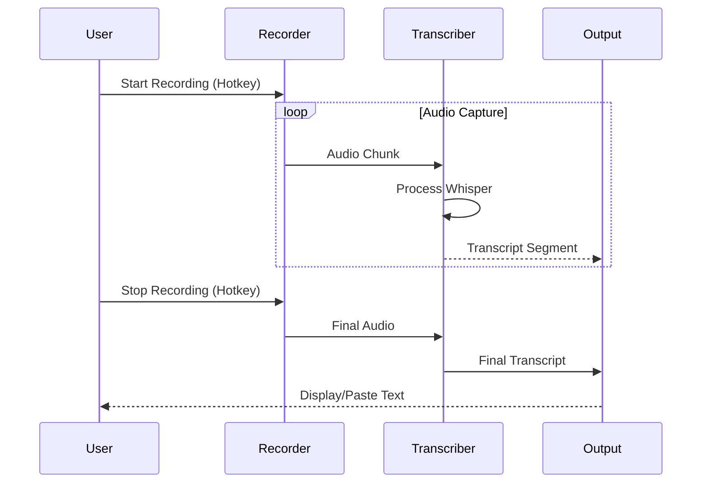
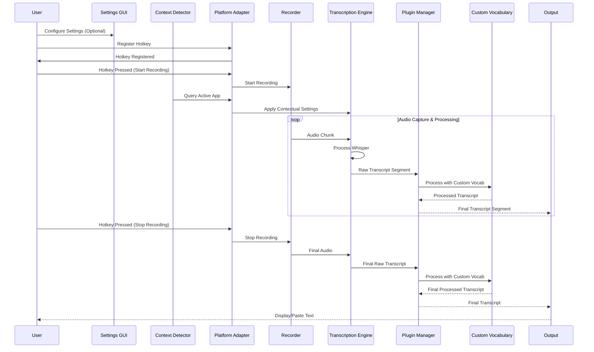

# As-Is → To-Be Architecture for whisper-dictation

## Context for AI Agents
This document visualizes the architectural evolution of `whisper-dictation` from its current state (As-Is) to its target state (To-Be) as defined by the strategic roadmap. Diagrams are presented at multiple abstraction levels (C4 model approximation) to provide a comprehensive understanding of the changes.

## 1. System Context (C4 Level 1 Approximation)

### As-Is: Current System Context


### To-Be: Future System Context


### Delta Highlights
-   Introduction of a GUI for user interaction, complementing keyboard shortcuts.
-   Explicit interaction with the Operating System for context awareness and robust hotkey management.

### Migration Path
Transition from CLI-only interaction to a GUI-driven experience will be gradual, starting with a settings panel and expanding to more interactive elements.

## 2. Container Architecture (C4 Level 2 Approximation)

### As-Is: Current Container Architecture


### To-Be: Future Container Architecture


### Delta Highlights
-   Consolidation of Python application logic into a single `main_python_app` container.
-   Introduction of an optional `native_helper` for macOS to offload platform-specific, performance-critical tasks.
-   `whisper.cpp` becomes a more integrated, standard component rather than an optional alternative.

### Migration Path
The `main_python_app` will absorb the logic from the two existing scripts. The `native_helper` will be introduced in a later phase as an optimization, initially using existing Python libraries for hotkeys and context detection.

## 3. Component Architecture (C4 Level 3 Approximation)

### As-Is: Current Component Architecture
```mermaid
C4Component
    title As-Is Component Architecture
    Container(python_app, "Python Application") {
        Component(recorder, "Audio Recorder", "Python", "Captures audio input")
        Component(transcriber_py, "Python Transcriber", "Python", "OpenAI Whisper Python implementation")
        Component(transcriber_cpp, "C++ Transcriber", "Python Wrapper", "Interface to whisper.cpp")
        Component(cli_ui, "CLI / Rumps UI", "Python", "Handles command-line args, status bar icon")
    }

    Rel(recorder, transcriber_py, "Sends audio to")
    Rel(recorder, transcriber_cpp, "Sends audio to")
    Rel(cli_ui, recorder, "Controls")
    Rel(cli_ui, transcriber_py, "Configures")
    Rel(cli_ui, transcriber_cpp, "Configures")
```

### To-Be: Future Component Architecture
```mermaid
C4Component
    title To-Be Component Architecture
    Container(main_python_app, "Main Python App") {
        Component(settings_gui, "Settings GUI", "Python", "Manages user preferences")
        Component(plugin_manager, "Plugin Manager", "Python", "Loads and orchestrates plugins")
        Component(context_detector, "Context Detector", "Python", "Identifies active application/window")
        Component(custom_vocab, "Custom Vocabulary", "Python", "Applies user-defined word replacements")
        Component(audio_io, "Audio I/O", "Python", "Platform-agnostic audio capture")
        Component(transcription_engine, "Transcription Engine", "Python", "Unified interface to Whisper backends")
        Component(platform_adapter, "Platform Adapter", "Python", "Abstracts OS-specific interactions")
    }

    Rel(settings_gui, plugin_manager, "Configures")
    Rel(settings_gui, context_detector, "Configures")
    Rel(settings_gui, custom_vocab, "Configures")
    Rel(audio_io, transcription_engine, "Sends audio to")
    Rel(transcription_engine, plugin_manager, "Sends transcript to")
    Rel(plugin_manager, custom_vocab, "Uses for post-processing")
    Rel(context_detector, platform_adapter, "Uses for OS info")
    Rel(platform_adapter, audio_io, "Manages devices")
```

### Delta Highlights
-   Introduction of dedicated components for `settings_gui`, `plugin_manager`, `context_detector`, and `custom_vocab`.
-   Unification of transcription logic into a single `transcription_engine` with a `platform_adapter` for OS-specific interactions.
-   A clear `plugin_manager` for extensibility.

### Migration Path
Existing recorder and transcriber logic will be refactored into `audio_io` and `transcription_engine`. New components will be built incrementally, starting with the `settings_gui` and `plugin_manager` in Phase 1.

## 4. Key Flows

### As-Is: Transcription Pipeline Flow


### To-Be: Enhanced Transcription Pipeline Flow


### Delta Highlights
-   Integration of `Context Detector` to dynamically adjust settings.
-   `Plugin Manager` and `Custom Vocabulary` are integrated into the transcription pipeline for enhanced post-processing.
-   `Platform Adapter` centralizes OS-specific interactions, including hotkey management.

### Migration Path
The existing transcription flow will be augmented with new components. The `Context Detector` and `Custom Vocabulary` will be integrated as plugins or modules within the `Plugin Manager` to maintain modularity.

## Quality Checklist
- [ ] Durability: No brittle references
- [ ] Diagram-first: Visual representations included
- [ ] Self-contained: Context for agents present
- [ ] Cross-linked: References to other analysis files (to be added)
