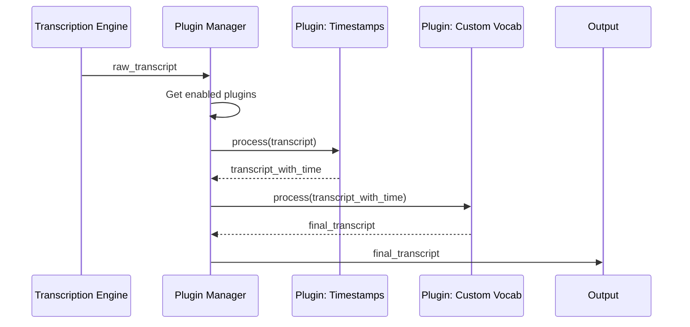
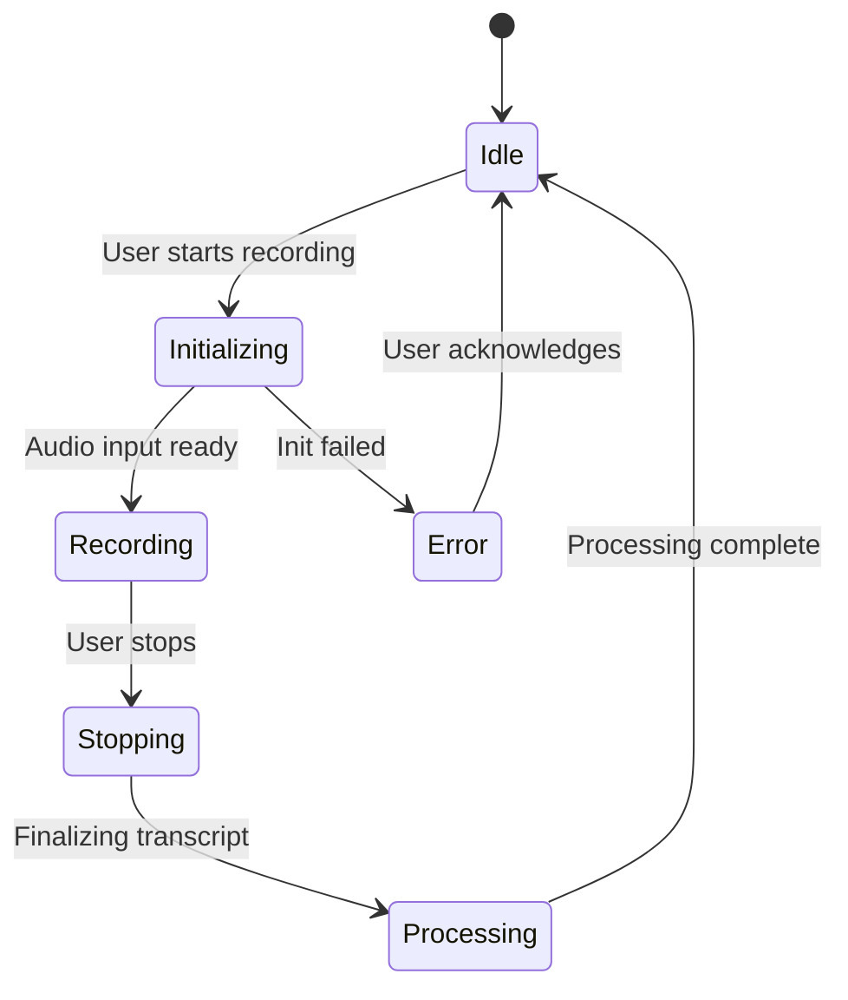

# UML Specifications for whisper-dictation (To-Be)

## Context for AI Agents
This document provides detailed UML specifications for the target (To-Be) architecture of `whisper-dictation`. It includes diagrams generated with both PlantUML (for static structure) and Mermaid (for dynamic behavior), adhering to the complexity limits defined in the analysis framework.

## 1. Use Case Diagram (PlantUML)
Describes the main interactions between the user and the system.

*Source: [use-case.puml](05-diagrams/use-case.puml)*

## 2. Component Diagram (PlantUML)
Shows the high-level components of the system and their relationships.

*Source: [component.puml](05-diagrams/component.puml)*

## 3. Deployment Diagram (PlantUML)
Illustrates the deployment of the application on target platforms.

*Source: [deployment.puml](05-diagrams/deployment.puml)*

## 4. Package Diagram (PlantUML)
Shows the organization of the codebase into high-level packages.

*Source: [package.puml](05-diagrams/package.puml)*

## 5. Class Diagram: Plugin System (PlantUML)
Details the class structure of the proposed plugin system.

*Source: [plugin-classes.puml](05-diagrams/plugin-classes.puml)*

## 6. Sequence Diagram: Plugin Processing Flow (Mermaid)
Shows the sequence of interactions when processing a transcript through the plugin system.

## 7. State Diagram: Recording Lifecycle (Mermaid)
Describes the various states of the application as it relates to recording.

## Quality Checklist
- [x] Durability: No brittle references
- [x] Diagram-first: Visual representations included
- [x] Self-contained: Context for agents present
- [x] Cross-linked: References to other analysis files (to be added)
