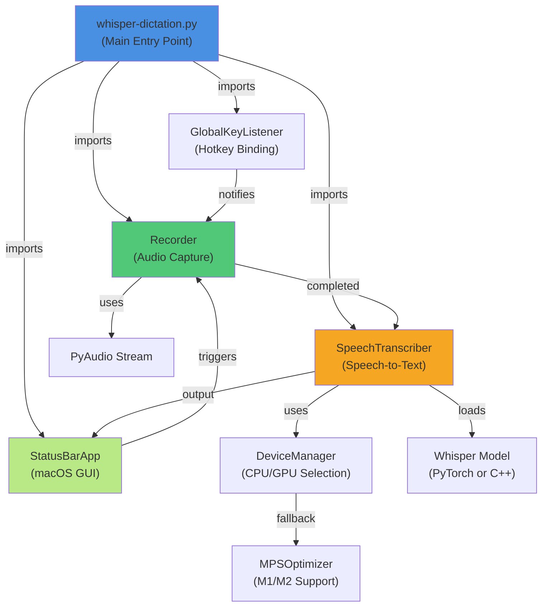
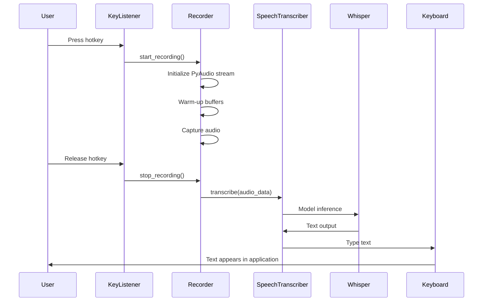
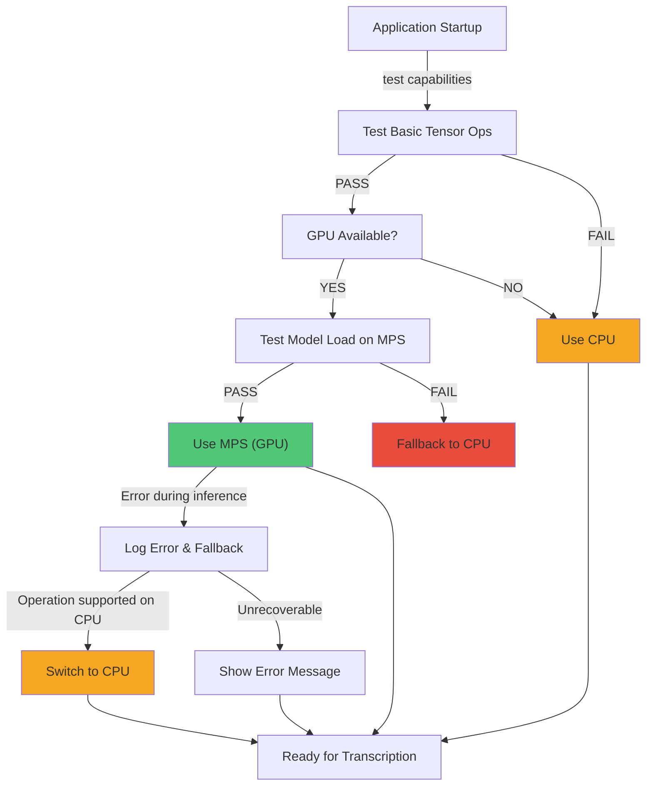

# System Patterns

## Core Architecture

### Module Organization

## Core Components

### SpeechTranscriber
- **Purpose:** Core transcription engine
- **Responsibilities:** Model loading, device management, text processing
- **Modular Design:** Can be used independently of GUI
- **Supports:** Both Python (PyTorch) and C++ (whisper.cpp) backends

### Recorder
- **Purpose:** Audio capture and processing
- **Responsibilities:** Stream management, buffer handling, warm-up buffers
- **Features:** Auto-fallback on errors, configurable frame size
- **TDD Module:** recorder.py for testing

### StatusBarApp
- **Purpose:** macOS integration and user interface
- **Framework:** Built on `rumps` library
- **Features:** Menu bar application, settings menu
- **Responsibilities:** UI state, user interactions, clipboard management

### Key Listeners
- **GlobalKeyListener:** Generic keyboard shortcut binding
- **DoubleCommandKeyListener:** Specialized double-tap detection
- **Purpose:** Global hotkey activation (works across all applications)

## Application Flow

## Design Patterns

### Observer Pattern
**Classes:** Recorder ↔ SpeechTranscriber
- Recorder captures audio events
- Notifies SpeechTranscriber when recording complete
- Decoupled components, can be tested independently

### Strategy Pattern
**Implementation:** Whisper Model Selection
- Multiple models available: tiny, base, small, medium, large
- User can choose strategy at runtime
- SwappableBackends: Python (PyTorch) vs C++ (whisper.cpp)

### Adapter Pattern
**Implementation:** Device Management
- DeviceManager adapts PyTorch to different hardware (CPU/MPS)
- Transparent fallback for unsupported operations
- Abstract device selection from core logic

## Device Management Flow

## Code Lifecycle & Maintenance

### Active Components
- **whisper-dictation.py**: Main Python implementation (active)
- **whisper-dictation-fast.py**: C++ implementation via whisper-cli (active)
- **recorder.py**: TDD-compatible module (maintained)
- **transcriber.py**: TDD-compatible wrapper (maintained)

### Obsolete Code Handling
- Old/experimental scripts → `temp/manual_tests/` folder
- Preserved as reference for future automated tests
- Not executed in normal workflows
- Gradually replaced with pytest equivalents
