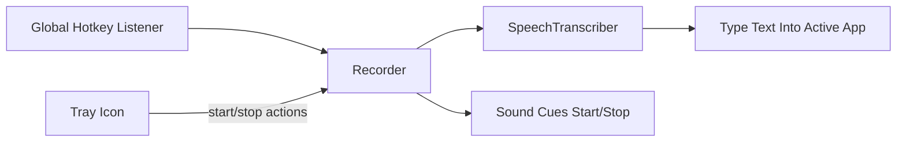

# System Patterns

## Current Runtime Pattern (Windows 11 MVP)

```mermaid
flowchart LR
    A[Global Hotkey Listener] --> B[Recorder]
    B --> C[SpeechTranscriber]
    C --> D[Type Text Into Active App]
    E[Tray Icon] -->|start/stop actions| B
    B --> F[Sound Cues Start/Stop]
```

## Key Design Decisions

- Keep a single Python entrypoint for MVP (`whisper-dictation.py` path).
- Separate platform-specific UI concerns from recording/transcription core.
- On Windows, avoid macOS-only UI dependency (`rumps`) in runtime path.
- Keep model loading behavior delegated to Whisper library for automatic download.

## Platform Notes

- macOS path remains as legacy/compatibility path.
- Windows path is now primary active development focus.
- `whisper.cpp` path is deferred for dedicated Windows portability work.
