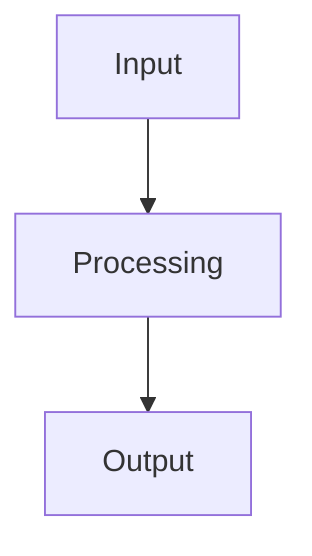

# Confluence Mermaid Diagrams - Lessons Learned

## Context
When adding Mermaid architecture diagrams to Confluence Cloud pages, the process is not straightforward due to Confluence's specific macro requirements.

**Date**: 2025-10-28
**Project**: Metal Scribe (whisper-dictation)
**Page**: Metal Scribe — Start Page (https://metal-scribe.atlassian.net/wiki/spaces/ZP/pages/131083)

---

## Key Discovery: File Naming is Critical

### The Problem
Initial attempts to add Mermaid diagrams failed because:
- Inline code blocks don't work (Confluence strips them)
- Inline SVG doesn't work (Confluence strips it)
- The `mermaid-cloud` macro requires attachments, not inline content

### The Solution
Confluence's `mermaid-cloud` macro requires:
1. **File uploaded as attachment** (not embedded in page content)
2. **File named WITHOUT `.mmd` extension** (just the base name)
3. **Macro references the attachment by filename**

### Working Example

**Correct file naming:**
```
✅ architecture-diagram      (correct - no extension)
❌ architecture-diagram.mmd  (incorrect - causes 404 in editor)
```

**Upload command:**
```bash
# Create file without extension
cat architecture-diagram.mmd > /tmp/architecture-diagram

# Upload to Confluence
curl -X POST \
  -H "X-Atlassian-Token: no-check" \
  -u "${CONFLUENCE_USERNAME}:${CONFLUENCE_API_TOKEN}" \
  -F "file=@/tmp/architecture-diagram" \
  -F "comment=Mermaid diagram source" \
  "${CONFLUENCE_URL}/rest/api/content/{PAGE_ID}/child/attachment"
```

**Macro syntax in page HTML storage format:**
```html
<ac:structured-macro ac:name="mermaid-cloud" ac:schema-version="1">
  <ac:parameter ac:name="toolbar">bottom</ac:parameter>
  <ac:parameter ac:name="filename">architecture-diagram</ac:parameter>
  <ac:parameter ac:name="zoom">fit</ac:parameter>
  <ac:parameter ac:name="revision">1</ac:parameter>
</ac:structured-macro>
```

---

## Working Process

### Step 1: Create Mermaid Diagram
Create a `.mmd` file locally with your diagram:



### Step 2: Upload Without Extension
Upload the file to Confluence **without** the `.mmd` extension:

```bash
cat your-diagram.mmd > /tmp/your-diagram

curl -X POST \
  -H "X-Atlassian-Token: no-check" \
  -u "${CONFLUENCE_USERNAME}:${CONFLUENCE_API_TOKEN}" \
  -F "file=@/tmp/your-diagram" \
  "${CONFLUENCE_URL}/rest/api/content/{PAGE_ID}/child/attachment"
```

### Step 3: Add Macro to Page
Update the page content using REST API with HTML storage format:

```json
{
  "version": {
    "number": 46  // Current version + 1
  },
  "type": "page",
  "title": "Your Page Title",
  "body": {
    "storage": {
      "value": "<ac:structured-macro ac:name=\"mermaid-cloud\" ac:schema-version=\"1\"><ac:parameter ac:name=\"filename\">your-diagram</ac:parameter><ac:parameter ac:name=\"toolbar\">bottom</ac:parameter><ac:parameter ac:name=\"zoom\">fit</ac:parameter><ac:parameter ac:name=\"revision\">1</ac:parameter></ac:structured-macro>",
      "representation": "storage"
    }
  }
}
```

```bash
curl -X PUT \
  -H "Content-Type: application/json" \
  -u "${CONFLUENCE_USERNAME}:${CONFLUENCE_API_TOKEN}" \
  -d @update.json \
  "${CONFLUENCE_URL}/rest/api/content/{PAGE_ID}"
```

### Step 4: Verify
- **View mode**: Diagram renders as PNG
- **Edit mode**: Clicking the macro opens Mermaid editor with source

---

## Important Parameters

### `mermaid-cloud` Macro Parameters

| Parameter | Required | Description | Example Values |
|-----------|----------|-------------|----------------|
| `filename` | Yes | Attachment filename (without extension) | `architecture-diagram` |
| `toolbar` | No | Toolbar position | `bottom`, `top`, `none` |
| `zoom` | No | Zoom behavior | `fit`, `100%`, `150%` |
| `revision` | Yes | Attachment version number | `1`, `2`, `3` |

**Note**: The `revision` parameter must match the attachment version. When updating a diagram, increment this number.

---

## Common Pitfalls

### ❌ Pitfall 1: Using `.mmd` Extension
**Problem**: Upload file as `diagram.mmd`
**Result**: Macro editor shows 404 error when trying to load source
**Solution**: Upload without extension

### ❌ Pitfall 2: Incorrect Revision Number
**Problem**: Macro references `revision=1` but attachment is at version 2
**Result**: Old diagram displays, edits don't save
**Solution**: Update revision parameter when uploading new version

### ❌ Pitfall 3: Using Markdown Instead of HTML Storage
**Problem**: Try to use MCP `confluence_update_page` with Markdown
**Result**: Macro gets converted/stripped
**Solution**: Use REST API directly with HTML storage format

### ❌ Pitfall 4: Wrong Macro Name
**Problem**: Use `macro-diagram` or `mermaid` as macro name
**Result**: Macro doesn't render
**Solution**: Use exact name `mermaid-cloud`

---

## Updating Diagrams

When updating an existing diagram:

1. **Update the attachment** (creates new version):
```bash
curl -X POST \
  -H "X-Atlassian-Token: no-check" \
  -u "${CONFLUENCE_USERNAME}:${CONFLUENCE_API_TOKEN}" \
  -F "file=@/tmp/diagram" \
  "${CONFLUENCE_URL}/rest/api/content/{PAGE_ID}/child/attachment/{ATTACHMENT_ID}/data"
```

2. **Update macro revision parameter** in page content:
```html
<ac:parameter ac:name="revision">2</ac:parameter>  <!-- Increment -->
```

---

## Environment Variables Needed

```bash
export CONFLUENCE_URL="https://your-domain.atlassian.net/wiki"
export CONFLUENCE_USERNAME="your-email@example.com"
export CONFLUENCE_API_TOKEN="your-api-token-here"
```

---

## References

- **Working Example**: Page 131083, attachment `test-diagram`
- **Task Documentation**: `CONFLUENCE_DIAGRAM_TASK.md` (project root)
- **Confluence REST API**: https://developer.atlassian.com/cloud/confluence/rest/v1/

---

## Summary

✅ **Do**:
- Upload files without `.mmd` extension
- Use `mermaid-cloud` macro (exact name)
- Use REST API with HTML storage format
- Match revision parameter to attachment version
- Test in both view mode (PNG) and edit mode (source)

❌ **Don't**:
- Include `.mmd` extension in uploaded filename
- Use inline code blocks or SVG
- Use Markdown conversion for macro content
- Forget to update revision number when updating diagram
