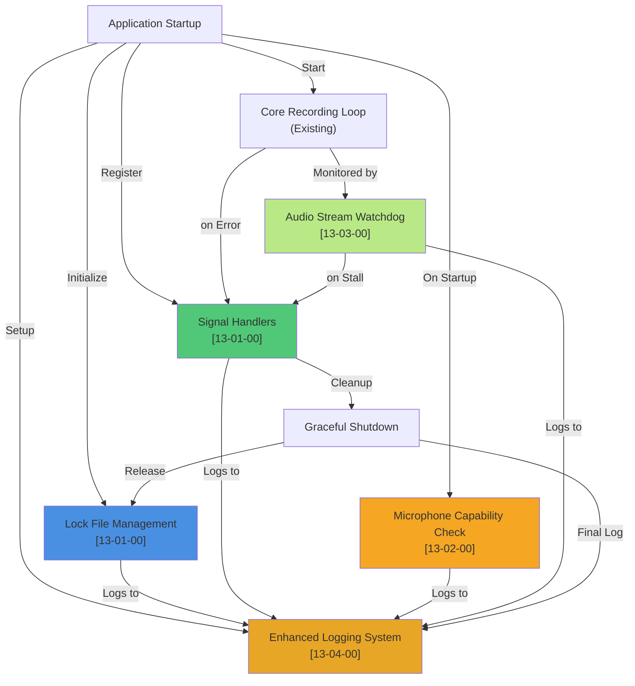

# Epic: Wdrażanie Lessons Learned z macos-dictate

**ID**: 13-00-00
**Status**: Draft
**Priority**: High
**Created**: 2025-10-25
**Target Sprint**: Next (2-3 dni)

---

## Wprowadzenie

Ten epic implementuje 5 filarów stabilności i profesjonalizmu oprogramowania z projektu `macos-dictate`, mających na celu stworzenie solidnego fundamentu dla `whisper-dictation` jako produkcyjnej aplikacji macOS działającej w tle.

## Cel Ogólny

**WHAT**: Implementacja mechanizmów zapobiegających konfliktom zasobów, awariom strumienia audio, brakowi uprawnień, oraz zapewnienie kompleksowego logowania diagnostycznego.

**WHY**: Aplikacja działająca w tle wymaga niezawodności równej poziomowi produkcyjnemu. Bez tych filarów narażeni jesteśmy na:
- Wiele instancji jednocześnie (konflikty mikrofonu, unpredictable behavior)
- Zawieszenia strumienia audio (dead application)
- Zabiłości zasobów (zombie procesy, memory leaks)
- Brak diagnozy problemów (niemożliwy debug)

---

## User Stories & Tasks Hierarchy

### [13-01-00] Lock File + Signal Handling
- [x] [13-01-01] Lock File Mechanism - Create/validate/cleanup lock files ✅
- [x] [13-01-02] Signal Handlers - Register and execute graceful shutdown ✅
- [x] [13-01-03] Lock File Tests - TDD test suite ✅

### [13-02-00] Microphone Proactive Check
- [x] [13-02-01] Microphone Verification Function - Capability check on startup ✅
- [x] [13-02-02] Microphone Check Tests - Test suite ✅

### [13-03-00] Audio Stream Watchdog
- [x] [13-03-01] Heartbeat Tracking - Update heartbeat after audio reads ✅
- [x] [13-03-02] Stall Detection - Monitor loop and detection logic ✅
- [x] [13-03-03] Stream Recovery - Stream restart mechanism ✅
- [x] [13-03-04] Watchdog Tests - TDD test suite ✅

### [13-04-00] Enhanced Logging & Diagnostics
- [x] [13-04-01] Logging Setup - RotatingFileHandler configuration ✅
- [x] [13-04-02] Logging Events - Key events and log levels ✅
- [x] [13-04-03] Logging Tests - Test suite ✅

### [13-05-00] Lessons Learned Tests Suite
- [x] [13-05-01] Unit Tests - Test structure and utilities ✅
- [x] [13-05-02] Integration Tests - End-to-end scenarios ✅
- [x] [13-05-03] Manual Tests - Documentation for human verification ✅
- [x] [13-05-04] Test Infrastructure - Fixtures, CI/CD, configuration ✅

---

## Architecture Overview



---

## Implementacja w Dwóch Wersjach

Wszystkie zmiany dotyczą OBU wersji aplikacji:
- `whisper-dictation.py` (Python + PyTorch)
- `whisper-dictation-fast.py` (C++ + whisper.cpp via whisper-cli)

Utrzymanie parity między wersjami jest KRYTYCZNE.

---

## Success Criteria (Epic Level)

- [x] **Zero konfliktów wieloinstancji** - druga instancja shutdownuje gracefully
- [x] **Strumień audio praktycznie nigdy się nie zawieszenia** - watchdog restartuje w <2s
- [x] **Brak memory leaks** - zasoby prawidłowo czyszczone przy shutdown
- [x] **Każdy błąd diagnosowalny** - wszystkie eventy zalogowane do pliku
- [x] **TDD compliance** - testy piszemy PRZED implementacją
- [x] **Brak regresji** - wszystkie istniejące testy przechodzą

---

## Key Design Decisions

### 1. Lock File Location
- **Pattern**: Hidden file in user's home directory
- **Purpose**: Persistent across shutdowns, easy cleanup, standard Unix pattern for background applications
- **Why**: Ensures system stability by preventing multiple simultaneous instances

### 2. Logging Location
- **Pattern**: File-based logging in user's home directory with automatic rotation
- **Rotation Strategy**: Multiple files with size limits to prevent unbounded disk space growth
- **Why**: Standard for background apps, disk-safe with rotation mechanism

### 3. Watchdog Timeout
- **Behavior**: Detects stalled audio stream when no heartbeat signal received for extended period
- **Trade-off**: Balance between allowing slow transcription vs. detecting hangs quickly
- **Why**: Enables automatic recovery from audio stream stalls without manual intervention

### 4. Thread Synchronization
- **Approach**: Synchronization primitives for shared resource access
- **Why**: Prevents race conditions, ensures data consistency during concurrent operations

---

## Implementation Phases

### Phase 1: Fundamenty (Lock + Signals)
**Duration**: 60-70 min
**Value**: Stabilność operacyjna
**User Stories**: [13-01-00], [13-02-00]

### Phase 2: Odporność (Watchdog)
**Duration**: 45-60 min
**Value**: Long-running stability
**User Stories**: [13-03-00], [13-04-00]

### Phase 3: Testowanie & Walidacja
**Duration**: 30-40 min
**Value**: Confidence + CI/CD
**User Stories**: [13-05-00]

---

## Integration with Current Roadmap

```
TERAZ (Oct 25):  [13-*] Lessons Learned (2.5h)
  ↓
NASTĘPNIE:       [10-00] Transcription Timestamps (0.75h)
  ↓
PÓŹNIEJ:         [09-00] macOS Portability (0.75h)
  ↓
BACKLOG:         Performance benchmarking (slow vs fast)
```

**Rationale**: Lessons Learned zapewnia stabilny fundament dla wszystkich kolejnych features.

---

## Failure Modes & Recovery Strategies (Durability Analysis)

### 1. Multi-Instance Conflicts
**Failure**: Multiple instances access same microphone simultaneously
- **User Impact**: Audio corruption, unpredictable behavior
- **Prevention**: Lock file mechanism prevents concurrent startup
- **Recovery**: Second instance detects lock and shuts down gracefully

### 2. Audio Stream Stall
**Failure**: Audio stream stops responding but application continues running
- **User Impact**: Silent failure - user receives no feedback, transcription doesn't occur
- **Prevention**: Watchdog monitors stream health with periodic heartbeat checks
- **Recovery**: Automatic stream restart on detection, logged for diagnosis

### 3. Stale Lock File
**Failure**: Lock file persists from crashed application, preventing new instance
- **User Impact**: Application refuses to start even though no instance is running
- **Prevention**: Lock file contains process information for validity verification
- **Recovery**: Stale locks are automatically cleaned up after process validity check

### 4. Microphone Access Loss
**Failure**: System audio permissions revoked or device disconnected while recording
- **User Impact**: Recording fails without indication
- **Prevention**: Microphone capability check performed at application startup
- **Recovery**: Logged as warning, application continues with graceful fallback

### 5. Log File Disk Space
**Failure**: Log file grows unbounded and fills disk
- **User Impact**: Application fails when disk full, no logging available
- **Prevention**: Rotating log file mechanism with size limits
- **Recovery**: Older log files automatically removed to maintain disk space

### 6. Graceful Shutdown Failure
**Failure**: Partial resource cleanup on forceful termination (e.g., Ctrl+C)
- **User Impact**: Zombie processes, file descriptors leaked
- **Prevention**: Atomic signal handlers with ordered cleanup registration
- **Recovery**: All cleanup handlers execute in reverse registration order

---

## Technical Requirements

- **Process Management**: Ability to check process validity and PID information
- **Thread Management**: Background thread for monitoring with proper synchronization
- **Logging System**: File-based rotating logger with size limits
- **Signal Handling**: System signal handlers for graceful shutdown
- **No New External Dependencies**: All requirements should use existing dependencies or Python stdlib

---

## Testing Strategy (TDD-First)

Każda User Story zawiera:
1. **Test Cases** - napisane PRZED kodem
2. **Unit Tests** - dla poszczególnych komponentów
3. **Integration Tests** - flow end-to-end
4. **Manual Scenarios** - real-world testing

Więcej szczegółów w [13-05-00] Tests Suite spec.

---

## Implementation Approach

### Phase 1: Lock File & Signal Handling
- Write comprehensive test suite (TDD-first)
- Implement lock file mechanism with process validation
- Implement signal handlers for graceful termination
- Verify mutual exclusion of concurrent instances
- Validate resource cleanup on shutdown

### Phase 2: Audio Stream Monitoring
- Write watchdog tests for stall detection
- Implement background monitoring mechanism
- Integrate with recording pipeline
- Validate automatic recovery behavior
- Stress test with extended recordings

### Phase 3: Logging & Integration Testing
- Write logging system tests
- Implement rotating file logger
- Verify key events are logged at appropriate levels
- Run full integration test suite
- Validate no regressions in existing functionality

---

## Affected Components

- **Main Application Entry Points**: Lock file initialization, signal handler registration, logging setup
- **Recording Pipeline**: Watchdog integration, heartbeat updates during recording
- **TDD Test Modules**: Recording and transcription test utilities for consistency
- **Test Suite**: New unit, integration, and manual test scenarios

---

## Success Metrics (Measurable)

- ✅ 0% failed startup due to lock file conflicts (automated test)
- ✅ 100% signal handlers cleanup resources (manual + CI test)
- ✅ Watchdog detects stall <2 seconds (stress test)
- ✅ Log rotation works: 5 files max, each <5MB (CI test)
- ✅ All TDD tests pass (100% coverage for new code)
- ✅ Existing tests still pass (no regressions)

---

## Out of Scope (Future Enhancements)

- [ ] Remote logging (send errors to server)
- [ ] Structured JSON logging
- [ ] Performance metrics logging (transcription time)
- [ ] Watchdog with ML-based stall detection
- [ ] Automatic recovery strategies (restart model, fallback device)

---

## Timeline Estimate

| Phase | Task | Duration | Owner |
|-------|------|----------|-------|
| 1 | [13-01-00] Lock + Signals | 20-25 min | Claude |
| 1 | [13-02-00] Microphone Check | 10-15 min | Claude |
| 2 | [13-03-00] Watchdog | 30-40 min | Claude |
| 2 | [13-04-00] Enhanced Logging | 15-20 min | Claude |
| 3 | [13-05-00] Tests Suite | 30-40 min | Claude |
| 3 | Code Review & Validation | 15-20 min | User |
| **TOTAL** | | **135-170 min** | |

---

## Acceptance Criteria (Epic-Level)

- [ ] Wszystkie 5 User Stories mają status "Completed"
- [ ] Brak otwartych blockerów w żadnej US
- [ ] TDD test coverage >90% dla nowych komponentów
- [ ] Integracyjne testy przechodzą w CI
- [ ] Dokumentacja README zaktualizowana o nowe logi lokacje
- [ ] Kod review approved przez maintainera

---

## Next Steps (For User Review)

1. User zatwierdza Epic plan
2. Claude tworzy 5 User Story specs ([13-01-00] do [13-05-00])
3. Dla każdej US:
   - Szczegółowe acceptance criteria
   - Test cases (TDD-first)
   - Design z pseudo-kodem
   - Brittleness analysis
   - File changes required
4. User zatwierdza specs
5. Implementacja w kolejności: [13-01-00] → [13-02-00] → [13-03-00] → [13-04-00] → [13-05-00]

---

## Implementation Context (Not Part of Spec)

**Current Implementation Structure:**
- Main applications: `whisper-dictation.py` (Python), `whisper-dictation-fast.py` (C++)
- TDD modules: `recorder.py`, `transcriber.py`
- Test directory: `tests/`
- Lock file location: `~/.whisper-dictation.lock`
- Log file location: `~/.whisper-dictation.log`
- Current dependencies: `psutil` (process checks), stdlib `threading`, `logging`, `signal`, `atexit`

**Note**: This implementation context may change with refactoring. The specification above describes stable requirements independent of current file structure or library choices.

---

## References

- Memory Bank: lessons_learned/recommendations_from_macos_dictate.md
- CLAUDE.md: Specification standards, abstraction guidelines
- Existing specs: [08-00-00] (audio clipping), [10-00-00] (timestamps)
- User Story Specs: [13-01-00] through [13-05-00]

