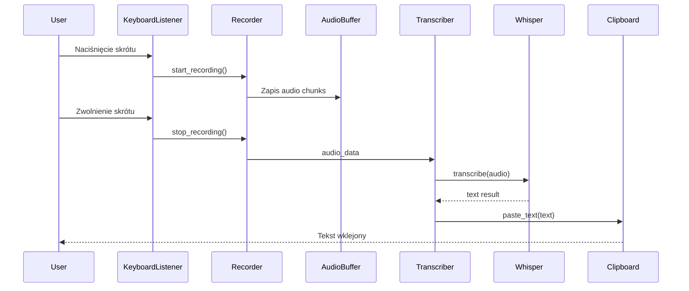
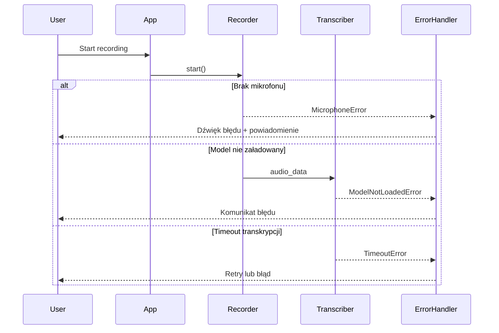

# Zadanie: Wygeneruj docs/DATA_FLOW.md + diagramy sekwencji

## Data
2025-10-10 14:26

## Priorytet
HIGH

## Cel
Utworzyć:
1. `/Users/mprzybyszewski/dev/ai-projects/whisper-dictation/docs/DATA_FLOW.md`
2. `/Users/mprzybyszewski/dev/ai-projects/whisper-dictation/docs/diagrams/sequence-main-flow.mmd`
3. `/Users/mprzybyszewski/dev/ai-projects/whisper-dictation/docs/diagrams/sequence-error-handling.mmd`

## Pliki do przeczytania
- `/Users/mprzybyszewski/dev/ai-projects/whisper-dictation/whisper-dictation.py`
- `/Users/mprzybyszewski/dev/ai-projects/whisper-dictation/recorder.py`
- `/Users/mprzybyszewski/dev/ai-projects/whisper-dictation/transcriber.py`

## Zawartość DATA_FLOW.md

### 1. Wprowadzenie
Opis głównych przepływów danych w aplikacji.

### 2. Główny przepływ - Happy Path

**Krok po kroku**:
1. Użytkownik naciska skrót klawiszowy
2. Aplikacja rozpoczyna nagrywanie
3. Audio trafia do bufora
4. Po zakończeniu nagrywania → transkrypcja
5. Model Whisper przetwarza audio
6. Tekst jest wklejany do aktywnej aplikacji

### 3. Diagram sekwencji - Main Flow

Plik: `docs/diagrams/sequence-main-flow.mmd`



### 4. Obsługa błędów

Scenariusze błędów:
- Brak mikrofonu
- Model nie załadowany
- Błąd transkrypcji
- Timeout

### 5. Diagram sekwencji - Error Handling

Plik: `docs/diagrams/sequence-error-handling.mmd`



### 6. Formaty danych

- **Audio**: numpy array, 16kHz, mono
- **Transkrypcja**: string (UTF-8)
- **Konfiguracja**: dict (język, model)

### 7. Powiązane dokumenty
```markdown
## Powiązane dokumenty

- [Architektura](./ARCHITECTURE.md)
- [API Interfaces](./API_INTERFACES.md) *(planowane)*
- [Diagram głównego przepływu](./diagrams/sequence-main-flow.mmd)
- [Diagram obsługi błędów](./diagrams/sequence-error-handling.mmd)
```

## Wymagania
- Język: Polski
- Format: Markdown + Mermaid
- Długość: 300-500 linii
- Bazuj na rzeczywistym kodzie

## Walidacja
1. Oba diagramy utworzone
2. Przepływy odpowiadają kodowi
3. Linki działają
