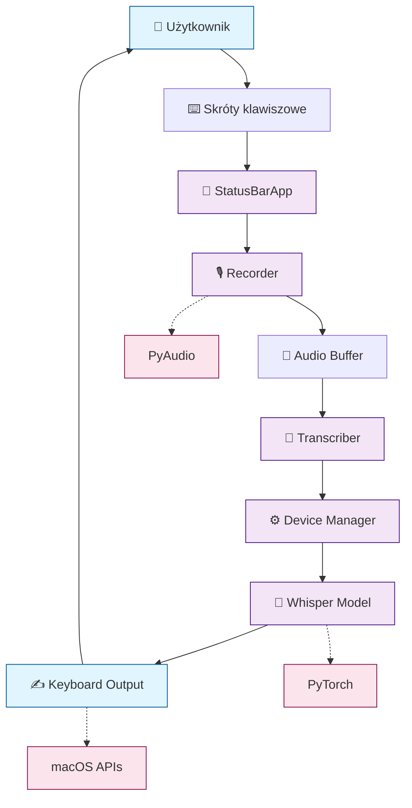

# Fix: Popraw diagram system-overview.mmd

## Data: 2025-10-10 17:26
## Priorytet: CRITICAL
## QA Issue: #1

## Problem
Diagram `docs/diagrams/system-overview.mmd` jest zbyt uproszczony (tylko 3 węzły) i nie odzwierciedla kompletnego systemu.

## Cel
Zastąpić obecny diagram kompleksowym przeglądem systemu whisper-dictation.

## Wymagania

Nowy diagram powinien pokazywać:
1. **Użytkownik** → interakcja przez skróty klawiszowe
2. **StatusBarApp** → menu bar interface
3. **GlobalKeyListener** → nasłuchiwanie klawiszy
4. **Recorder** → nagrywanie audio
5. **AudioBuffer** → przechowywanie
6. **Transcriber** → transkrypcja
7. **DeviceManager** → zarządzanie M1/M2
8. **Whisper Model** → silnik ASR
9. **Output** → wklejanie tekstu

### Wzór z QA raportu:

## Akcja
Zastąp całą zawartość `/Users/mprzybyszewski/dev/ai-projects/whisper-dictation/docs/diagrams/system-overview.mmd` powyższym diagramem (lub podobnym, jeśli masz lepszy pomysł bazując na kodzie).

## Walidacja
- Diagram ma >5 węzłów
- Pokazuje przepływ od użytkownika do outputu
- Zawiera kluczowe komponenty (Recorder, Transcriber, DeviceManager)
- Używa emoji dla czytelności
- Ma style/kolory dla różnych typów węzłów
