# Fix: Popraw diagram system-overview.mmd

## Data: 2025-10-10 17:26
## Priorytet: CRITICAL
## QA Issue: #1

## Problem
Diagram `docs/diagrams/system-overview.mmd` jest zbyt uproszczony (tylko 3 węzły) i nie odzwierciedla kompletnego systemu.

## Cel
Zastąpić obecny diagram kompleksowym przeglądem systemu whisper-dictation.

## Wymagania

Nowy diagram powinien pokazywać:
1. **Użytkownik** → interakcja przez skróty klawiszowe
2. **StatusBarApp** → menu bar interface
3. **GlobalKeyListener** → nasłuchiwanie klawiszy
4. **Recorder** → nagrywanie audio
5. **AudioBuffer** → przechowywanie
6. **Transcriber** → transkrypcja
7. **DeviceManager** → zarządzanie M1/M2
8. **Whisper Model** → silnik ASR
9. **Output** → wklejanie tekstu

### Wzór z QA raportu:

```mermaid
graph TB
    User[👤 Użytkownik] --> Keyboard[⌨️ Skróty klawiszowe]
    Keyboard --> StatusBar[📱 StatusBarApp]
    StatusBar --> Recorder[🎙️ Recorder]
    Recorder --> AudioBuffer[💾 Audio Buffer]
    AudioBuffer --> Transcriber[🤖 Transcriber]
    Transcriber --> DeviceManager[⚙️ Device Manager]
    DeviceManager --> Whisper[🧠 Whisper Model]
    Whisper --> Output[✍️ Keyboard Output]
    Output --> User
    
    %% Integracje zewnętrzne
    Recorder -.-> PyAudio[PyAudio]
    Whisper -.-> PyTorch[PyTorch]
    Output -.-> macOS[macOS APIs]
    
    %% Style
    classDef userStyle fill:#e1f5ff,stroke:#01579b
    classDef coreStyle fill:#f3e5f5,stroke:#4a148c
    classDef externalStyle fill:#fce4ec,stroke:#880e4f
    
    class User,Output userStyle
    class StatusBar,Recorder,Transcriber,DeviceManager,Whisper coreStyle
    class PyAudio,PyTorch,macOS externalStyle
```

## Akcja
Zastąp całą zawartość `/Users/mprzybyszewski/dev/ai-projects/whisper-dictation/docs/diagrams/system-overview.mmd` powyższym diagramem (lub podobnym, jeśli masz lepszy pomysł bazując na kodzie).

## Walidacja
- Diagram ma >5 węzłów
- Pokazuje przepływ od użytkownika do outputu
- Zawiera kluczowe komponenty (Recorder, Transcriber, DeviceManager)
- Używa emoji dla czytelności
- Ma style/kolory dla różnych typów węzłów
