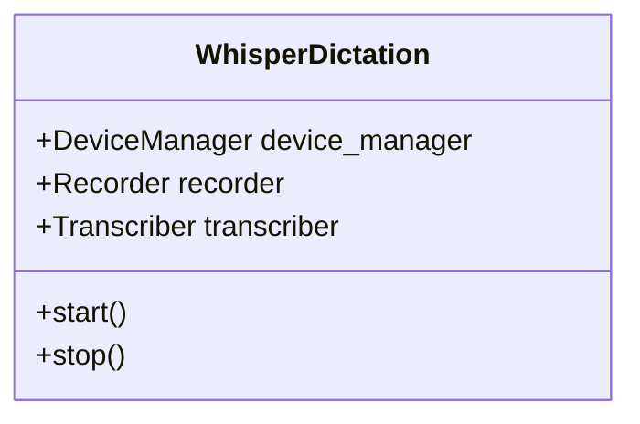
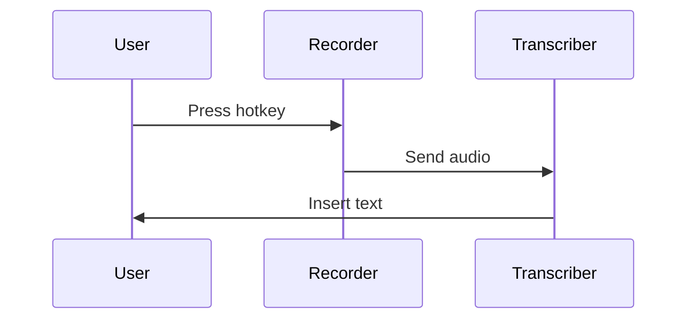
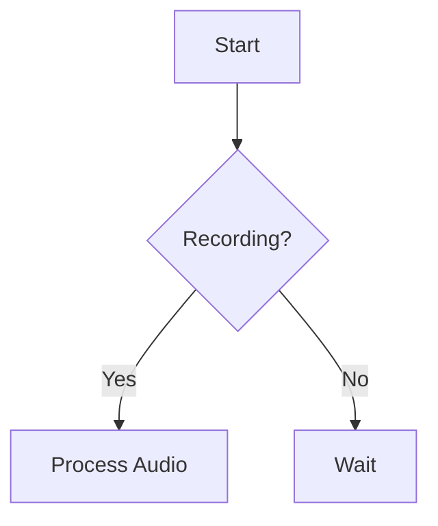
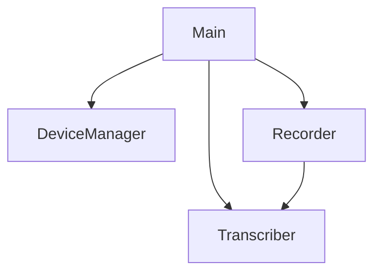

# Task: Convert ARCHITECTURE.md Code to Diagrams

## Principle: "Image Over Code"
Replace source code blocks with visual diagrams (UML, sequence diagrams, flowcharts) using Mermaid syntax.

## File to Modify
**EXACT PATH**: `/Users/mprzybyszewski/dev/ai-projects/whisper-dictation/docs/ARCHITECTURE.md`

## Objectives

### 1. Identify Code Blocks
Read the current ARCHITECTURE.md and identify all code blocks that show:
- System architecture
- Component relationships
- Class structures
- Initialization flows
- Any technical concepts

### 2. Replace with Diagrams
For each code block, create appropriate Mermaid diagrams:

#### Component Architecture
Use **Class Diagrams** or **Component Diagrams**:


#### Process Flows
Use **Sequence Diagrams**:


#### System Flow
Use **Flowcharts**:


#### Component Relationships
Use **Graph Diagrams**:


### 3. Keep Minimal Code Examples
Only keep code if it shows:
- Critical configuration snippets (max 5 lines)
- Key API usage that can't be visualized

### 4. Add Diagram Descriptions
For each diagram, add a brief description above it explaining what it shows.

## Guidelines

### DO:
- ✅ Use Mermaid diagrams for visualization
- ✅ Show system architecture with component diagrams
- ✅ Show processes with sequence/flow diagrams
- ✅ Add descriptions for each diagram
- ✅ Make diagrams clear and readable

### DON'T:
- ❌ Keep large code blocks
- ❌ Show implementation details in diagrams
- ❌ Make diagrams too complex (split if needed)
- ❌ Remove important technical information

## Verification
After editing:
1. Check no large code blocks remain: `grep -n '```python' /Users/mprzybyszewski/dev/ai-projects/whisper-dictation/docs/ARCHITECTURE.md`
2. Count diagrams added: `grep -c '```mermaid' /Users/mprzybyszewski/dev/ai-projects/whisper-dictation/docs/ARCHITECTURE.md`
3. Verify git changes: `git -C /Users/mprzybyszewski/dev/ai-projects/whisper-dictation diff docs/ARCHITECTURE.md`

## Success Criteria
- [ ] All major code blocks replaced with diagrams
- [ ] At least 4-6 Mermaid diagrams added
- [ ] Document maintains technical accuracy
- [ ] Diagrams are clear and well-labeled
- [ ] File is more visual and easier to understand
