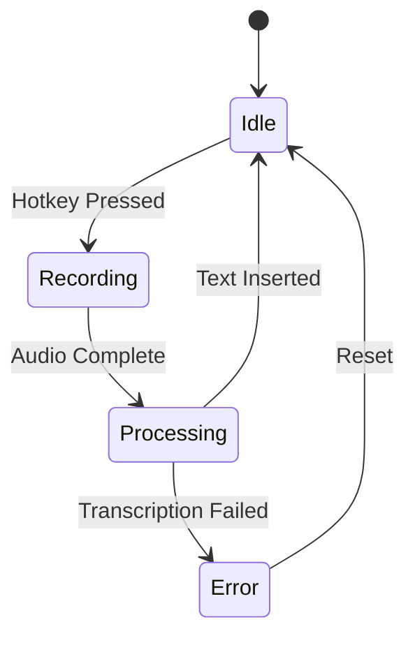
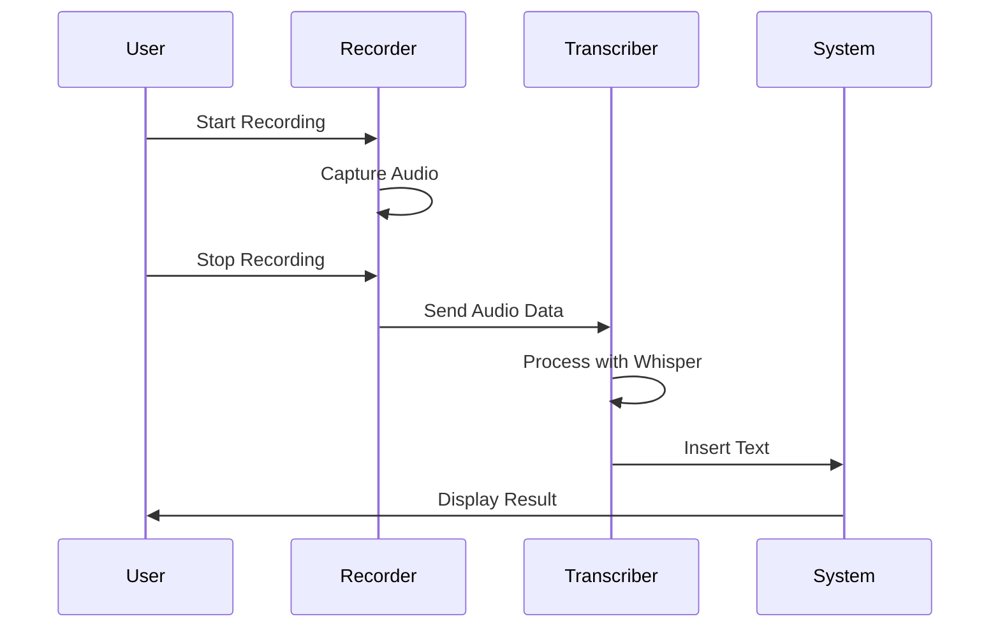
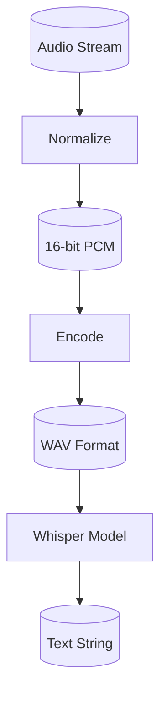

# Task: Convert DATA_FLOW.md Code to Diagrams

## Principle: "Image Over Code"
Replace source code blocks with visual diagrams showing data flow, state transitions, and processes.

## File to Modify
**EXACT PATH**: `/Users/mprzybyszewski/dev/ai-projects/whisper-dictation/docs/DATA_FLOW.md`

## Objectives

### 1. Identify Code Blocks
Read DATA_FLOW.md and identify code blocks showing:
- Data flow patterns
- State machines
- Processing pipelines
- Event handling

### 2. Replace with Flow Diagrams

#### Data Flow Pipeline
Use **Flowcharts**:


#### State Machine
Use **State Diagrams**:


#### Sequence of Events
Use **Sequence Diagrams**:


#### Data Transformation
Use **Flowcharts** with data shapes:


### 3. Keep Minimal Code
Only keep code for:
- Data structure definitions (max 5 lines)
- Critical API signatures

### 4. Add Explanations
For each diagram, add:
- Title describing the flow
- Brief explanation of what happens at each step
- Any important notes about the data transformation

## Guidelines

### DO:
- ✅ Show complete data flows end-to-end
- ✅ Use appropriate diagram types for each flow
- ✅ Label all connections clearly
- ✅ Show data transformations
- ✅ Indicate error paths

### DON'T:
- ❌ Keep implementation code
- ❌ Show internal variable names
- ❌ Make flows too detailed (abstract when needed)
- ❌ Forget error handling paths

## Verification
After editing:
1. Check code blocks: `grep -n '```python' /Users/mprzybyszewski/dev/ai-projects/whisper-dictation/docs/DATA_FLOW.md`
2. Count diagrams: `grep -c '```mermaid' /Users/mprzybyszewski/dev/ai-projects/whisper-dictation/docs/DATA_FLOW.md`
3. Verify changes: `git -C /Users/mprzybyszewski/dev/ai-projects/whisper-dictation diff docs/DATA_FLOW.md`

## Success Criteria
- [ ] All code blocks replaced with flow diagrams
- [ ] At least 4-5 Mermaid diagrams added
- [ ] Data flows are clear and complete
- [ ] State transitions are well-defined
- [ ] Document is more visual than textual
