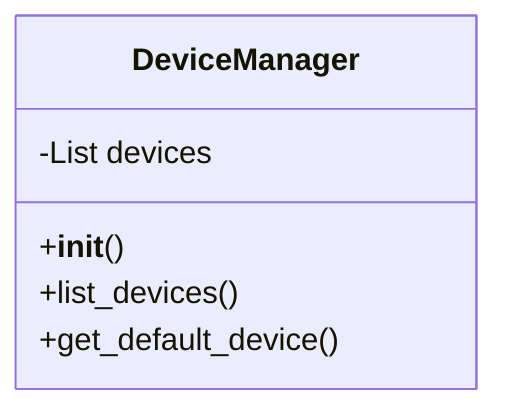
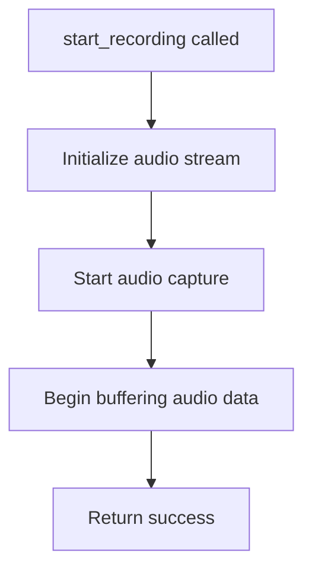
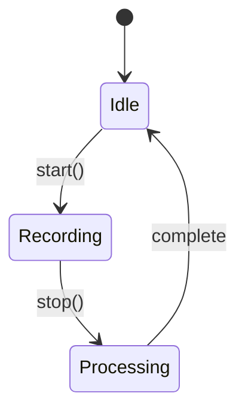
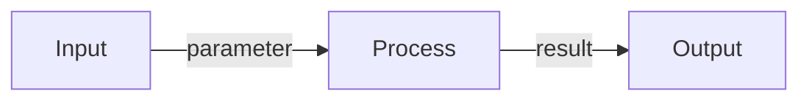

# Task: Convert Module Documentation Code to Diagrams

## Principle: "Image Over Code"
Replace source code blocks in individual module documentation files with visual diagrams.

## Files to Modify
**EXACT PATHS**:
- `/Users/mprzybyszewski/dev/ai-projects/whisper-dictation/docs/modules/device_manager.md`
- `/Users/mprzybyszewski/dev/ai-projects/whisper-dictation/docs/modules/recorder.md`
- `/Users/mprzybyszewski/dev/ai-projects/whisper-dictation/docs/modules/transcriber.md`

## Objectives

### 1. Process Each Module File
For each module documentation file:

#### A. Replace Class Definitions
**Before**:
```python
class DeviceManager:
    def __init__(self):
        self.devices = []
```

**After**:


#### B. Replace Method Flows
**Before**:
```python
def start_recording(self):
    # Initialize stream
    # Start capture
    # Buffer audio
```

**After**:


#### C. Show State Transitions


#### D. Show Data Flow


### 2. Keep Minimal Code
Only keep:
- **Usage examples** (max 3 lines showing how to use the module)
- **Configuration examples** (max 3 lines)
- Remove all implementation code

Example to keep:
```python
# Usage
manager = DeviceManager()
devices = manager.list_devices()
```

### 3. Document Structure for Each Module

Each module doc should have:

1. **Purpose** (text)
2. **Component Structure** (Mermaid class diagram)
3. **Key Methods** (Mermaid class diagram with methods)
4. **Usage Flow** (Mermaid sequence diagram)
5. **State Management** (Mermaid state diagram, if applicable)
6. **Usage Example** (minimal code, max 5 lines)
7. **Dependencies** (Mermaid graph)

### 4. Diagram Types by Content

| Content Type | Diagram Type |
|-------------|--------------|
| Class structure | Class Diagram |
| Method flow | Flowchart |
| Object interactions | Sequence Diagram |
| State changes | State Diagram |
| Dependencies | Graph/Component Diagram |
| Data transformation | Flowchart with data nodes |

## Guidelines

### DO:
- ✅ Show complete class interface
- ✅ Show method call flows
- ✅ Show state transitions
- ✅ Keep usage examples minimal
- ✅ Add diagram descriptions

### DON'T:
- ❌ Show implementation details
- ❌ Include private methods in main diagrams
- ❌ Keep large code blocks
- ❌ Duplicate information across diagrams

## Verification
After editing each file:
1. Check code reduction: `grep -c '```python' /Users/mprzybyszewski/dev/ai-projects/whisper-dictation/docs/modules/*.md`
2. Count diagrams: `grep -c '```mermaid' /Users/mprzybyszewski/dev/ai-projects/whisper-dictation/docs/modules/*.md`
3. Verify changes: `git -C /Users/mprzybyszewski/dev/ai-projects/whisper-dictation status docs/modules/`

## Success Criteria
- [ ] All 3 module files updated
- [ ] Each file has 3-5 Mermaid diagrams
- [ ] Code blocks reduced to usage examples only
- [ ] Module interfaces clearly visualized
- [ ] State flows are documented with diagrams
