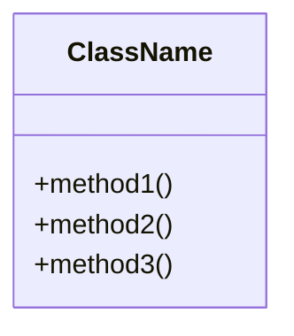
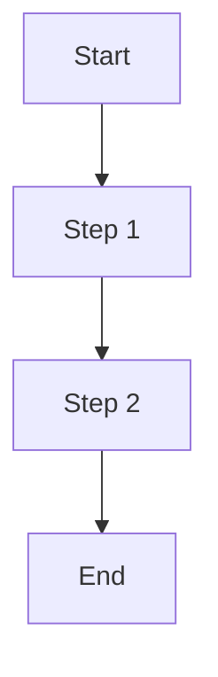

# Task: Add Diagrams to Module Documentation (Simplified)

## Objective
Add 2-3 Mermaid diagrams to each module documentation file. Keep it simple.

## Files to Update
1. `/Users/mprzybyszewski/dev/ai-projects/whisper-dictation/docs/modules/device_manager.md`
2. `/Users/mprzybyszewski/dev/ai-projects/whisper-dictation/docs/modules/recorder.md`
3. `/Users/mprzybyszewski/dev/ai-projects/whisper-dictation/docs/modules/transcriber.md`

## What to Do

### For EACH file:

#### 1. Add Class Structure Diagram
At the beginning, add a simple class diagram showing the main class:



#### 2. Add a Process Flow Diagram
Show the main workflow:



#### 3. Replace Large Code Blocks
If there are code blocks longer than 10 lines showing structure/flow, replace with diagrams.
Keep short usage examples (< 5 lines).

## Guidelines
- Simple diagrams only
- Don't remove important information
- Keep usage examples
- Add diagram before the section it describes

## Verification
After each file:
```bash
grep -c '```mermaid' /path/to/file.md
```
Should show at least 2.

## Success Criteria
- [ ] device_manager.md has 2-3 diagrams
- [ ] recorder.md has 2-3 diagrams  
- [ ] transcriber.md has 2-3 diagrams
- [ ] Files are still readable and informative
