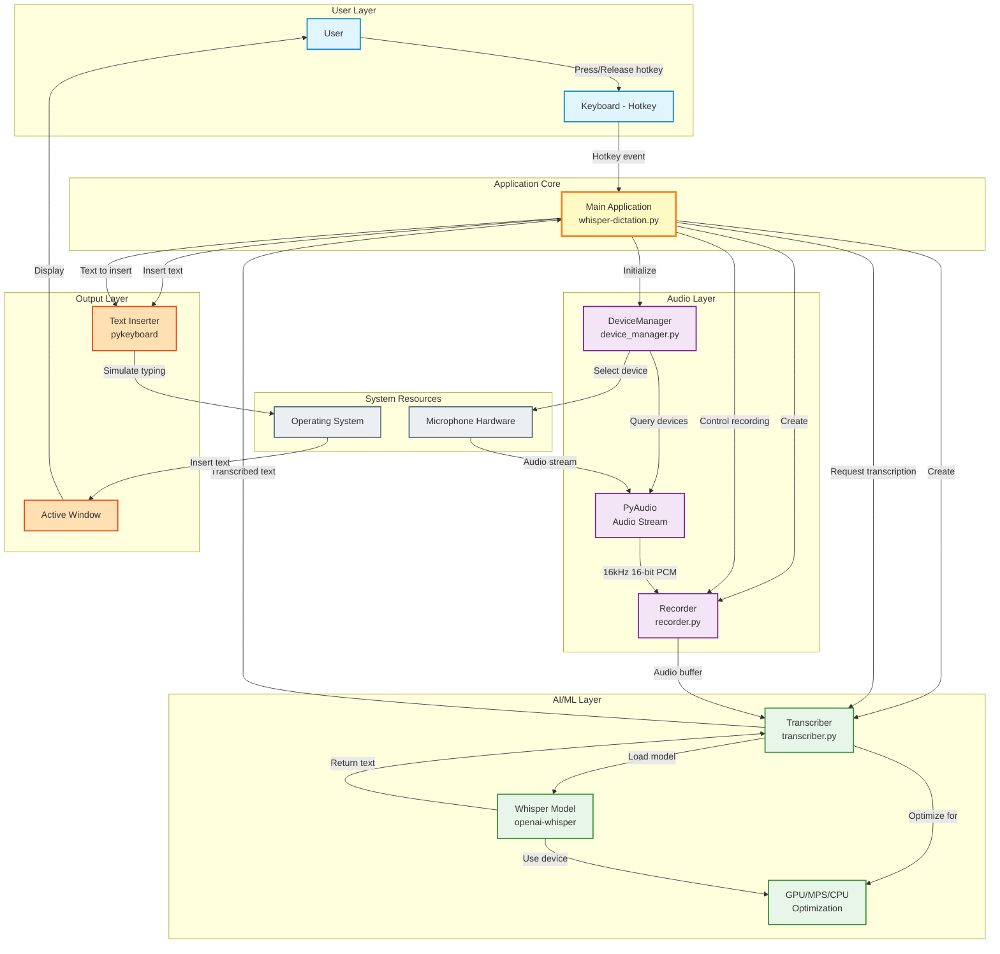
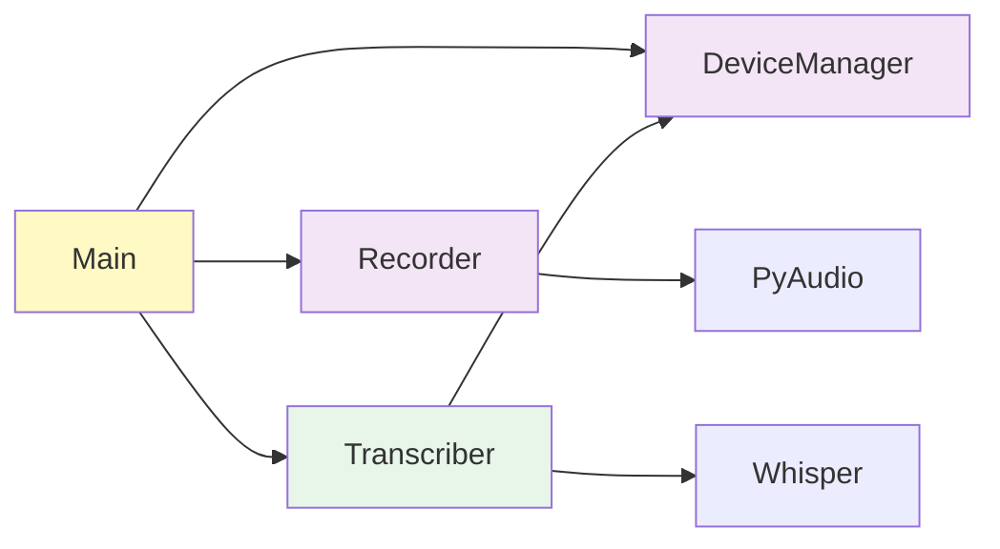
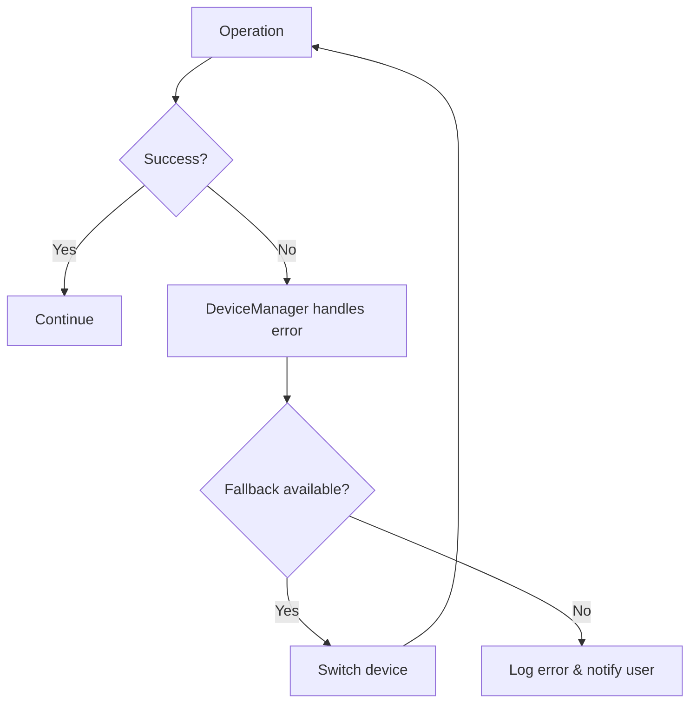

# Task: Create System-Level Integration Diagram

## Objective
Create a comprehensive system integration diagram showing all components working together.

## Files to Create/Modify

### 1. Create New File
**Path**: `/Users/mprzybyszewski/dev/ai-projects/whisper-dictation/docs/SYSTEM_INTEGRATION.md`

**Content Structure**:
```markdown
# System Integration Diagram

This diagram shows how all components of Whisper Dictation work together.

## Complete System Overview



## Data Flow Explanation

### 1. Initialization Phase
1. Main app starts
2. DeviceManager queries available audio devices
3. Recorder and Transcriber are initialized
4. Whisper model is loaded with optimal device (MPS/CUDA/CPU)

### 2. Recording Phase (Hotkey Pressed)
1. User presses hotkey
2. Main app signals Recorder to start
3. Recorder opens audio stream via PyAudio
4. Audio data flows: Microphone → PyAudio → Recorder buffer

### 3. Processing Phase (Hotkey Released)
1. User releases hotkey
2. Recorder stops and returns audio buffer
3. Main app passes audio to Transcriber
4. Transcriber processes with Whisper model
5. Model returns transcribed text

### 4. Output Phase
1. Main app receives text from Transcriber
2. Text Inserter simulates keyboard typing
3. Text appears in active application window
4. User sees result

## Component Dependencies



## Error Handling Flow



## See Also
- [Architecture Details](ARCHITECTURE.md)
- [Data Flow Documentation](DATA_FLOW.md)
- [Module Documentation](modules/)
```

### 2. Update README.md
**Path**: `/Users/mprzybyszewski/dev/ai-projects/whisper-dictation/docs/README.md`

**Action**: Add link to SYSTEM_INTEGRATION.md in appropriate section (e.g., in "Documentation" section or near the top).

Add this line:
```markdown
- **[System Integration Diagram](SYSTEM_INTEGRATION.md)** - Complete overview of all components working together
```

## Requirements

1. Create comprehensive Mermaid diagram showing:
   - All major components
   - Data flow between components
   - User interactions
   - External dependencies (PyAudio, Whisper, OS)
   - Clear visual grouping (subgraphs)
   - Color coding for different layers

2. Include explanatory text:
   - Phase-by-phase explanation
   - Component dependencies
   - Error handling overview

3. Keep it high-level but complete:
   - Show the big picture
   - Don't dive into implementation details
   - Make it understandable for newcomers

4. Add cross-references to detailed docs

## Verification

After creation:
```bash
# Verify file created
ls -lh /Users/mprzybyszewski/dev/ai-projects/whisper-dictation/docs/SYSTEM_INTEGRATION.md

# Check diagram syntax
grep -c 'mermaid' /Users/mprzybyszewski/dev/ai-projects/whisper-dictation/docs/SYSTEM_INTEGRATION.md

# Verify README link added
grep -n 'SYSTEM_INTEGRATION' /Users/mprzybyszewski/dev/ai-projects/whisper-dictation/docs/README.md
```

## Success Criteria
- [ ] SYSTEM_INTEGRATION.md file created
- [ ] Main integration diagram shows all components
- [ ] Dependencies diagram included
- [ ] Error handling flow shown
- [ ] Explanatory text provided
- [ ] README.md updated with link
- [ ] Diagrams use proper Mermaid syntax
- [ ] Visual grouping with subgraphs
- [ ] Color coding applied
